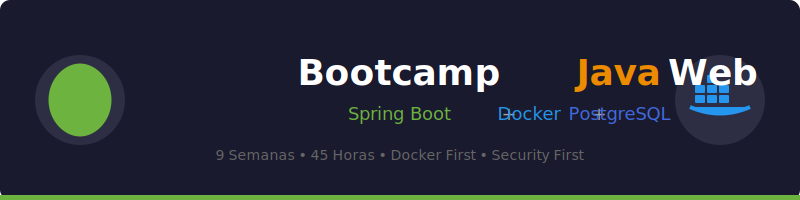

<p align="center">
  
</p>

<p align="center">
  <a href="https://www.oracle.com/java/"></a>
  <a href="https://spring.io/projects/spring-boot"></a>
  <a href="https://www.docker.com/"></a>
  <a href="https://www.postgresql.org/"></a>
  <a href="LICENSE"></a>
</p>

<p align="center">
  <a href="#-descripción"></a>
  <a href="#-descripción"></a>
  <a href="#-contenido-por-semana"></a>
  <a href="CONTRIBUTING.md"></a>
</p>

---

## 📋 Descripción

Bootcamp intensivo de **9 semanas** (45 horas) enfocado en el desarrollo de **APIs REST profesionales** con Java y Spring Boot. Diseñado con un enfoque **Docker First** para garantizar entornos de desarrollo consistentes y reproducibles.

### 🎯 Objetivos

- ✅ Dominar el desarrollo de APIs RESTful con Spring Boot
- ✅ Implementar arquitectura en capas (Controller-Service-Repository)
- ✅ Gestionar persistencia de datos con JPA y PostgreSQL
- ✅ Documentar APIs con OpenAPI/Swagger
- ✅ Escribir tests unitarios y de integración con TestContainers
- ✅ Contenedorizar aplicaciones con Docker desde el día 1
- ✅ Aplicar buenas prácticas de seguridad (Security First)

### 🐳 ¿Por qué Docker First?

> En ambientes de formación compartidos, múltiples cohortes utilizan los mismos equipos, causando configuraciones inestables. **Docker desde la Semana 1** garantiza que todos tengan el mismo entorno, eliminando el clásico problema de "en mi máquina funciona".

---

## 🗓️ Estructura del Bootcamp

| Semana | Tema | Docker | Horas |
|:------:|------|--------|:-----:|
| 1 | Entorno de Desarrollo con Docker y Fundamentos REST | Básico, JDK 21 en contenedor | 5h |
| 2 | Spring Boot en Docker: Primeros Pasos | Dockerfile, `docker build/run` | 5h |
| 3 | Arquitectura en Capas y Configuración Avanzada | Compose con perfiles, `.env` | 5h |
| 4 | Persistencia con JPA y PostgreSQL en Docker | PostgreSQL containerizado, multi-stage | 5h |
| 5 | Relaciones JPA y Redes Docker | Networks, healthchecks | 5h |
| 6 | Documentación con Swagger/OpenAPI | Swagger UI | 5h |
| 7 | Testing con TestContainers | TestContainers | 5h |
| 8 | Docker Avanzado y Preparación para Producción | Optimización, registros | 5h |
| 9 | Proyecto Final Integrador | Stack completo | 5h |

**Total: 45 horas** de formación intensiva

---

## 📚 Contenido por Semana

Cada semana incluye:

```
bootcamp/week-XX/
├── README.md                 # Descripción y objetivos
├── rubrica-evaluacion.md     # Criterios de evaluación
├── 0-assets/                 # Imágenes y diagramas
├── 1-teoria/                 # Material teórico
├── 2-practicas/              # Ejercicios guiados
├── 3-proyecto/               # Proyecto semanal
├── 4-recursos/               # Recursos adicionales
│   ├── ebooks-free/
│   ├── videografia/
│   └── webgrafia/
└── 5-glosario/               # Términos clave
```

### 🔑 Componentes Clave

- 📖 **Teoría**: Conceptos fundamentales con ejemplos del mundo real
- 💻 **Práctica**: Ejercicios progresivos y proyectos hands-on
- 📝 **Evaluación**: Evidencias de conocimiento, desempeño y producto
- 🎓 **Recursos**: Glosarios, referencias y material complementario

---

## 🛠️ Stack Tecnológico

| Tecnología | Versión | Propósito |
|------------|---------|-----------|
| Docker | 24+ | Entorno de desarrollo containerizado |
| Docker Compose | 2.x | Orquestación de servicios |
| Java | JDK 21 | Lenguaje de programación |
| Spring Boot | 3.2+ | Framework web |
| Spring Data JPA | 3.2+ | Persistencia de datos |
| PostgreSQL | 16+ | Base de datos (containerizada) |
| SpringDoc OpenAPI | 2.x | Documentación Swagger |
| JUnit 5 | 5.10+ | Testing unitario |
| TestContainers | 1.19+ | Testing de integración |
| Maven | 3.9+ | Gestión de dependencias |

---

## 🚀 Inicio Rápido

### Prerrequisitos

- [Docker Desktop](https://www.docker.com/products/docker-desktop/) (incluye Docker Compose)
- [VS Code](https://code.visualstudio.com/) con extensiones recomendadas
- Git

### 1. Clonar el Repositorio

```bash
git clone https://github.com/tu-usuario/bc-javaweb-sb.git
cd bc-javaweb-sb
```

### 2. Instalar Extensiones de VS Code

```bash
# Abrir en VS Code
code .

# Las extensiones recomendadas aparecerán automáticamente
# O ejecutar: Ctrl+Shift+P → "Extensions: Show Recommended Extensions"
```

### 3. Navegar a la Semana Actual

```bash
cd bootcamp/week-01
```

### 4. Seguir las Instrucciones

Cada semana contiene un `README.md` con instrucciones detalladas.

---

## 📊 Metodología de Aprendizaje

### Estrategias Didácticas

- 🎯 **Aprendizaje Basado en Proyectos (ABP)**
- 🧩 **Aprendizaje Basado en Problemas**
- 🔄 **Clase Invertida (Flipped Classroom)**
- 👥 **Pair Programming**
- 🔍 **Code Review entre pares**
- 🧪 **TDD (Test-Driven Development)**
- 🎮 **Live Coding y debugging colaborativo**

### Evaluación

Cada semana incluye tres tipos de evidencias:

1. **Conocimiento** 🧠: Cuestionarios y evaluaciones teóricas
2. **Desempeño** 💪: Ejercicios prácticos en clase
3. **Producto** 📦: Entregables evaluables (código, documentación, APIs funcionales)

---

## 🔐 Seguridad Primero

> **Mentalidad**: "Ya nos atacaron, ¿qué vamos a hacer?" en lugar de "¿Nos podrían atacar? Después vemos..."

Este bootcamp enfatiza la seguridad desde el diseño:

- ✅ Validación de TODOS los inputs (`@Valid`, Bean Validation)
- ✅ Nunca exponer datos sensibles en errores
- ✅ Credenciales en variables de entorno, nunca hardcodeadas
- ✅ Queries parametrizadas (prevención de SQL Injection)
- ✅ Headers de seguridad en respuestas HTTP

---

## 🤝 Contribuir

¡Las contribuciones son bienvenidas! Este es un proyecto educativo de código abierto.

### Cómo Contribuir

1. Lee la [Guía de Contribución](CONTRIBUTING.md)
2. Revisa el [Código de Conducta](CODE_OF_CONDUCT.md)
3. Fork del repositorio
4. Crea tu rama (`git checkout -b feature/nueva-funcionalidad`)
5. Commit con [Conventional Commits](https://www.conventionalcommits.org/) (`git commit -m 'feat: add new exercise'`)
6. Push a la rama (`git push origin feature/nueva-funcionalidad`)
7. Abre un Pull Request

### 📋 Áreas de Contribución

- ✨ Ejercicios adicionales
- 📚 Mejoras en documentación
- 🐛 Corrección de errores
- 🎨 Recursos visuales (diagramas SVG)
- 🌐 Traducciones
- 📹 Videos tutoriales

---

## 📞 Soporte

- 📧 **Email**: [tu-email@ejemplo.com](mailto:tu-email@ejemplo.com)
- 💬 **Discussions**: [GitHub Discussions](../../discussions)
- 🐛 **Issues**: [GitHub Issues](../../issues)

---

## 📄 Licencia

Este proyecto está bajo la Licencia MIT - ver el archivo [LICENSE](LICENSE) para más detalles.

---

## 🏆 Agradecimientos

- [Spring](https://spring.io/) - Por el increíble ecosistema
- [Docker](https://www.docker.com/) - Por revolucionar el desarrollo
- [PostgreSQL](https://www.postgresql.org/) - Por la mejor base de datos open source
- Comunidad Java - Por los recursos y ejemplos
- Todos los contribuidores

---

## 📚 Documentación Adicional

- [🤖 Instrucciones de Copilot](.github/copilot-instructions.md)
- [🤝 Guía de Contribución](CONTRIBUTING.md)
- [📜 Código de Conducta](CODE_OF_CONDUCT.md)
- [🔒 Política de Seguridad](SECURITY.md)

---

<p align="center">
  <strong>🎓 Bootcamp Java Web con Spring Boot</strong><br>
  <em>De cero a API REST profesional en 9 semanas</em>
</p>

<p align="center">
  <a href="bootcamp/week-01">Comenzar Semana 1</a> •
  <a href="_docs">Ver Documentación</a> •
  <a href="../../issues">Reportar Issue</a> •
  <a href="CONTRIBUTING.md">Contribuir</a>
</p>

<p align="center">
  Hecho con ❤️ para la comunidad de desarrolladores
</p>
