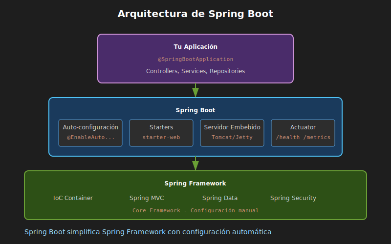

# Introducción a Spring Boot

## 🎯 Objetivos

- Entender qué es Spring Boot y por qué usarlo
- Conocer la relación entre Spring y Spring Boot
- Comprender el concepto de autoconfiguración
- Usar Spring Initializr para crear proyectos

---

## 1. ¿Qué es Spring Boot?

### 1.1 El Problema que Resuelve

Antes de Spring Boot, crear una aplicación web con Spring Framework requería:

```
❌ Sin Spring Boot:
├── Configurar decenas de archivos XML
├── Gestionar manualmente las dependencias
├── Configurar el servidor de aplicaciones (Tomcat, Jetty)
├── Resolver conflictos de versiones entre librerías
├── Escribir código repetitivo (boilerplate)
└── Tiempo de setup: días o semanas
```

```
✅ Con Spring Boot:
├── Configuración mínima o nula
├── Dependencias gestionadas automáticamente
├── Servidor embebido (Tomcat incluido)
├── Versiones compatibles garantizadas
├── Convención sobre configuración
└── Tiempo de setup: minutos
```

### 1.2 Definición

> **Spring Boot** es un framework que simplifica la creación de aplicaciones Spring, proporcionando configuración automática, servidores embebidos y una estructura de proyecto estandarizada.

### 1.3 Características Principales

| Característica | Descripción |
|---------------|-------------|
| **Autoconfiguración** | Configura automáticamente beans según las dependencias |
| **Starters** | Dependencias pre-empaquetadas para funcionalidades comunes |
| **Servidor embebido** | Tomcat, Jetty o Undertow incluidos |
| **Sin XML** | Configuración con anotaciones y properties |
| **Actuator** | Monitoreo y métricas listas para producción |
| **DevTools** | Hot-reload para desarrollo más rápido |

### 1.4 Arquitectura de Spring Boot



---

## 2. Spring vs Spring Boot

### 2.1 Analogía

Piensa en la diferencia como:

- **Spring Framework** = Kit de herramientas completo (martillo, destornillador, sierra, etc.)
- **Spring Boot** = Taladro eléctrico con puntas intercambiables

Spring Boot no reemplaza a Spring, **lo simplifica**.

### 2.2 Comparación

```java
// ❌ Spring tradicional (mucha configuración)
@Configuration
@EnableWebMvc
@ComponentScan(basePackages = "com.example")
public class WebConfig implements WebMvcConfigurer {
    @Bean
    public ViewResolver viewResolver() {
        InternalResourceViewResolver resolver = new InternalResourceViewResolver();
        resolver.setPrefix("/WEB-INF/views/");
        resolver.setSuffix(".jsp");
        return resolver;
    }

    @Bean
    public DataSource dataSource() {
        // Configuración manual de base de datos...
    }

    // ... más configuración
}
```

```java
// ✅ Spring Boot (configuración mínima)
@SpringBootApplication
public class Application {
    public static void main(String[] args) {
        SpringApplication.run(Application.class, args);
    }
}
// ¡Eso es todo! La autoconfiguración hace el resto.
```

---

## 3. La Anotación @SpringBootApplication

### 3.1 ¿Qué hace?

`@SpringBootApplication` es una anotación compuesta que equivale a:

```java
@SpringBootApplication
// Es lo mismo que usar estas tres juntas:
// @SpringBootConfiguration  → Marca la clase como fuente de configuración
// @EnableAutoConfiguration  → Habilita la autoconfiguración
// @ComponentScan            → Busca componentes en el paquete actual y subpaquetes
```

### 3.2 Ejemplo Mínimo

```java
package com.bootcamp.demo;

import org.springframework.boot.SpringApplication;
import org.springframework.boot.autoconfigure.SpringBootApplication;

@SpringBootApplication
public class DemoApplication {

    public static void main(String[] args) {
        // Inicia la aplicación Spring Boot
        SpringApplication.run(DemoApplication.class, args);
    }
}
```

### 3.3 ¿Qué sucede al ejecutar?

1. **Escaneo de componentes**: Busca clases con `@Component`, `@Service`, `@Repository`, `@Controller`
2. **Autoconfiguración**: Detecta dependencias y configura beans automáticamente
3. **Inicio del servidor**: Levanta Tomcat embebido en puerto 8080
4. **Registro de endpoints**: Mapea URLs a métodos de controladores

---

## 4. Spring Initializr

### 4.1 ¿Qué es?

**Spring Initializr** es una herramienta web oficial para generar proyectos Spring Boot preconfigurados.

**URL**: https://start.spring.io/

### 4.2 Opciones de Configuración

| Opción | Recomendado para el Bootcamp |
|--------|------------------------------|
| **Project** | Maven |
| **Language** | Java |
| **Spring Boot** | 3.2.x (última estable) |
| **Packaging** | Jar |
| **Java** | 21 |

### 4.3 Dependencias Iniciales

Para la Semana 02, selecciona:

| Dependencia | ID | Propósito |
|-------------|-------|-----------|
| **Spring Web** | `spring-boot-starter-web` | APIs REST, Tomcat embebido |
| **Spring Boot DevTools** | `spring-boot-devtools` | Hot-reload en desarrollo |

### 4.4 Estructura Generada

```
demo/
├── src/
│   ├── main/
│   │   ├── java/
│   │   │   └── com/bootcamp/demo/
│   │   │       └── DemoApplication.java
│   │   └── resources/
│   │       ├── application.properties
│   │       ├── static/
│   │       └── templates/
│   └── test/
│       └── java/
│           └── com/bootcamp/demo/
│               └── DemoApplicationTests.java
├── pom.xml
├── mvnw
├── mvnw.cmd
└── .gitignore
```

---

## 5. Starters: Dependencias Simplificadas

### 5.1 Concepto

Los **starters** son dependencias que agrupan múltiples librerías relacionadas.

```xml
<!-- En lugar de agregar 10+ dependencias manualmente... -->
<!-- Solo agregas UN starter -->
<dependency>
    <groupId>org.springframework.boot</groupId>
    <artifactId>spring-boot-starter-web</artifactId>
</dependency>
```

### 5.2 ¿Qué incluye `spring-boot-starter-web`?

- Spring MVC
- Tomcat embebido
- Jackson (JSON)
- Validación
- Logging (SLF4J + Logback)
- Y más...

### 5.3 Starters Comunes

| Starter | Uso |
|---------|-----|
| `spring-boot-starter-web` | APIs REST y aplicaciones web |
| `spring-boot-starter-data-jpa` | Persistencia con JPA/Hibernate |
| `spring-boot-starter-validation` | Validación de datos |
| `spring-boot-starter-test` | Testing (JUnit, Mockito) |
| `spring-boot-starter-actuator` | Monitoreo y métricas |
| `spring-boot-starter-security` | Seguridad y autenticación |

---

## 6. Autoconfiguración

### 6.1 ¿Cómo funciona?

Spring Boot examina las dependencias en el classpath y configura beans automáticamente.

```
Dependencia detectada → Configuración automática
─────────────────────────────────────────────────
spring-boot-starter-web  → Configura Tomcat, DispatcherServlet
spring-boot-starter-data-jpa → Configura EntityManager, DataSource
postgresql → Configura driver PostgreSQL
```

### 6.2 Ejemplo: Base de Datos

```properties
# application.properties
spring.datasource.url=jdbc:postgresql://localhost:5432/demo
spring.datasource.username=user
spring.datasource.password=pass
```

Con solo estas líneas, Spring Boot:
1. Detecta PostgreSQL en el classpath
2. Crea un `DataSource` configurado
3. Configura el pool de conexiones (HikariCP)
4. Configura JPA/Hibernate si está presente

### 6.3 Desactivar Autoconfiguración

Si necesitas control manual:

```java
@SpringBootApplication(exclude = {DataSourceAutoConfiguration.class})
public class Application {
    // La autoconfiguración de DataSource está desactivada
}
```

---

## 7. Ejecutar una Aplicación Spring Boot

### 7.1 Desde IDE

```
Click derecho en clase principal → Run As → Java Application
```

### 7.2 Desde Terminal con Maven

```bash
# Usando el wrapper de Maven (recomendado)
./mvnw spring-boot:run

# O si tienes Maven instalado globalmente
mvn spring-boot:run
```

### 7.3 Como JAR ejecutable

```bash
# 1. Empaquetar
./mvnw package

# 2. Ejecutar el JAR
java -jar target/demo-0.0.1-SNAPSHOT.jar
```

### 7.4 Con Docker

```bash
docker run --rm -v $(pwd):/app -w /app -p 8080:8080 \
  eclipse-temurin:21-jdk ./mvnw spring-boot:run
```

---

## 8. Verificar que Funciona

### 8.1 Logs de Inicio

Al ejecutar, verás algo como:

```
  .   ____          _            __ _ _
 /\\ / ___'_ __ _ _(_)_ __  __ _ \ \ \ \
( ( )\___ | '_ | '_| | '_ \/ _` | \ \ \ \
 \\/  ___)| |_)| | | | | || (_| |  ) ) ) )
  '  |____| .__|_| |_|_| |_\__, | / / / /
 =========|_|==============|___/=/_/_/_/
 :: Spring Boot ::                (v3.2.0)

2024-01-15 10:30:00.000  INFO --- Starting DemoApplication
2024-01-15 10:30:01.234  INFO --- Tomcat started on port(s): 8080 (http)
2024-01-15 10:30:01.250  INFO --- Started DemoApplication in 2.5 seconds
```

### 8.2 Probar con curl

```bash
# Por defecto, sin endpoints configurados, devuelve error 404
curl http://localhost:8080
# {"timestamp":"...","status":404,"error":"Not Found",...}

# Esto es normal - aún no hemos creado endpoints
```

---

## 9. Resumen

| Concepto | Descripción |
|----------|-------------|
| Spring Boot | Framework que simplifica Spring con autoconfiguración |
| @SpringBootApplication | Anotación que habilita toda la magia |
| Spring Initializr | Herramienta web para generar proyectos |
| Starters | Dependencias agrupadas (ej: starter-web) |
| Autoconfiguración | Configuración automática según dependencias |
| Servidor embebido | Tomcat incluido, no necesitas instalarlo |

---

## 📚 Lecturas Complementarias

- [Spring Boot Reference Documentation](https://docs.spring.io/spring-boot/docs/current/reference/html/)
- [Spring Initializr](https://start.spring.io/)
- [Guía: Building REST services with Spring](https://spring.io/guides/tutorials/rest/)

---

*Siguiente: [02-estructura-proyecto-maven.md](02-estructura-proyecto-maven.md)*
