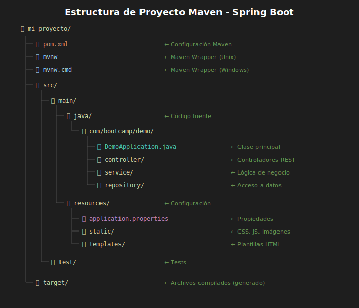

# Estructura de Proyecto Maven

## 🎯 Objetivos

- Entender la estructura estándar de un proyecto Maven
- Conocer el archivo pom.xml y sus secciones principales
- Comprender el ciclo de vida de Maven
- Usar comandos básicos de Maven

---

## 1. ¿Qué es Maven?

### 1.1 Definición

> **Maven** es una herramienta de gestión de proyectos que maneja dependencias, compilación, empaquetado y más, basándose en convenciones.

### 1.2 Problemas que Resuelve

| Sin Maven | Con Maven |
|-----------|-----------|
| Descargar JARs manualmente | Dependencias automáticas |
| Gestionar versiones a mano | Versiones centralizadas |
| Scripts de build personalizados | Ciclo de vida estándar |
| Estructura de proyecto variable | Estructura convencional |
| Conflictos de dependencias | Resolución automática |

### 1.3 Convención sobre Configuración

Maven sigue el principio de **"convención sobre configuración"**: si sigues la estructura estándar, no necesitas configurar nada extra.

---

## 2. Estructura de Proyecto Estándar

### 2.1 Árbol de Directorios

```
mi-proyecto/
├── pom.xml                      # Configuración de Maven
├── mvnw                         # Maven Wrapper (Unix)
├── mvnw.cmd                     # Maven Wrapper (Windows)
├── .mvn/                        # Configuración del wrapper
│   └── wrapper/
│       └── maven-wrapper.properties
├── src/
│   ├── main/
│   │   ├── java/                # Código fuente Java
│   │   │   └── com/
│   │   │       └── bootcamp/
│   │   │           └── demo/
│   │   │               ├── DemoApplication.java
│   │   │               ├── controller/
│   │   │               ├── service/
│   │   │               └── repository/
│   │   └── resources/           # Recursos (configuración, estáticos)
│   │       ├── application.properties
│   │       ├── application.yml
│   │       ├── static/          # Archivos estáticos (CSS, JS, imágenes)
│   │       └── templates/       # Plantillas (Thymeleaf, etc.)
│   └── test/
│       ├── java/                # Tests unitarios e integración
│       │   └── com/
│       │       └── bootcamp/
│       │           └── demo/
│       │               └── DemoApplicationTests.java
│       └── resources/           # Recursos para tests
│           └── application-test.properties
└── target/                      # Archivos generados (compilados, JAR)
    ├── classes/
    ├── test-classes/
    └── demo-0.0.1-SNAPSHOT.jar
```



### 2.2 Directorios Clave

| Directorio | Propósito |
|------------|-----------|
| `src/main/java` | Código fuente de la aplicación |
| `src/main/resources` | Archivos de configuración y recursos |
| `src/test/java` | Código de tests |
| `src/test/resources` | Recursos para tests |
| `target` | Salida de compilación (generado) |

---

## 3. El Archivo pom.xml

### 3.1 ¿Qué es?

**POM** = Project Object Model

Es el archivo central de configuración de Maven. Define:
- Identificación del proyecto
- Dependencias
- Plugins
- Configuración de build

### 3.2 Estructura Básica

```xml
<?xml version="1.0" encoding="UTF-8"?>
<project xmlns="http://maven.apache.org/POM/4.0.0"
         xmlns:xsi="http://www.w3.org/2001/XMLSchema-instance"
         xsi:schemaLocation="http://maven.apache.org/POM/4.0.0
         https://maven.apache.org/xsd/maven-4.0.0.xsd">

    <modelVersion>4.0.0</modelVersion>

    <!-- Herencia de Spring Boot -->
    <parent>
        <groupId>org.springframework.boot</groupId>
        <artifactId>spring-boot-starter-parent</artifactId>
        <version>3.2.0</version>
    </parent>

    <!-- Identificación del proyecto -->
    <groupId>com.bootcamp</groupId>
    <artifactId>demo</artifactId>
    <version>0.0.1-SNAPSHOT</version>
    <name>demo</name>
    <description>Proyecto demo del bootcamp</description>

    <!-- Propiedades -->
    <properties>
        <java.version>21</java.version>
    </properties>

    <!-- Dependencias -->
    <dependencies>
        <!-- ... -->
    </dependencies>

    <!-- Plugins de build -->
    <build>
        <plugins>
            <!-- ... -->
        </plugins>
    </build>

</project>
```

### 3.3 Coordenadas Maven (GAV)

Cada proyecto/dependencia se identifica con tres valores:

| Coordenada | Descripción | Ejemplo |
|------------|-------------|---------|
| **groupId** | Organización o grupo | `com.bootcamp` |
| **artifactId** | Nombre del proyecto | `demo` |
| **version** | Versión del proyecto | `0.0.1-SNAPSHOT` |

```xml
<!-- Identifica unívocamente tu proyecto -->
<groupId>com.bootcamp</groupId>
<artifactId>demo</artifactId>
<version>0.0.1-SNAPSHOT</version>
```

---

## 4. Dependencias

### 4.1 Agregar Dependencias

```xml
<dependencies>
    <!-- Spring Boot Web -->
    <dependency>
        <groupId>org.springframework.boot</groupId>
        <artifactId>spring-boot-starter-web</artifactId>
    </dependency>

    <!-- Spring Boot DevTools -->
    <dependency>
        <groupId>org.springframework.boot</groupId>
        <artifactId>spring-boot-devtools</artifactId>
        <scope>runtime</scope>
        <optional>true</optional>
    </dependency>

    <!-- Testing -->
    <dependency>
        <groupId>org.springframework.boot</groupId>
        <artifactId>spring-boot-starter-test</artifactId>
        <scope>test</scope>
    </dependency>
</dependencies>
```

### 4.2 Scopes (Alcances)

| Scope | Disponible en | Uso |
|-------|---------------|-----|
| `compile` (default) | Compilación, ejecución, tests | Dependencias principales |
| `runtime` | Ejecución, tests | JDBC drivers |
| `test` | Solo tests | JUnit, Mockito |
| `provided` | Compilación | APIs que provee el servidor |

### 4.3 ¿De dónde vienen las dependencias?

Maven las descarga de **Maven Central** (repositorio público) y las guarda en:

```
~/.m2/repository/
└── org/
    └── springframework/
        └── boot/
            └── spring-boot-starter-web/
                └── 3.2.0/
                    └── spring-boot-starter-web-3.2.0.jar
```

---

## 5. El Parent de Spring Boot

### 5.1 ¿Por qué heredar de spring-boot-starter-parent?

```xml
<parent>
    <groupId>org.springframework.boot</groupId>
    <artifactId>spring-boot-starter-parent</artifactId>
    <version>3.2.0</version>
</parent>
```

Este parent proporciona:

| Beneficio | Descripción |
|-----------|-------------|
| **Gestión de versiones** | No necesitas especificar versiones de dependencias Spring |
| **Plugins preconfigurados** | maven-compiler, spring-boot-maven-plugin |
| **Configuración por defecto** | Encoding UTF-8, versión de Java |
| **Compatibilidad garantizada** | Todas las versiones son compatibles entre sí |

### 5.2 Sin especificar versiones

```xml
<!-- Con el parent, no necesitas versión -->
<dependency>
    <groupId>org.springframework.boot</groupId>
    <artifactId>spring-boot-starter-web</artifactId>
    <!-- Sin <version> - la hereda del parent -->
</dependency>
```

---

## 6. Ciclo de Vida de Maven

### 6.1 Fases Principales

```
validate → compile → test → package → verify → install → deploy
    ↓         ↓        ↓        ↓         ↓        ↓         ↓
 Valida   Compila  Ejecuta  Crea     Verifica  Instala   Despliega
 el POM   código   tests    JAR/WAR  calidad   en .m2    en repo
```

### 6.2 Comandos Comunes

```bash
# Compilar
./mvnw compile

# Ejecutar tests
./mvnw test

# Crear el JAR
./mvnw package

# Limpiar + empaquetar (recomendado)
./mvnw clean package

# Instalar en repositorio local
./mvnw install

# Ejecutar la aplicación Spring Boot
./mvnw spring-boot:run

# Limpiar archivos generados
./mvnw clean
```

### 6.3 Flags Útiles

```bash
# Saltar tests (para builds rápidos)
./mvnw package -DskipTests

# Modo offline (sin descargar dependencias)
./mvnw package -o

# Mostrar más información
./mvnw package -X
```

---

## 7. Maven Wrapper

### 7.1 ¿Qué es?

El **Maven Wrapper** (`mvnw`) es un script que:
- Descarga la versión correcta de Maven
- No requiere instalación global de Maven
- Garantiza que todos usen la misma versión

### 7.2 Archivos del Wrapper

```
├── mvnw                    # Script para Unix/Mac/Linux
├── mvnw.cmd               # Script para Windows
└── .mvn/
    └── wrapper/
        └── maven-wrapper.properties   # Configuración de versión
```

### 7.3 Uso

```bash
# Unix/Mac/Linux
./mvnw spring-boot:run

# Windows
mvnw.cmd spring-boot:run

# Si no tienes permisos de ejecución
chmod +x mvnw
```

---

## 8. Plugins de Build

### 8.1 Spring Boot Maven Plugin

```xml
<build>
    <plugins>
        <plugin>
            <groupId>org.springframework.boot</groupId>
            <artifactId>spring-boot-maven-plugin</artifactId>
        </plugin>
    </plugins>
</build>
```

Este plugin permite:
- `./mvnw spring-boot:run` - Ejecutar la aplicación
- Crear JARs ejecutables con todas las dependencias
- Información de build en `/actuator/info`

### 8.2 JAR Ejecutable

```bash
# Crear el JAR
./mvnw clean package

# Ver el contenido
jar tf target/demo-0.0.1-SNAPSHOT.jar

# Ejecutar
java -jar target/demo-0.0.1-SNAPSHOT.jar
```

---

## 9. Recursos: application.properties

### 9.1 Ubicación

```
src/main/resources/application.properties
```

### 9.2 Configuraciones Comunes

```properties
# Puerto del servidor
server.port=8080

# Nombre de la aplicación
spring.application.name=demo

# Nivel de logging
logging.level.root=INFO
logging.level.com.bootcamp=DEBUG

# Mostrar SQL (cuando uses JPA)
spring.jpa.show-sql=true

# Configuración de base de datos (Semana 04)
# spring.datasource.url=jdbc:postgresql://localhost:5432/demo
```

### 9.3 Alternativa: application.yml

```yaml
server:
  port: 8080

spring:
  application:
    name: demo

logging:
  level:
    root: INFO
    com.bootcamp: DEBUG
```

---

## 10. Resumen

| Concepto | Descripción |
|----------|-------------|
| Maven | Herramienta de gestión de proyectos y dependencias |
| pom.xml | Archivo de configuración central |
| GAV | groupId + artifactId + version |
| Starter Parent | Herencia que simplifica configuración |
| Dependencias | Librerías externas declaradas en pom.xml |
| Ciclo de vida | validate → compile → test → package |
| Maven Wrapper | Script para usar Maven sin instalación global |
| application.properties | Configuración de la aplicación |

---

## 📋 Comandos Más Usados

```bash
# Compilar
./mvnw compile

# Tests
./mvnw test

# Empaquetar
./mvnw clean package

# Ejecutar
./mvnw spring-boot:run

# Limpiar
./mvnw clean
```

---

*Siguiente: [03-endpoints-rest-basicos.md](03-endpoints-rest-basicos.md)*
