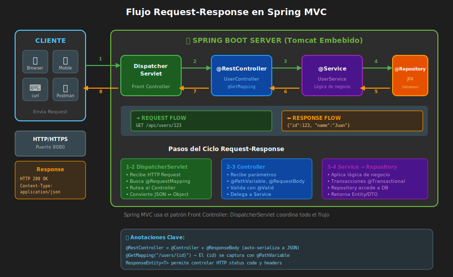
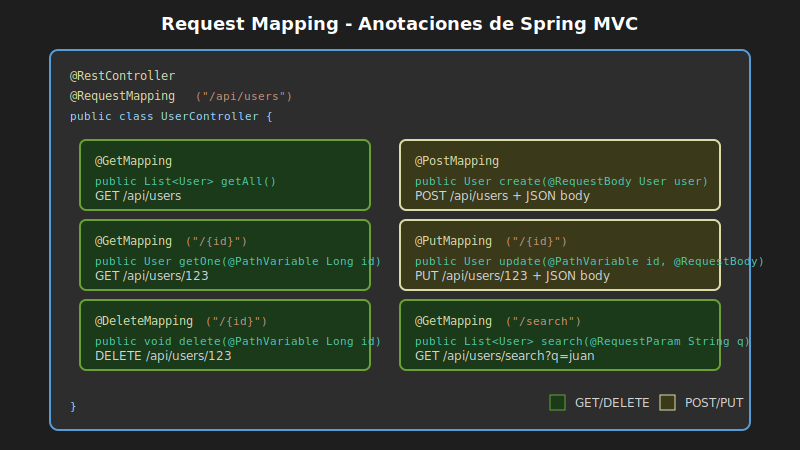

# Endpoints REST Básicos

## 🎯 Objetivos

- Crear controladores REST con `@RestController`
- Mapear URLs a métodos con `@RequestMapping`
- Implementar métodos GET y POST
- Usar `@PathVariable` y `@RequestParam`
- Retornar diferentes tipos de respuesta

---

## 1. Controladores REST

### 1.1 ¿Qué es un Controlador?

Un **controlador** es una clase que recibe peticiones HTTP y devuelve respuestas.



### 1.2 @Controller vs @RestController

| Anotación | Devuelve | Uso |
|-----------|----------|-----|
| `@Controller` | Vista (HTML) | Aplicaciones web tradicionales |
| `@RestController` | Datos (JSON/XML) | APIs REST |

```java
// @RestController = @Controller + @ResponseBody
@RestController
public class UserController {
    // Los métodos devuelven datos, no vistas
}
```

---

## 2. Tu Primer Endpoint

### 2.1 Hola Mundo

```java
package com.bootcamp.demo.controller;

import org.springframework.web.bind.annotation.GetMapping;
import org.springframework.web.bind.annotation.RestController;

@RestController
public class HelloController {

    @GetMapping("/hello")
    public String hello() {
        return "¡Hola Mundo!";
    }
}
```

### 2.2 Probar

```bash
# Iniciar la aplicación
./mvnw spring-boot:run

# En otra terminal
curl http://localhost:8080/hello
# Respuesta: ¡Hola Mundo!
```

---

## 3. Anotaciones de Mapeo

### 3.1 @RequestMapping

Anotación base para mapear URLs:

```java
@RestController
@RequestMapping("/api")  // Prefijo para todos los endpoints de esta clase
public class ApiController {

    @RequestMapping(value = "/status", method = RequestMethod.GET)
    public String status() {
        return "OK";
    }
}
// URL: GET /api/status
```

### 3.2 Atajos por Método HTTP

| Anotación | Equivalente a |
|-----------|---------------|
| `@GetMapping` | `@RequestMapping(method = GET)` |
| `@PostMapping` | `@RequestMapping(method = POST)` |
| `@PutMapping` | `@RequestMapping(method = PUT)` |
| `@PatchMapping` | `@RequestMapping(method = PATCH)` |
| `@DeleteMapping` | `@RequestMapping(method = DELETE)` |



```java
@RestController
@RequestMapping("/api/users")
public class UserController {

    @GetMapping           // GET /api/users
    public String getAll() { ... }

    @GetMapping("/{id}")  // GET /api/users/123
    public String getOne(@PathVariable Long id) { ... }

    @PostMapping          // POST /api/users
    public String create() { ... }

    @PutMapping("/{id}")  // PUT /api/users/123
    public String update(@PathVariable Long id) { ... }

    @DeleteMapping("/{id}") // DELETE /api/users/123
    public String delete(@PathVariable Long id) { ... }
}
```

---

## 4. Path Variables

### 4.1 Concepto

Extraen valores de la URL:

```
URL:     /api/users/42
Pattern: /api/users/{id}
Valor:   id = 42
```

### 4.2 Uso con @PathVariable

```java
@GetMapping("/users/{id}")
public String getUser(@PathVariable Long id) {
    return "Usuario con ID: " + id;
}
// GET /users/42 → "Usuario con ID: 42"
```

### 4.3 Múltiples Variables

```java
@GetMapping("/users/{userId}/orders/{orderId}")
public String getOrder(
        @PathVariable Long userId,
        @PathVariable Long orderId) {
    return "Usuario " + userId + ", Orden " + orderId;
}
// GET /users/5/orders/100 → "Usuario 5, Orden 100"
```

### 4.4 Nombre Explícito

```java
// Si el nombre del parámetro no coincide con la variable de la URL
@GetMapping("/products/{productId}")
public String getProduct(@PathVariable("productId") Long id) {
    return "Producto: " + id;
}
```

---

## 5. Query Parameters

### 5.1 Concepto

Parámetros después del `?` en la URL:

```
URL: /api/users?name=Juan&age=25
     └── base ─┘└── query params ──┘
```

### 5.2 Uso con @RequestParam

```java
@GetMapping("/search")
public String search(@RequestParam String query) {
    return "Buscando: " + query;
}
// GET /search?query=java → "Buscando: java"
```

### 5.3 Parámetros Opcionales

```java
@GetMapping("/users")
public String getUsers(
        @RequestParam(required = false) String name,
        @RequestParam(defaultValue = "10") int limit) {
    return "Nombre: " + name + ", Límite: " + limit;
}
// GET /users                → "Nombre: null, Límite: 10"
// GET /users?name=Ana       → "Nombre: Ana, Límite: 10"
// GET /users?name=Ana&limit=5 → "Nombre: Ana, Límite: 5"
```

### 5.4 Múltiples Valores

```java
@GetMapping("/filter")
public String filter(@RequestParam List<String> tags) {
    return "Tags: " + tags;
}
// GET /filter?tags=java&tags=spring → "Tags: [java, spring]"
```

---

## 6. Retornar Objetos (JSON)

### 6.1 Conversión Automática

Spring Boot convierte automáticamente objetos Java a JSON (usando Jackson):

```java
// Clase modelo
public class User {
    private Long id;
    private String name;
    private String email;

    // Constructor
    public User(Long id, String name, String email) {
        this.id = id;
        this.name = name;
        this.email = email;
    }

    // Getters y Setters (necesarios para Jackson)
    public Long getId() { return id; }
    public void setId(Long id) { this.id = id; }
    public String getName() { return name; }
    public void setName(String name) { this.name = name; }
    public String getEmail() { return email; }
    public void setEmail(String email) { this.email = email; }
}
```

```java
@RestController
@RequestMapping("/api/users")
public class UserController {

    @GetMapping("/{id}")
    public User getUser(@PathVariable Long id) {
        // Spring convierte automáticamente a JSON
        return new User(id, "Juan", "juan@email.com");
    }
}
```

```bash
curl http://localhost:8080/api/users/1
# Respuesta:
# {"id":1,"name":"Juan","email":"juan@email.com"}
```

### 6.2 Listas

```java
@GetMapping
public List<User> getAllUsers() {
    return List.of(
        new User(1L, "Juan", "juan@email.com"),
        new User(2L, "María", "maria@email.com"),
        new User(3L, "Pedro", "pedro@email.com")
    );
}
```

```json
[
  {"id":1,"name":"Juan","email":"juan@email.com"},
  {"id":2,"name":"María","email":"maria@email.com"},
  {"id":3,"name":"Pedro","email":"pedro@email.com"}
]
```

---

## 7. Recibir Datos (POST)

### 7.1 @RequestBody

Para recibir JSON en el cuerpo de la petición:

```java
@PostMapping
public User createUser(@RequestBody User user) {
    // user ya contiene los datos del JSON recibido
    System.out.println("Creando usuario: " + user.getName());
    return user;
}
```

```bash
curl -X POST http://localhost:8080/api/users \
  -H "Content-Type: application/json" \
  -d '{"name":"Ana","email":"ana@email.com"}'
```

### 7.2 Ejemplo Completo de CRUD

```java
@RestController
@RequestMapping("/api/products")
public class ProductController {

    // Simulamos una "base de datos" con un Map
    private Map<Long, Product> products = new HashMap<>();
    private Long nextId = 1L;

    // CREATE
    @PostMapping
    public Product create(@RequestBody Product product) {
        product.setId(nextId++);
        products.put(product.getId(), product);
        return product;
    }

    // READ ALL
    @GetMapping
    public List<Product> getAll() {
        return new ArrayList<>(products.values());
    }

    // READ ONE
    @GetMapping("/{id}")
    public Product getOne(@PathVariable Long id) {
        return products.get(id);
    }

    // UPDATE
    @PutMapping("/{id}")
    public Product update(@PathVariable Long id, @RequestBody Product product) {
        product.setId(id);
        products.put(id, product);
        return product;
    }

    // DELETE
    @DeleteMapping("/{id}")
    public String delete(@PathVariable Long id) {
        products.remove(id);
        return "Producto eliminado";
    }
}
```

---

## 8. ResponseEntity

### 8.1 ¿Por qué usarlo?

`ResponseEntity` permite controlar:
- Código de estado HTTP
- Headers de respuesta
- Cuerpo de la respuesta

### 8.2 Uso Básico

```java
@GetMapping("/{id}")
public ResponseEntity<User> getUser(@PathVariable Long id) {
    User user = findUserById(id);

    if (user == null) {
        return ResponseEntity.notFound().build();  // 404
    }

    return ResponseEntity.ok(user);  // 200 + usuario
}
```

### 8.3 Códigos de Estado Comunes

```java
// 200 OK
return ResponseEntity.ok(data);

// 201 Created
return ResponseEntity.status(HttpStatus.CREATED).body(newUser);
// O más simple:
return ResponseEntity.created(URI.create("/api/users/" + id)).body(newUser);

// 204 No Content
return ResponseEntity.noContent().build();

// 400 Bad Request
return ResponseEntity.badRequest().body("Error en los datos");

// 404 Not Found
return ResponseEntity.notFound().build();

// 500 Internal Server Error
return ResponseEntity.internalServerError().body("Error del servidor");
```

### 8.4 Ejemplo con Headers

```java
@PostMapping
public ResponseEntity<User> create(@RequestBody User user) {
    User saved = saveUser(user);

    return ResponseEntity
        .status(HttpStatus.CREATED)
        .header("X-Custom-Header", "valor")
        .body(saved);
}
```

---

## 9. Organización de Controladores

### 9.1 Un Controlador por Recurso

```
src/main/java/com/bootcamp/demo/
└── controller/
    ├── UserController.java      # /api/users
    ├── ProductController.java   # /api/products
    ├── OrderController.java     # /api/orders
    └── HealthController.java    # /health, /status
```

### 9.2 Ejemplo de Organización

```java
package com.bootcamp.demo.controller;

@RestController
@RequestMapping("/api/v1/users")  // Incluye versión de API
public class UserController {

    // Endpoints de usuarios...
}
```

---

## 10. Resumen de Anotaciones

| Anotación | Propósito |
|-----------|-----------|
| `@RestController` | Marca la clase como controlador REST |
| `@RequestMapping` | Define la URL base del controlador |
| `@GetMapping` | Mapea peticiones GET |
| `@PostMapping` | Mapea peticiones POST |
| `@PutMapping` | Mapea peticiones PUT |
| `@DeleteMapping` | Mapea peticiones DELETE |
| `@PathVariable` | Extrae valores de la URL |
| `@RequestParam` | Extrae query parameters |
| `@RequestBody` | Parsea el cuerpo JSON a objeto |

---

## 📋 Ejemplo Completo

```java
package com.bootcamp.demo.controller;

import org.springframework.http.HttpStatus;
import org.springframework.http.ResponseEntity;
import org.springframework.web.bind.annotation.*;
import java.util.*;

@RestController
@RequestMapping("/api/books")
public class BookController {

    private Map<Long, Book> books = new HashMap<>();
    private Long nextId = 1L;

    @GetMapping
    public List<Book> getAll(
            @RequestParam(required = false) String author,
            @RequestParam(defaultValue = "10") int limit) {
        // Filtrar y limitar resultados
        return books.values().stream()
            .filter(b -> author == null || b.getAuthor().contains(author))
            .limit(limit)
            .toList();
    }

    @GetMapping("/{id}")
    public ResponseEntity<Book> getOne(@PathVariable Long id) {
        Book book = books.get(id);
        if (book == null) {
            return ResponseEntity.notFound().build();
        }
        return ResponseEntity.ok(book);
    }

    @PostMapping
    public ResponseEntity<Book> create(@RequestBody Book book) {
        book.setId(nextId++);
        books.put(book.getId(), book);
        return ResponseEntity.status(HttpStatus.CREATED).body(book);
    }

    @PutMapping("/{id}")
    public ResponseEntity<Book> update(
            @PathVariable Long id,
            @RequestBody Book book) {
        if (!books.containsKey(id)) {
            return ResponseEntity.notFound().build();
        }
        book.setId(id);
        books.put(id, book);
        return ResponseEntity.ok(book);
    }

    @DeleteMapping("/{id}")
    public ResponseEntity<Void> delete(@PathVariable Long id) {
        if (!books.containsKey(id)) {
            return ResponseEntity.notFound().build();
        }
        books.remove(id);
        return ResponseEntity.noContent().build();
    }
}
```

---

*Siguiente: [04-dockerfile-spring-boot.md](04-dockerfile-spring-boot.md)*
