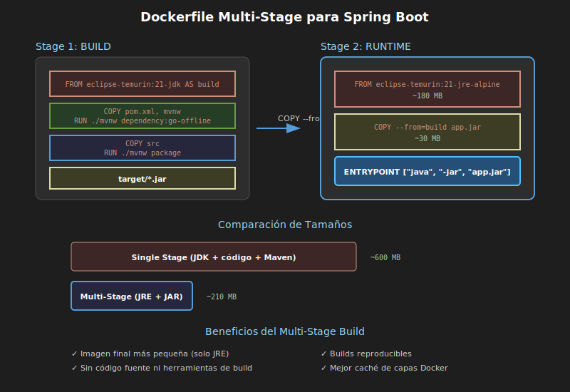

# Dockerfile para Spring Boot

## 🎯 Objetivos

- Crear Dockerfiles para aplicaciones Spring Boot
- Entender las diferentes estrategias de containerización
- Implementar builds multi-stage
- Configurar Docker Compose para desarrollo

---

## 1. Estrategias de Containerización

### 1.1 Tres Enfoques

| Estrategia | Descripción | Uso |
|------------|-------------|-----|
| **Desarrollo** | Código fuente + Maven en contenedor | Desarrollo local |
| **JAR pre-built** | JAR ya compilado → contenedor | CI/CD simple |
| **Multi-stage** | Build + Runtime en un Dockerfile | Producción |

---

## 2. Dockerfile para Desarrollo

### 2.1 Enfoque: Compilar dentro del contenedor

Ideal para desarrollo porque permite hot-reload:

```dockerfile
# Dockerfile.dev
FROM eclipse-temurin:21-jdk

WORKDIR /app

# El código se monta como volumen, no se copia
# Esto permite cambios en tiempo real

EXPOSE 8080

# Ejecutar con Maven
CMD ["./mvnw", "spring-boot:run"]
```

### 2.2 Docker Compose para Desarrollo

```yaml
# docker-compose.yml
services:
  app:
    image: eclipse-temurin:21-jdk
    container_name: bootcamp-spring
    working_dir: /app
    volumes:
      - .:/app                    # Código fuente
      - maven-cache:/root/.m2    # Caché de Maven
    ports:
      - "8080:8080"
    command: ./mvnw spring-boot:run
    environment:
      - SPRING_PROFILES_ACTIVE=dev

volumes:
  maven-cache:  # Evita descargar dependencias cada vez
```

### 2.3 Ejecutar

```bash
docker compose up
# Cambias código → Spring Boot recarga automáticamente (DevTools)
```

---

## 3. Dockerfile con JAR Pre-compilado

### 3.1 Paso 1: Compilar localmente

```bash
./mvnw clean package -DskipTests
# Genera: target/demo-0.0.1-SNAPSHOT.jar
```

### 3.2 Paso 2: Dockerfile

```dockerfile
FROM eclipse-temurin:21-jre

WORKDIR /app

# Copiar el JAR compilado
COPY target/*.jar app.jar

EXPOSE 8080

ENTRYPOINT ["java", "-jar", "app.jar"]
```

### 3.3 Construir y Ejecutar

```bash
docker build -t mi-app .
docker run -p 8080:8080 mi-app
```

### 3.4 Ventajas y Desventajas

| ✅ Ventajas | ❌ Desventajas |
|------------|---------------|
| Dockerfile simple | Requiere build previo |
| Imagen pequeña (JRE) | No reproducible sin Maven local |
| Rápido de construir | El JAR debe existir |

---

## 4. Dockerfile Multi-Stage (Recomendado)

### 4.1 Concepto

Usa múltiples etapas:
1. **Build stage**: Compila con JDK + Maven
2. **Runtime stage**: Solo ejecuta con JRE

```dockerfile
# ============================================
# STAGE 1: Build
# ============================================
FROM eclipse-temurin:21-jdk AS build

WORKDIR /app

# Copiar archivos de Maven primero (mejor caché)
COPY pom.xml .
COPY mvnw .
COPY .mvn .mvn

# Descargar dependencias (capa cacheada)
RUN ./mvnw dependency:go-offline

# Copiar código fuente
COPY src src

# Compilar
RUN ./mvnw package -DskipTests

# ============================================
# STAGE 2: Runtime
# ============================================
FROM eclipse-temurin:21-jre

WORKDIR /app

# Copiar solo el JAR del stage anterior
COPY --from=build /app/target/*.jar app.jar

EXPOSE 8080

ENTRYPOINT ["java", "-jar", "app.jar"]
```

### 4.2 Beneficios



| Beneficio | Descripción |
|-----------|-------------|
| **Imagen pequeña** | Solo JRE + JAR (~200MB vs ~500MB) |
| **Reproducible** | No depende del entorno local |
| **Seguro** | Sin código fuente ni herramientas de build |
| **Cacheable** | Las capas de dependencias se reutilizan |

### 4.3 Orden de COPY para Caché

```dockerfile
# ✅ CORRECTO: Dependencias primero, código después
COPY pom.xml .
COPY mvnw .
COPY .mvn .mvn
RUN ./mvnw dependency:go-offline  # Esta capa se cachea

COPY src src  # Solo se re-ejecuta si cambia el código
RUN ./mvnw package

# ❌ INCORRECTO: Todo junto
COPY . .  # Cualquier cambio invalida todo el caché
RUN ./mvnw package
```

---

## 5. Optimización de Imágenes

### 5.1 Usar JRE en lugar de JDK

```dockerfile
# ❌ JDK completo (~400MB)
FROM eclipse-temurin:21-jdk

# ✅ Solo JRE (~200MB)
FROM eclipse-temurin:21-jre
```

### 5.2 Usar Alpine

```dockerfile
# ✅ Aún más pequeño (~100MB)
FROM eclipse-temurin:21-jre-alpine
```

### 5.3 Comparación de Tamaños

| Imagen Base | Tamaño Aproximado |
|-------------|-------------------|
| eclipse-temurin:21-jdk | ~450 MB |
| eclipse-temurin:21-jre | ~270 MB |
| eclipse-temurin:21-jre-alpine | ~180 MB |

---

## 6. Variables de Entorno

### 6.1 En Dockerfile

```dockerfile
FROM eclipse-temurin:21-jre

WORKDIR /app

# Variables de entorno por defecto
ENV JAVA_OPTS="-Xmx256m -Xms128m" \
    SPRING_PROFILES_ACTIVE=prod

COPY --from=build /app/target/*.jar app.jar

EXPOSE 8080

# Usar las variables
ENTRYPOINT ["sh", "-c", "java $JAVA_OPTS -jar app.jar"]
```

### 6.2 Sobrescribir al ejecutar

```bash
# Cambiar perfil
docker run -e SPRING_PROFILES_ACTIVE=dev -p 8080:8080 mi-app

# Cambiar opciones de JVM
docker run -e JAVA_OPTS="-Xmx512m" -p 8080:8080 mi-app
```

### 6.3 En Docker Compose

```yaml
services:
  app:
    build: .
    ports:
      - "8080:8080"
    environment:
      - SPRING_PROFILES_ACTIVE=dev
      - SPRING_DATASOURCE_URL=jdbc:postgresql://db:5432/demo
    env_file:
      - .env
```

---

## 7. Docker Compose Completo

### 7.1 Para Desarrollo

```yaml
# docker-compose.yml
services:
  app:
    image: eclipse-temurin:21-jdk
    container_name: spring-dev
    working_dir: /app
    volumes:
      - .:/app
      - maven-cache:/root/.m2
    ports:
      - "8080:8080"
    environment:
      - SPRING_PROFILES_ACTIVE=dev
    command: ./mvnw spring-boot:run

volumes:
  maven-cache:
```

### 7.2 Para Producción (con build)

```yaml
# docker-compose.prod.yml
services:
  app:
    build:
      context: .
      dockerfile: Dockerfile
    container_name: spring-prod
    ports:
      - "8080:8080"
    environment:
      - SPRING_PROFILES_ACTIVE=prod
      - JAVA_OPTS=-Xmx512m
    restart: unless-stopped
```

### 7.3 Ejecutar

```bash
# Desarrollo
docker compose up

# Producción
docker compose -f docker-compose.prod.yml up --build
```

---

## 8. Health Checks

### 8.1 En Dockerfile

```dockerfile
FROM eclipse-temurin:21-jre

WORKDIR /app
COPY --from=build /app/target/*.jar app.jar

EXPOSE 8080

# Verificar que la aplicación responde
HEALTHCHECK --interval=30s --timeout=3s --start-period=60s \
  CMD curl -f http://localhost:8080/actuator/health || exit 1

ENTRYPOINT ["java", "-jar", "app.jar"]
```

### 8.2 Requiere Spring Actuator

```xml
<!-- pom.xml -->
<dependency>
    <groupId>org.springframework.boot</groupId>
    <artifactId>spring-boot-starter-actuator</artifactId>
</dependency>
```

```properties
# application.properties
management.endpoints.web.exposure.include=health
```

---

## 9. .dockerignore

### 9.1 Archivo .dockerignore

```
# .dockerignore
target/
!target/*.jar
.git
.gitignore
.idea
*.iml
.vscode
*.md
docker-compose*.yml
Dockerfile*
.env*
```

### 9.2 ¿Por qué es importante?

- Reduce el contexto de build
- Evita copiar archivos innecesarios
- Mejora la velocidad de build
- Evita filtrar secretos

---

## 10. Resumen

| Estrategia | Cuándo usar |
|------------|-------------|
| **Desarrollo (volúmenes)** | Desarrollo local con hot-reload |
| **JAR pre-built** | CI/CD donde ya tienes el JAR |
| **Multi-stage** | Producción, builds reproducibles |

### Dockerfile Recomendado (Multi-stage)

```dockerfile
# Build
FROM eclipse-temurin:21-jdk AS build
WORKDIR /app
COPY pom.xml mvnw ./
COPY .mvn .mvn
RUN ./mvnw dependency:go-offline
COPY src src
RUN ./mvnw package -DskipTests

# Runtime
FROM eclipse-temurin:21-jre-alpine
WORKDIR /app
COPY --from=build /app/target/*.jar app.jar
EXPOSE 8080
ENTRYPOINT ["java", "-jar", "app.jar"]
```

---

*Siguiente: [Práctica 01](../2-practicas/01-crear-proyecto-spring-boot.md)*
