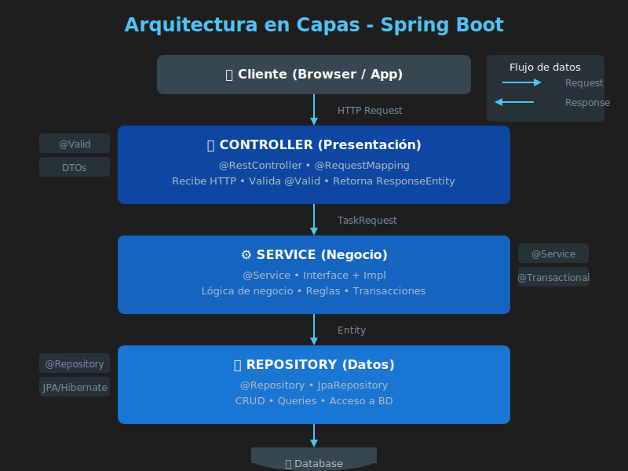

# 🏗️ Arquitectura en Capas

## Introducción

La **arquitectura en capas** es un patrón de diseño que organiza el código en niveles separados, cada uno con una responsabilidad específica. En aplicaciones Spring Boot, típicamente usamos tres capas principales.



---

## ¿Por Qué Usar Capas?

### El Problema: Código Monolítico

```java
// ❌ TODO en el Controller - difícil de mantener
@RestController
public class TaskController {

    private List<Task> tasks = new ArrayList<>();

    @PostMapping("/tasks")
    public Task createTask(@RequestBody Task task) {
        // Validación aquí
        if (task.getTitle() == null || task.getTitle().isEmpty()) {
            throw new RuntimeException("Title required");
        }
        // Lógica de negocio aquí
        task.setId(UUID.randomUUID().toString());
        task.setCreatedAt(LocalDateTime.now());
        // Persistencia aquí
        tasks.add(task);
        return task;
    }
}
```

**Problemas:**
- Difícil de probar (todo mezclado)
- Difícil de mantener (cambios afectan todo)
- Difícil de reutilizar (lógica atrapada en controller)
- Violación del principio de responsabilidad única (SRP)

---

## Las Tres Capas

```
┌─────────────────────────────────────────────────────────────┐
│                    CLIENTE (Browser/App)                     │
└─────────────────────────────────────────────────────────────┘
                              │
                              ▼
┌─────────────────────────────────────────────────────────────┐
│                 CONTROLLER (Presentación)                    │
│  • Recibe peticiones HTTP                                   │
│  • Valida entrada (@Valid)                                  │
│  • Transforma DTOs                                          │
│  • Retorna respuestas HTTP                                  │
└─────────────────────────────────────────────────────────────┘
                              │
                              ▼
┌─────────────────────────────────────────────────────────────┐
│                   SERVICE (Negocio)                          │
│  • Lógica de negocio                                        │
│  • Reglas y validaciones de dominio                         │
│  • Orquestación de operaciones                              │
│  • Transacciones                                            │
└─────────────────────────────────────────────────────────────┘
                              │
                              ▼
┌─────────────────────────────────────────────────────────────┐
│                 REPOSITORY (Datos)                           │
│  • Acceso a base de datos                                   │
│  • Operaciones CRUD                                         │
│  • Consultas                                                │
└─────────────────────────────────────────────────────────────┘
                              │
                              ▼
┌─────────────────────────────────────────────────────────────┐
│                    BASE DE DATOS                             │
└─────────────────────────────────────────────────────────────┘
```

---

## Capa Controller (Presentación)

### Responsabilidades

- Recibir peticiones HTTP
- Validar datos de entrada
- Convertir DTOs a entidades y viceversa
- Delegar al Service
- Retornar respuestas HTTP con códigos apropiados

### Ejemplo

```java
@RestController
@RequestMapping("/api/tasks")
public class TaskController {

    private final TaskService taskService;

    // Inyección por constructor (recomendada)
    public TaskController(TaskService taskService) {
        this.taskService = taskService;
    }

    @PostMapping
    public ResponseEntity<TaskResponse> createTask(
            @Valid @RequestBody TaskRequest request) {

        TaskResponse response = taskService.createTask(request);
        return ResponseEntity
            .status(HttpStatus.CREATED)
            .body(response);
    }

    @GetMapping("/{id}")
    public ResponseEntity<TaskResponse> getTask(@PathVariable String id) {
        TaskResponse response = taskService.getTaskById(id);
        return ResponseEntity.ok(response);
    }
}
```

### ¿Qué NO debe hacer?

- ❌ Acceder directamente a la base de datos
- ❌ Contener lógica de negocio compleja
- ❌ Manejar transacciones directamente

---

## Capa Service (Negocio)

### Responsabilidades

- Implementar lógica de negocio
- Aplicar reglas de dominio
- Coordinar operaciones entre repositories
- Manejar transacciones

### Patrón Interface + Implementación

```java
// Interface - define el contrato
public interface TaskService {
    TaskResponse createTask(TaskRequest request);
    TaskResponse getTaskById(String id);
    List<TaskResponse> getAllTasks();
    TaskResponse updateTask(String id, TaskRequest request);
    void deleteTask(String id);
}
```

```java
// Implementación
@Service
public class TaskServiceImpl implements TaskService {

    private final TaskRepository taskRepository;

    public TaskServiceImpl(TaskRepository taskRepository) {
        this.taskRepository = taskRepository;
    }

    @Override
    public TaskResponse createTask(TaskRequest request) {
        // Lógica de negocio
        Task task = new Task();
        task.setId(UUID.randomUUID().toString());
        task.setTitle(request.getTitle());
        task.setDescription(request.getDescription());
        task.setCompleted(false);
        task.setCreatedAt(LocalDateTime.now());

        Task saved = taskRepository.save(task);
        return mapToResponse(saved);
    }

    @Override
    public TaskResponse getTaskById(String id) {
        Task task = taskRepository.findById(id)
            .orElseThrow(() -> new ResourceNotFoundException("Task not found: " + id));
        return mapToResponse(task);
    }

    private TaskResponse mapToResponse(Task task) {
        return new TaskResponse(
            task.getId(),
            task.getTitle(),
            task.getDescription(),
            task.isCompleted(),
            task.getCreatedAt()
        );
    }
}
```

### ¿Por Qué Interface + Implementación?

1. **Desacoplamiento**: El controller depende de la interface, no de la implementación
2. **Testing**: Fácil de mockear en tests
3. **Flexibilidad**: Cambiar implementación sin afectar consumidores
4. **Principio de Inversión de Dependencias (DIP)**

---

## Capa Repository (Datos)

### Responsabilidades

- Acceso a la fuente de datos
- Operaciones CRUD
- Consultas específicas

### Ejemplo con Lista (sin BD)

```java
@Repository
public class TaskRepository {

    private final Map<String, Task> tasks = new ConcurrentHashMap<>();

    public Task save(Task task) {
        tasks.put(task.getId(), task);
        return task;
    }

    public Optional<Task> findById(String id) {
        return Optional.ofNullable(tasks.get(id));
    }

    public List<Task> findAll() {
        return new ArrayList<>(tasks.values());
    }

    public void deleteById(String id) {
        tasks.remove(id);
    }

    public boolean existsById(String id) {
        return tasks.containsKey(id);
    }
}
```

> 💡 En la **Semana 04** reemplazaremos esto con **Spring Data JPA** y una base de datos real.

---

## Estructura de Paquetes

```
src/main/java/com/bootcamp/taskmanager/
├── TaskManagerApplication.java      # Clase principal
├── controller/
│   └── TaskController.java          # Endpoints REST
├── service/
│   ├── TaskService.java             # Interface
│   └── impl/
│       └── TaskServiceImpl.java     # Implementación
├── repository/
│   └── TaskRepository.java          # Acceso a datos
├── model/
│   └── Task.java                    # Entidad
├── dto/
│   ├── TaskRequest.java             # DTO entrada
│   └── TaskResponse.java            # DTO salida
├── exception/
│   ├── GlobalExceptionHandler.java  # Manejo excepciones
│   └── ResourceNotFoundException.java
└── config/
    └── AppConfig.java               # Configuraciones
```

---

## Flujo de una Petición

```
POST /api/tasks
     │
     ▼
┌─────────────────────┐
│  TaskController     │  1. Recibe JSON
│  @PostMapping       │  2. Valida @Valid
│                     │  3. Llama a Service
└─────────────────────┘
           │
           ▼
┌─────────────────────┐
│  TaskServiceImpl    │  4. Crea entidad
│  @Service           │  5. Aplica lógica
│                     │  6. Llama a Repository
└─────────────────────┘
           │
           ▼
┌─────────────────────┐
│  TaskRepository     │  7. Guarda en memoria/BD
│  @Repository        │  8. Retorna entidad
└─────────────────────┘
           │
           ▼
┌─────────────────────┐
│  TaskServiceImpl    │  9. Convierte a DTO
│                     │  10. Retorna Response
└─────────────────────┘
           │
           ▼
┌─────────────────────┐
│  TaskController     │  11. ResponseEntity
│                     │  12. HTTP 201 Created
└─────────────────────┘
           │
           ▼
      JSON Response
```

---

## Beneficios de la Arquitectura en Capas

| Beneficio | Descripción |
|-----------|-------------|
| **Separación de responsabilidades** | Cada capa tiene un propósito claro |
| **Testabilidad** | Fácil de probar cada capa de forma aislada |
| **Mantenibilidad** | Cambios en una capa no afectan otras |
| **Reutilización** | La lógica de negocio es independiente del transporte |
| **Escalabilidad** | Fácil de escalar capas independientemente |

---

## Relación con MVC

La arquitectura en capas para APIs REST es una adaptación del patrón **MVC (Model-View-Controller)**:

| MVC | API REST | Descripción |
|-----|----------|-------------|
| View | DTO/JSON | Representación de datos |
| Controller | Controller | Maneja peticiones HTTP |
| Model | Service + Repository + Entity | Lógica y datos |

> 📌 En APIs REST no hay "Vista" como tal, sino respuestas JSON estructuradas mediante DTOs.

---

## 📚 Referencias

- [Spring Layered Architecture](https://www.baeldung.com/spring-boot-clean-architecture)
- [Martin Fowler - Layered Architecture](https://martinfowler.com/bliki/PresentationDomainDataLayering.html)
- [Spring MVC Documentation](https://docs.spring.io/spring-framework/docs/current/reference/html/web.html)
