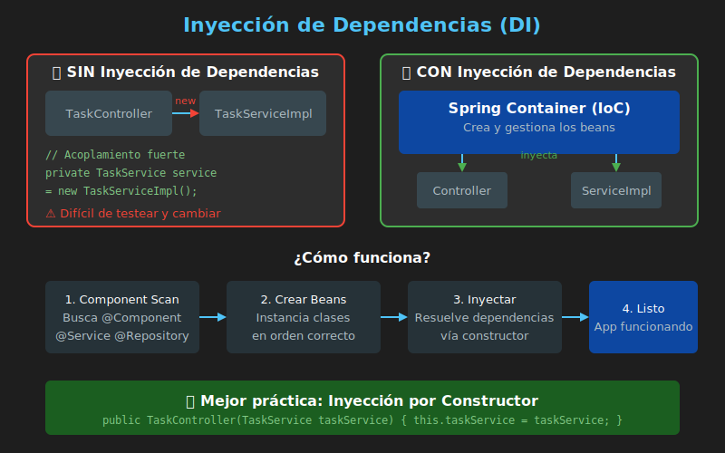

# 💉 Inyección de Dependencias en Spring

## Introducción

La **Inyección de Dependencias (DI)** es un patrón de diseño fundamental en Spring que permite crear aplicaciones desacopladas y fáciles de probar.



---

## El Problema: Acoplamiento Fuerte

### Sin Inyección de Dependencias

```java
// ❌ El Controller crea directamente sus dependencias
public class TaskController {

    // Acoplamiento fuerte - difícil de cambiar o testear
    private TaskService taskService = new TaskServiceImpl();

    public Task createTask(Task task) {
        return taskService.createTask(task);
    }
}
```

**Problemas:**

1. **Acoplamiento fuerte**: El Controller está atado a `TaskServiceImpl`
2. **Difícil de testear**: No puedes usar un mock
3. **Inflexible**: Cambiar la implementación requiere modificar código
4. **Viola DIP**: Depende de implementación, no de abstracción

---

## La Solución: Inversión de Control (IoC)

### Concepto

En lugar de que el objeto cree sus dependencias, **alguien más** (el contenedor de Spring) las crea y las **inyecta**.

```
┌─────────────────────────────────────────────────────────────┐
│               SIN IoC (Control Normal)                       │
│                                                              │
│   TaskController ──────creates──────▶ TaskServiceImpl       │
│                                                              │
└─────────────────────────────────────────────────────────────┘

┌─────────────────────────────────────────────────────────────┐
│               CON IoC (Control Invertido)                    │
│                                                              │
│   Spring Container                                          │
│        │                                                    │
│        ├──creates──▶ TaskServiceImpl                        │
│        │                                                    │
│        └──injects──▶ TaskController                         │
│                                                              │
└─────────────────────────────────────────────────────────────┘
```

---

## El Contenedor de Spring

Spring Boot automáticamente escanea y gestiona los **beans** (objetos) de tu aplicación.

### ¿Qué es un Bean?

Un **bean** es un objeto gestionado por Spring. Spring lo crea, lo configura y lo destruye cuando es necesario.

### Anotaciones para Declarar Beans

| Anotación | Uso | Descripción |
|-----------|-----|-------------|
| `@Component` | General | Componente genérico de Spring |
| `@Service` | Capa Service | Indica lógica de negocio |
| `@Repository` | Capa Repository | Indica acceso a datos |
| `@Controller` | Capa Controller | Controlador MVC (vistas) |
| `@RestController` | Capa Controller | Controlador REST (JSON) |
| `@Configuration` | Configuración | Clase de configuración |

> 💡 `@Service`, `@Repository` y `@Controller` son especializaciones de `@Component`. Funcionalmente son iguales, pero semánticamente indican el propósito.

---

## Formas de Inyección

### 1. Inyección por Constructor (✅ Recomendada)

```java
@RestController
@RequestMapping("/api/tasks")
public class TaskController {

    private final TaskService taskService;

    // Spring inyecta automáticamente el TaskService
    public TaskController(TaskService taskService) {
        this.taskService = taskService;
    }

    @GetMapping
    public List<TaskResponse> getAllTasks() {
        return taskService.getAllTasks();
    }
}
```

**Ventajas:**
- Dependencias son `final` (inmutables)
- Fácil de testear (pasas mocks en constructor)
- Falla rápido si falta dependencia
- No necesita `@Autowired` (desde Spring 4.3)

### 2. Inyección por Campo (@Autowired)

```java
@RestController
@RequestMapping("/api/tasks")
public class TaskController {

    @Autowired
    private TaskService taskService;  // No es final

    @GetMapping
    public List<TaskResponse> getAllTasks() {
        return taskService.getAllTasks();
    }
}
```

**Desventajas:**
- No puede ser `final`
- Más difícil de testear (necesitas reflexión)
- Oculta dependencias

### 3. Inyección por Setter

```java
@RestController
@RequestMapping("/api/tasks")
public class TaskController {

    private TaskService taskService;

    @Autowired
    public void setTaskService(TaskService taskService) {
        this.taskService = taskService;
    }
}
```

**Uso:** Cuando la dependencia es opcional.

---

## Ejemplo Completo

### Estructura

```
src/main/java/com/bootcamp/demo/
├── DemoApplication.java
├── controller/
│   └── TaskController.java
├── service/
│   ├── TaskService.java          # Interface
│   └── impl/
│       └── TaskServiceImpl.java  # Implementación
└── repository/
    └── TaskRepository.java
```

### Implementación

```java
// Interface del servicio
public interface TaskService {
    List<TaskResponse> getAllTasks();
    TaskResponse createTask(TaskRequest request);
}
```

```java
// Implementación marcada como @Service
@Service
public class TaskServiceImpl implements TaskService {

    private final TaskRepository taskRepository;

    // Spring inyecta TaskRepository
    public TaskServiceImpl(TaskRepository taskRepository) {
        this.taskRepository = taskRepository;
    }

    @Override
    public List<TaskResponse> getAllTasks() {
        return taskRepository.findAll()
            .stream()
            .map(this::mapToResponse)
            .collect(Collectors.toList());
    }

    @Override
    public TaskResponse createTask(TaskRequest request) {
        Task task = mapToEntity(request);
        Task saved = taskRepository.save(task);
        return mapToResponse(saved);
    }

    // Métodos privados de mapeo...
}
```

```java
// Repository marcado como @Repository
@Repository
public class TaskRepository {

    private final Map<String, Task> storage = new ConcurrentHashMap<>();

    public List<Task> findAll() {
        return new ArrayList<>(storage.values());
    }

    public Task save(Task task) {
        storage.put(task.getId(), task);
        return task;
    }
}
```

```java
// Controller marcado como @RestController
@RestController
@RequestMapping("/api/tasks")
public class TaskController {

    private final TaskService taskService;

    // Spring inyecta la implementación de TaskService
    public TaskController(TaskService taskService) {
        this.taskService = taskService;
    }

    @GetMapping
    public ResponseEntity<List<TaskResponse>> getAllTasks() {
        return ResponseEntity.ok(taskService.getAllTasks());
    }

    @PostMapping
    public ResponseEntity<TaskResponse> createTask(
            @Valid @RequestBody TaskRequest request) {
        TaskResponse response = taskService.createTask(request);
        return ResponseEntity.status(HttpStatus.CREATED).body(response);
    }
}
```

---

## Flujo de Inyección

```
┌──────────────────────────────────────────────────────────────┐
│                    SPRING BOOT STARTUP                        │
└──────────────────────────────────────────────────────────────┘
                              │
                              ▼
┌──────────────────────────────────────────────────────────────┐
│  1. Component Scan                                           │
│     Busca clases con @Component, @Service, @Repository, etc. │
└──────────────────────────────────────────────────────────────┘
                              │
                              ▼
┌──────────────────────────────────────────────────────────────┐
│  2. Crear Beans (orden por dependencias)                     │
│     TaskRepository (sin dependencias)                        │
│     TaskServiceImpl (necesita TaskRepository)                │
│     TaskController (necesita TaskService)                    │
└──────────────────────────────────────────────────────────────┘
                              │
                              ▼
┌──────────────────────────────────────────────────────────────┐
│  3. Inyectar Dependencias                                    │
│     TaskRepository → TaskServiceImpl                         │
│     TaskServiceImpl → TaskController                         │
└──────────────────────────────────────────────────────────────┘
                              │
                              ▼
┌──────────────────────────────────────────────────────────────┐
│  4. Aplicación Lista                                         │
│     Todos los beans configurados y conectados                │
└──────────────────────────────────────────────────────────────┘
```

---

## @Qualifier - Múltiples Implementaciones

Cuando hay más de una implementación de una interface:

```java
public interface NotificationService {
    void send(String message);
}

@Service
@Qualifier("email")
public class EmailNotificationService implements NotificationService {
    @Override
    public void send(String message) {
        System.out.println("Email: " + message);
    }
}

@Service
@Qualifier("sms")
public class SmsNotificationService implements NotificationService {
    @Override
    public void send(String message) {
        System.out.println("SMS: " + message);
    }
}
```

```java
@Service
public class TaskServiceImpl implements TaskService {

    private final NotificationService notificationService;

    public TaskServiceImpl(
            @Qualifier("email") NotificationService notificationService) {
        this.notificationService = notificationService;
    }
}
```

---

## Scope de los Beans

| Scope | Descripción | Uso |
|-------|-------------|-----|
| `singleton` | Una instancia por contenedor (default) | La mayoría de casos |
| `prototype` | Nueva instancia cada vez | Objetos con estado |
| `request` | Una instancia por request HTTP | Web apps |
| `session` | Una instancia por sesión HTTP | Web apps |

```java
@Service
@Scope("prototype")
public class PrototypeService {
    // Nueva instancia cada vez que se inyecta
}
```

---

## Testing con DI

La inyección por constructor facilita el testing:

```java
class TaskControllerTest {

    private TaskController controller;
    private TaskService mockService;

    @BeforeEach
    void setUp() {
        // Crear mock
        mockService = mock(TaskService.class);
        // Inyectar mock en constructor
        controller = new TaskController(mockService);
    }

    @Test
    void getAllTasks_ReturnsEmptyList() {
        when(mockService.getAllTasks()).thenReturn(Collections.emptyList());

        ResponseEntity<List<TaskResponse>> response = controller.getAllTasks();

        assertEquals(HttpStatus.OK, response.getStatusCode());
        assertTrue(response.getBody().isEmpty());
    }
}
```

---

## Resumen

| Concepto | Descripción |
|----------|-------------|
| **IoC** | El contenedor controla la creación de objetos |
| **DI** | Las dependencias se inyectan, no se crean |
| **Bean** | Objeto gestionado por Spring |
| **@Autowired** | Marca punto de inyección |
| **Constructor DI** | Método preferido de inyección |

---

## 📚 Referencias

- [Spring IoC Container](https://docs.spring.io/spring-framework/docs/current/reference/html/core.html#beans)
- [Dependency Injection in Spring](https://www.baeldung.com/spring-dependency-injection)
- [Constructor vs Field Injection](https://www.baeldung.com/constructor-injection-in-spring)
