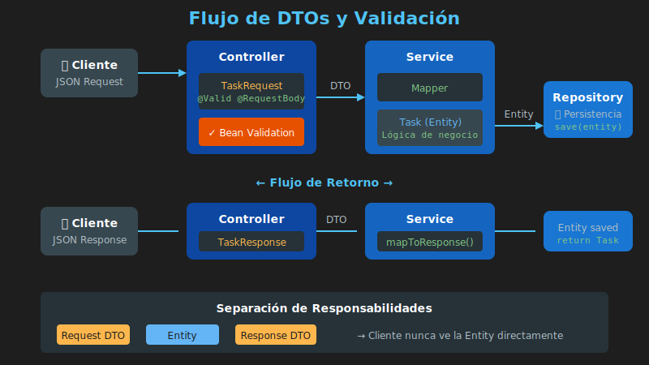

# 📋 DTOs y Validación con Bean Validation

## Introducción

Los **DTOs (Data Transfer Objects)** son objetos que transportan datos entre capas, mientras que **Bean Validation** permite validar estos datos de forma declarativa con anotaciones.



---

## ¿Por Qué Usar DTOs?

### El Problema: Exponer Entidades Directamente

```java
// ❌ Exponer la entidad directamente
@PostMapping("/tasks")
public Task createTask(@RequestBody Task task) {
    return taskRepository.save(task);
}
```

**Problemas:**

1. **Seguridad**: El cliente puede enviar campos no permitidos (ej: `id`, `createdAt`)
2. **Acoplamiento**: Cambios en la entidad afectan la API pública
3. **Flexibilidad**: No puedes tener diferentes representaciones
4. **Validación**: Mezcla validaciones de BD con validaciones de API

### La Solución: DTOs

```
┌──────────────┐      ┌───────────────┐      ┌──────────────┐
│  Request DTO │ ───▶ │    Entity     │ ───▶ │ Response DTO │
│  (entrada)   │      │  (dominio)    │      │  (salida)    │
└──────────────┘      └───────────────┘      └──────────────┘
```

---

## Implementación de DTOs

### Entidad (Model)

```java
// Entidad - representa el dominio y la persistencia
public class Task {
    private String id;
    private String title;
    private String description;
    private boolean completed;
    private LocalDateTime createdAt;
    private LocalDateTime updatedAt;

    // Constructor, getters, setters...
}
```

### Request DTO (Entrada)

```java
// DTO para crear/actualizar - solo campos que el cliente puede enviar
public class TaskRequest {
    private String title;
    private String description;

    // Constructor vacío (necesario para deserialización JSON)
    public TaskRequest() {}

    public TaskRequest(String title, String description) {
        this.title = title;
        this.description = description;
    }

    // Getters y setters
    public String getTitle() { return title; }
    public void setTitle(String title) { this.title = title; }

    public String getDescription() { return description; }
    public void setDescription(String description) { this.description = description; }
}
```

### Response DTO (Salida)

```java
// DTO para respuestas - campos que el cliente puede ver
public class TaskResponse {
    private String id;
    private String title;
    private String description;
    private boolean completed;
    private LocalDateTime createdAt;

    public TaskResponse(String id, String title, String description,
                        boolean completed, LocalDateTime createdAt) {
        this.id = id;
        this.title = title;
        this.description = description;
        this.completed = completed;
        this.createdAt = createdAt;
    }

    // Solo getters (inmutable)
    public String getId() { return id; }
    public String getTitle() { return title; }
    public String getDescription() { return description; }
    public boolean isCompleted() { return completed; }
    public LocalDateTime getCreatedAt() { return createdAt; }
}
```

### Usando Records (Java 16+)

```java
// Request DTO como Record
public record TaskRequest(
    String title,
    String description
) {}

// Response DTO como Record
public record TaskResponse(
    String id,
    String title,
    String description,
    boolean completed,
    LocalDateTime createdAt
) {}
```

> 💡 Los **records** son ideales para DTOs: inmutables, concisos, con equals/hashCode automáticos.

---

## Bean Validation

### Dependencia Maven

```xml
<dependency>
    <groupId>org.springframework.boot</groupId>
    <artifactId>spring-boot-starter-validation</artifactId>
</dependency>
```

### Anotaciones Comunes

| Anotación | Descripción | Ejemplo |
|-----------|-------------|---------|
| `@NotNull` | No puede ser null | `@NotNull String name` |
| `@NotBlank` | No null, no vacío, no solo espacios | `@NotBlank String title` |
| `@NotEmpty` | No null y no vacío | `@NotEmpty List<String> items` |
| `@Size` | Tamaño entre min y max | `@Size(min=3, max=100)` |
| `@Min` / `@Max` | Valor numérico mínimo/máximo | `@Min(0) @Max(100)` |
| `@Email` | Formato de email válido | `@Email String email` |
| `@Pattern` | Expresión regular | `@Pattern(regexp="^[A-Z].*")` |
| `@Positive` | Número positivo | `@Positive BigDecimal price` |
| `@PastOrPresent` | Fecha pasada o presente | `@PastOrPresent LocalDate date` |

### DTO con Validaciones

```java
public class TaskRequest {

    @NotBlank(message = "El título es requerido")
    @Size(min = 3, max = 100, message = "El título debe tener entre 3 y 100 caracteres")
    private String title;

    @Size(max = 500, message = "La descripción no puede exceder 500 caracteres")
    private String description;

    @Min(value = 1, message = "La prioridad mínima es 1")
    @Max(value = 5, message = "La prioridad máxima es 5")
    private Integer priority;

    // Constructor, getters, setters...
}
```

### Usando Record con Validaciones

```java
public record TaskRequest(
    @NotBlank(message = "El título es requerido")
    @Size(min = 3, max = 100, message = "El título debe tener entre 3 y 100 caracteres")
    String title,

    @Size(max = 500, message = "La descripción no puede exceder 500 caracteres")
    String description
) {}
```

---

## Activar Validación en Controller

### @Valid en @RequestBody

```java
@RestController
@RequestMapping("/api/tasks")
public class TaskController {

    private final TaskService taskService;

    public TaskController(TaskService taskService) {
        this.taskService = taskService;
    }

    @PostMapping
    public ResponseEntity<TaskResponse> createTask(
            @Valid @RequestBody TaskRequest request) {  // ¡@Valid activa validación!

        TaskResponse response = taskService.createTask(request);
        return ResponseEntity.status(HttpStatus.CREATED).body(response);
    }

    @PutMapping("/{id}")
    public ResponseEntity<TaskResponse> updateTask(
            @PathVariable String id,
            @Valid @RequestBody TaskRequest request) {

        TaskResponse response = taskService.updateTask(id, request);
        return ResponseEntity.ok(response);
    }
}
```

### Validar Path Variables y Query Params

```java
@RestController
@RequestMapping("/api/tasks")
@Validated  // Necesario para validar parámetros
public class TaskController {

    @GetMapping("/{id}")
    public ResponseEntity<TaskResponse> getTask(
            @PathVariable
            @NotBlank(message = "ID es requerido")
            @Size(min = 36, max = 36, message = "ID debe ser UUID válido")
            String id) {

        TaskResponse response = taskService.getTaskById(id);
        return ResponseEntity.ok(response);
    }

    @GetMapping
    public ResponseEntity<List<TaskResponse>> getTasks(
            @RequestParam(defaultValue = "0")
            @Min(value = 0, message = "Página debe ser >= 0")
            int page,

            @RequestParam(defaultValue = "10")
            @Min(value = 1, message = "Tamaño debe ser >= 1")
            @Max(value = 100, message = "Tamaño debe ser <= 100")
            int size) {

        List<TaskResponse> tasks = taskService.getTasks(page, size);
        return ResponseEntity.ok(tasks);
    }
}
```

---

## Mappers: Conversión entre DTO y Entity

### Mapper Manual

```java
@Service
public class TaskServiceImpl implements TaskService {

    private final TaskRepository taskRepository;

    public TaskServiceImpl(TaskRepository taskRepository) {
        this.taskRepository = taskRepository;
    }

    @Override
    public TaskResponse createTask(TaskRequest request) {
        // DTO → Entity
        Task task = mapToEntity(request);
        task.setId(UUID.randomUUID().toString());
        task.setCompleted(false);
        task.setCreatedAt(LocalDateTime.now());

        Task saved = taskRepository.save(task);

        // Entity → DTO
        return mapToResponse(saved);
    }

    // Método de conversión: Request → Entity
    private Task mapToEntity(TaskRequest request) {
        Task task = new Task();
        task.setTitle(request.getTitle());
        task.setDescription(request.getDescription());
        return task;
    }

    // Método de conversión: Entity → Response
    private TaskResponse mapToResponse(Task task) {
        return new TaskResponse(
            task.getId(),
            task.getTitle(),
            task.getDescription(),
            task.isCompleted(),
            task.getCreatedAt()
        );
    }
}
```

### Clase Mapper Dedicada

```java
@Component
public class TaskMapper {

    public Task toEntity(TaskRequest request) {
        Task task = new Task();
        task.setTitle(request.title());
        task.setDescription(request.description());
        return task;
    }

    public TaskResponse toResponse(Task task) {
        return new TaskResponse(
            task.getId(),
            task.getTitle(),
            task.getDescription(),
            task.isCompleted(),
            task.getCreatedAt()
        );
    }

    public List<TaskResponse> toResponseList(List<Task> tasks) {
        return tasks.stream()
            .map(this::toResponse)
            .collect(Collectors.toList());
    }

    public void updateEntity(Task task, TaskRequest request) {
        task.setTitle(request.title());
        task.setDescription(request.description());
        task.setUpdatedAt(LocalDateTime.now());
    }
}
```

---

## Respuesta de Error de Validación

Cuando una validación falla, Spring retorna un error 400 Bad Request. Podemos personalizar esta respuesta:

```java
@RestControllerAdvice
public class GlobalExceptionHandler {

    @ExceptionHandler(MethodArgumentNotValidException.class)
    public ResponseEntity<Map<String, Object>> handleValidationErrors(
            MethodArgumentNotValidException ex) {

        Map<String, String> errors = new HashMap<>();

        ex.getBindingResult().getFieldErrors().forEach(error ->
            errors.put(error.getField(), error.getDefaultMessage())
        );

        Map<String, Object> response = new HashMap<>();
        response.put("status", HttpStatus.BAD_REQUEST.value());
        response.put("error", "Validation Error");
        response.put("message", "Error de validación en los datos enviados");
        response.put("errors", errors);
        response.put("timestamp", LocalDateTime.now());

        return ResponseEntity.badRequest().body(response);
    }
}
```

### Ejemplo de Respuesta de Error

```json
{
  "status": 400,
  "error": "Validation Error",
  "message": "Error de validación en los datos enviados",
  "errors": {
    "title": "El título es requerido",
    "priority": "La prioridad máxima es 5"
  },
  "timestamp": "2024-01-15T10:30:00"
}
```

---

## Validaciones Personalizadas

### Crear Anotación Custom

```java
@Documented
@Constraint(validatedBy = NoProfanityValidator.class)
@Target({ElementType.FIELD, ElementType.PARAMETER})
@Retention(RetentionPolicy.RUNTIME)
public @interface NoProfanity {
    String message() default "El texto contiene palabras no permitidas";
    Class<?>[] groups() default {};
    Class<? extends Payload>[] payload() default {};
}
```

### Implementar Validador

```java
public class NoProfanityValidator implements ConstraintValidator<NoProfanity, String> {

    private static final Set<String> BLOCKED_WORDS = Set.of("spam", "prohibited");

    @Override
    public boolean isValid(String value, ConstraintValidatorContext context) {
        if (value == null) {
            return true; // @NotNull se encarga de esto
        }

        String lowerValue = value.toLowerCase();
        return BLOCKED_WORDS.stream()
            .noneMatch(lowerValue::contains);
    }
}
```

### Usar Validación Custom

```java
public record TaskRequest(
    @NotBlank
    @NoProfanity
    String title,

    @NoProfanity
    String description
) {}
```

---

## Resumen

| Concepto | Propósito |
|----------|-----------|
| **DTO** | Objeto para transferir datos entre capas |
| **Request DTO** | Datos que el cliente envía |
| **Response DTO** | Datos que el servidor retorna |
| **@Valid** | Activa validación en Controller |
| **@NotBlank** | Campo requerido y no vacío |
| **@Size** | Limitar longitud |
| **Mapper** | Convierte entre DTO y Entity |

---

## 📚 Referencias

- [Bean Validation](https://beanvalidation.org/)
- [Spring Validation](https://docs.spring.io/spring-framework/docs/current/reference/html/core.html#validation)
- [Hibernate Validator](https://hibernate.org/validator/)
