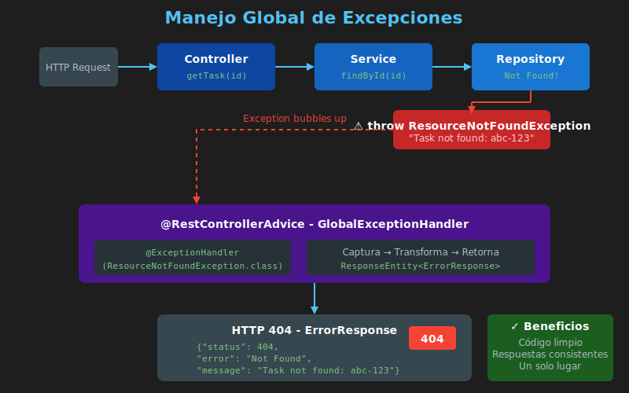

# ⚠️ Manejo Global de Excepciones

## Introducción

El **manejo global de excepciones** en Spring Boot permite centralizar la lógica de tratamiento de errores, proporcionando respuestas consistentes y evitando código duplicado.



---

## El Problema: Manejo Disperso

```java
// ❌ Manejo de excepciones en cada método
@GetMapping("/{id}")
public ResponseEntity<?> getTask(@PathVariable String id) {
    try {
        Task task = taskRepository.findById(id);
        if (task == null) {
            Map<String, String> error = new HashMap<>();
            error.put("message", "Task not found");
            return ResponseEntity.status(404).body(error);
        }
        return ResponseEntity.ok(task);
    } catch (Exception e) {
        Map<String, String> error = new HashMap<>();
        error.put("message", "Internal error");
        return ResponseEntity.status(500).body(error);
    }
}
```

**Problemas:**
- Código duplicado en cada endpoint
- Respuestas de error inconsistentes
- Difícil de mantener
- Mezcla lógica de negocio con manejo de errores

---

## La Solución: @ControllerAdvice

```
┌─────────────────────────────────────────────────────────────┐
│                     PETICIÓN HTTP                            │
└─────────────────────────────────────────────────────────────┘
                              │
                              ▼
┌─────────────────────────────────────────────────────────────┐
│                     Controller                               │
│         throw new ResourceNotFoundException()                │
└─────────────────────────────────────────────────────────────┘
                              │
                              ▼
┌─────────────────────────────────────────────────────────────┐
│              GlobalExceptionHandler                          │
│              @ControllerAdvice                               │
│                                                              │
│  @ExceptionHandler(ResourceNotFoundException.class)          │
│  → Captura y retorna ErrorResponse con HTTP 404              │
└─────────────────────────────────────────────────────────────┘
                              │
                              ▼
┌─────────────────────────────────────────────────────────────┐
│               RESPUESTA HTTP 404                             │
│               { "error": "...", "message": "..." }           │
└─────────────────────────────────────────────────────────────┘
```

---

## Implementación Paso a Paso

### 1. Crear Clase de Respuesta de Error

```java
package com.bootcamp.taskmanager.exception;

import java.time.LocalDateTime;

public class ErrorResponse {

    private int status;
    private String error;
    private String message;
    private String path;
    private LocalDateTime timestamp;

    public ErrorResponse(int status, String error, String message, String path) {
        this.status = status;
        this.error = error;
        this.message = message;
        this.path = path;
        this.timestamp = LocalDateTime.now();
    }

    // Getters
    public int getStatus() { return status; }
    public String getError() { return error; }
    public String getMessage() { return message; }
    public String getPath() { return path; }
    public LocalDateTime getTimestamp() { return timestamp; }
}
```

### 2. Crear Excepciones Personalizadas

```java
package com.bootcamp.taskmanager.exception;

public class ResourceNotFoundException extends RuntimeException {

    public ResourceNotFoundException(String message) {
        super(message);
    }

    public ResourceNotFoundException(String resource, String id) {
        super(String.format("%s not found with id: %s", resource, id));
    }
}
```

```java
package com.bootcamp.taskmanager.exception;

public class BadRequestException extends RuntimeException {

    public BadRequestException(String message) {
        super(message);
    }
}
```

```java
package com.bootcamp.taskmanager.exception;

public class ConflictException extends RuntimeException {

    public ConflictException(String message) {
        super(message);
    }
}
```

### 3. Crear Global Exception Handler

```java
package com.bootcamp.taskmanager.exception;

import jakarta.servlet.http.HttpServletRequest;
import org.springframework.http.HttpStatus;
import org.springframework.http.ResponseEntity;
import org.springframework.web.bind.MethodArgumentNotValidException;
import org.springframework.web.bind.annotation.ExceptionHandler;
import org.springframework.web.bind.annotation.RestControllerAdvice;

import java.util.HashMap;
import java.util.Map;

@RestControllerAdvice
public class GlobalExceptionHandler {

    // Recurso no encontrado → 404
    @ExceptionHandler(ResourceNotFoundException.class)
    public ResponseEntity<ErrorResponse> handleResourceNotFound(
            ResourceNotFoundException ex,
            HttpServletRequest request) {

        ErrorResponse error = new ErrorResponse(
            HttpStatus.NOT_FOUND.value(),
            "Not Found",
            ex.getMessage(),
            request.getRequestURI()
        );

        return ResponseEntity.status(HttpStatus.NOT_FOUND).body(error);
    }

    // Solicitud inválida → 400
    @ExceptionHandler(BadRequestException.class)
    public ResponseEntity<ErrorResponse> handleBadRequest(
            BadRequestException ex,
            HttpServletRequest request) {

        ErrorResponse error = new ErrorResponse(
            HttpStatus.BAD_REQUEST.value(),
            "Bad Request",
            ex.getMessage(),
            request.getRequestURI()
        );

        return ResponseEntity.status(HttpStatus.BAD_REQUEST).body(error);
    }

    // Conflicto → 409
    @ExceptionHandler(ConflictException.class)
    public ResponseEntity<ErrorResponse> handleConflict(
            ConflictException ex,
            HttpServletRequest request) {

        ErrorResponse error = new ErrorResponse(
            HttpStatus.CONFLICT.value(),
            "Conflict",
            ex.getMessage(),
            request.getRequestURI()
        );

        return ResponseEntity.status(HttpStatus.CONFLICT).body(error);
    }

    // Errores de validación → 400
    @ExceptionHandler(MethodArgumentNotValidException.class)
    public ResponseEntity<Map<String, Object>> handleValidationErrors(
            MethodArgumentNotValidException ex,
            HttpServletRequest request) {

        Map<String, String> fieldErrors = new HashMap<>();
        ex.getBindingResult().getFieldErrors().forEach(error ->
            fieldErrors.put(error.getField(), error.getDefaultMessage())
        );

        Map<String, Object> response = new HashMap<>();
        response.put("status", HttpStatus.BAD_REQUEST.value());
        response.put("error", "Validation Error");
        response.put("message", "Error de validación en los datos enviados");
        response.put("errors", fieldErrors);
        response.put("path", request.getRequestURI());

        return ResponseEntity.badRequest().body(response);
    }

    // Catch-all para excepciones no manejadas → 500
    @ExceptionHandler(Exception.class)
    public ResponseEntity<ErrorResponse> handleAllExceptions(
            Exception ex,
            HttpServletRequest request) {

        // Log del error real (no exponer al cliente)
        System.err.println("Error interno: " + ex.getMessage());
        ex.printStackTrace();

        ErrorResponse error = new ErrorResponse(
            HttpStatus.INTERNAL_SERVER_ERROR.value(),
            "Internal Server Error",
            "Ha ocurrido un error interno. Por favor, intente más tarde.",
            request.getRequestURI()
        );

        return ResponseEntity.status(HttpStatus.INTERNAL_SERVER_ERROR).body(error);
    }
}
```

---

## Uso en el Código

### En el Service

```java
@Service
public class TaskServiceImpl implements TaskService {

    private final TaskRepository taskRepository;

    public TaskServiceImpl(TaskRepository taskRepository) {
        this.taskRepository = taskRepository;
    }

    @Override
    public TaskResponse getTaskById(String id) {
        Task task = taskRepository.findById(id)
            .orElseThrow(() -> new ResourceNotFoundException("Task", id));

        return mapToResponse(task);
    }

    @Override
    public TaskResponse createTask(TaskRequest request) {
        // Validación de negocio
        if (taskRepository.existsByTitle(request.getTitle())) {
            throw new ConflictException("Ya existe una tarea con ese título");
        }

        Task task = mapToEntity(request);
        task.setId(UUID.randomUUID().toString());
        task.setCreatedAt(LocalDateTime.now());

        Task saved = taskRepository.save(task);
        return mapToResponse(saved);
    }

    // ... otros métodos
}
```

### En el Controller (Limpio)

```java
@RestController
@RequestMapping("/api/tasks")
public class TaskController {

    private final TaskService taskService;

    public TaskController(TaskService taskService) {
        this.taskService = taskService;
    }

    @GetMapping("/{id}")
    public ResponseEntity<TaskResponse> getTask(@PathVariable String id) {
        // Si no existe, el service lanza ResourceNotFoundException
        // que es capturada por GlobalExceptionHandler
        TaskResponse response = taskService.getTaskById(id);
        return ResponseEntity.ok(response);
    }

    @PostMapping
    public ResponseEntity<TaskResponse> createTask(
            @Valid @RequestBody TaskRequest request) {
        TaskResponse response = taskService.createTask(request);
        return ResponseEntity.status(HttpStatus.CREATED).body(response);
    }
}
```

---

## Ejemplos de Respuestas de Error

### 404 Not Found

```json
{
  "status": 404,
  "error": "Not Found",
  "message": "Task not found with id: abc-123",
  "path": "/api/tasks/abc-123",
  "timestamp": "2024-01-15T10:30:00"
}
```

### 400 Validation Error

```json
{
  "status": 400,
  "error": "Validation Error",
  "message": "Error de validación en los datos enviados",
  "errors": {
    "title": "El título es requerido",
    "description": "La descripción no puede exceder 500 caracteres"
  },
  "path": "/api/tasks"
}
```

### 409 Conflict

```json
{
  "status": 409,
  "error": "Conflict",
  "message": "Ya existe una tarea con ese título",
  "path": "/api/tasks",
  "timestamp": "2024-01-15T10:30:00"
}
```

### 500 Internal Server Error

```json
{
  "status": 500,
  "error": "Internal Server Error",
  "message": "Ha ocurrido un error interno. Por favor, intente más tarde.",
  "path": "/api/tasks",
  "timestamp": "2024-01-15T10:30:00"
}
```

---

## Códigos HTTP Comunes

| Código | Nombre | Uso |
|--------|--------|-----|
| 200 | OK | Operación exitosa |
| 201 | Created | Recurso creado |
| 204 | No Content | Eliminación exitosa |
| 400 | Bad Request | Error en datos del cliente |
| 401 | Unauthorized | No autenticado |
| 403 | Forbidden | Sin permisos |
| 404 | Not Found | Recurso no existe |
| 409 | Conflict | Conflicto (duplicado, etc.) |
| 422 | Unprocessable Entity | Error de validación semántica |
| 500 | Internal Server Error | Error del servidor |

---

## Buenas Prácticas de Seguridad

### ❌ NO exponer información sensible

```java
// ❌ MAL: Expone stack trace y detalles internos
@ExceptionHandler(Exception.class)
public ResponseEntity<String> handleError(Exception ex) {
    return ResponseEntity.status(500).body(ex.getMessage());
}
```

### ✅ SÍ: Mensajes genéricos + logging interno

```java
// ✅ BIEN: Mensaje genérico al cliente, log interno
@ExceptionHandler(Exception.class)
public ResponseEntity<ErrorResponse> handleError(
        Exception ex, HttpServletRequest request) {

    // Log completo internamente
    log.error("Error en {}: {}", request.getRequestURI(), ex.getMessage(), ex);

    // Respuesta genérica al cliente
    ErrorResponse error = new ErrorResponse(
        500,
        "Internal Server Error",
        "Ha ocurrido un error. Contacte al administrador.",
        request.getRequestURI()
    );

    return ResponseEntity.status(500).body(error);
}
```

---

## Estructura de Paquetes

```
src/main/java/com/bootcamp/taskmanager/
├── exception/
│   ├── GlobalExceptionHandler.java   # @RestControllerAdvice
│   ├── ErrorResponse.java            # DTO de respuesta de error
│   ├── ResourceNotFoundException.java # 404
│   ├── BadRequestException.java       # 400
│   └── ConflictException.java         # 409
└── ...
```

---

## Resumen

| Componente | Propósito |
|------------|-----------|
| `@RestControllerAdvice` | Centraliza manejo de excepciones |
| `@ExceptionHandler` | Captura un tipo específico de excepción |
| `ErrorResponse` | DTO estándar para respuestas de error |
| Excepciones custom | Expresan errores de dominio |

---

## 📚 Referencias

- [Spring Exception Handling](https://docs.spring.io/spring-framework/docs/current/reference/html/web.html#mvc-exceptionhandlers)
- [Error Handling Best Practices](https://www.baeldung.com/exception-handling-for-rest-with-spring)
- [RFC 7807 - Problem Details](https://datatracker.ietf.org/doc/html/rfc7807)
