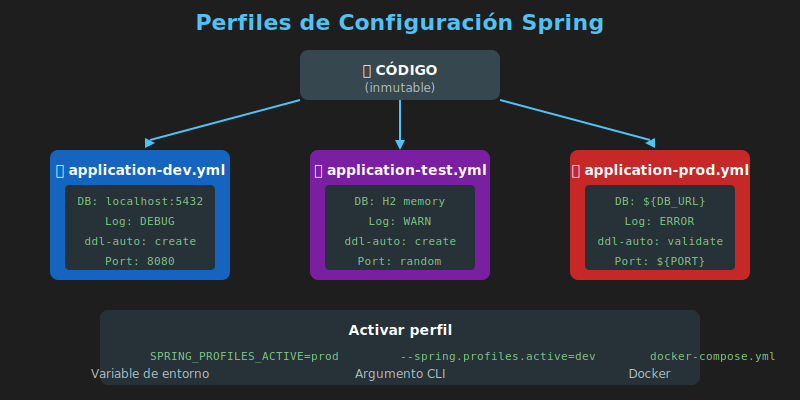

# ⚙️ Perfiles y Configuración por Entorno

## Introducción

Los **perfiles de Spring** permiten tener diferentes configuraciones para diferentes entornos (desarrollo, testing, producción) sin cambiar código.



---

## ¿Por Qué Usar Perfiles?

### El Problema: Configuración Hardcodeada

```properties
# ❌ Una sola configuración para todo
spring.datasource.url=jdbc:postgresql://localhost:5432/mydb
spring.datasource.password=dev123
logging.level.root=DEBUG
```

**Problemas:**
- Credenciales de desarrollo en producción
- Nivel de log inadecuado
- Cambiar configuración requiere recompilar

### La Solución: Perfiles

```
┌─────────────────────────────────────────────────────────────┐
│                    CÓDIGO (inmutable)                        │
└─────────────────────────────────────────────────────────────┘
                              │
         ┌────────────────────┼────────────────────┐
         ▼                    ▼                    ▼
┌─────────────────┐  ┌─────────────────┐  ┌─────────────────┐
│ application-dev │  │ application-test│  │ application-prod│
│     .yml        │  │     .yml        │  │     .yml        │
│                 │  │                 │  │                 │
│ BD: localhost   │  │ BD: H2 memory   │  │ BD: RDS AWS     │
│ Log: DEBUG      │  │ Log: INFO       │  │ Log: WARN       │
│ Port: 8080      │  │ Port: random    │  │ Port: 80        │
└─────────────────┘  └─────────────────┘  └─────────────────┘
```

---

## Archivos de Configuración

### application.yml (Base)

```yaml
# Configuración común a todos los entornos
spring:
  application:
    name: task-manager

# Perfil por defecto
  profiles:
    active: dev

# Configuración del servidor
server:
  error:
    include-message: always
    include-binding-errors: always
```

### application-dev.yml (Desarrollo)

```yaml
# Configuración para desarrollo local
spring:
  datasource:
    url: jdbc:h2:mem:devdb
    username: sa
    password:
    driver-class-name: org.h2.Driver

  h2:
    console:
      enabled: true
      path: /h2-console

  jpa:
    hibernate:
      ddl-auto: create-drop
    show-sql: true

server:
  port: 8080

logging:
  level:
    root: INFO
    com.bootcamp: DEBUG
    org.springframework.web: DEBUG
```

### application-test.yml (Testing)

```yaml
# Configuración para tests
spring:
  datasource:
    url: jdbc:h2:mem:testdb
    username: sa
    password:

  jpa:
    hibernate:
      ddl-auto: create-drop
    show-sql: false

logging:
  level:
    root: WARN
```

### application-prod.yml (Producción)

```yaml
# Configuración para producción
spring:
  datasource:
    url: ${DATABASE_URL}
    username: ${DATABASE_USERNAME}
    password: ${DATABASE_PASSWORD}

  jpa:
    hibernate:
      ddl-auto: validate
    show-sql: false

server:
  port: ${PORT:8080}

logging:
  level:
    root: WARN
    com.bootcamp: INFO
```

---

## Activar un Perfil

### 1. En application.yml

```yaml
spring:
  profiles:
    active: dev
```

### 2. Variable de Entorno

```bash
export SPRING_PROFILES_ACTIVE=prod
java -jar app.jar
```

### 3. Argumento de Línea de Comandos

```bash
java -jar app.jar --spring.profiles.active=prod
```

### 4. En Docker Compose

```yaml
services:
  app:
    image: task-manager:latest
    environment:
      - SPRING_PROFILES_ACTIVE=prod
```

---

## Variables de Entorno

### Referencia en YAML

```yaml
spring:
  datasource:
    url: ${DATABASE_URL}           # Variable de entorno
    username: ${DB_USER:admin}     # Con valor por defecto
    password: ${DB_PASSWORD}
```

### Archivo .env

```env
# .env - NO SUBIR A GIT
DATABASE_URL=jdbc:postgresql://localhost:5432/taskdb
DB_USER=postgres
DB_PASSWORD=secretpassword
JWT_SECRET=mi-secreto-super-largo-de-256-bits
```

### .env.example (Sí subir a Git)

```env
# .env.example - Template de configuración
# Copiar a .env y completar valores

DATABASE_URL=jdbc:postgresql://localhost:5432/taskdb
DB_USER=your_username
DB_PASSWORD=your_password
JWT_SECRET=generate-a-256-bit-secret
```

---

## Docker Compose con Perfiles

### docker-compose.yml

```yaml
services:
  app:
    build: .
    ports:
      - "${APP_PORT:-8080}:8080"
    environment:
      - SPRING_PROFILES_ACTIVE=${PROFILE:-dev}
      - DATABASE_URL=jdbc:postgresql://db:5432/${DB_NAME:-taskdb}
      - DATABASE_USERNAME=${DB_USER:-postgres}
      - DATABASE_PASSWORD=${DB_PASSWORD:-postgres}
    env_file:
      - .env
    depends_on:
      db:
        condition: service_healthy

  db:
    image: postgres:16-alpine
    environment:
      - POSTGRES_DB=${DB_NAME:-taskdb}
      - POSTGRES_USER=${DB_USER:-postgres}
      - POSTGRES_PASSWORD=${DB_PASSWORD:-postgres}
    volumes:
      - postgres_data:/var/lib/postgresql/data
    healthcheck:
      test: ["CMD-SHELL", "pg_isready -U postgres"]
      interval: 10s
      timeout: 5s
      retries: 5

volumes:
  postgres_data:
```

### Usar con diferentes perfiles

```bash
# Desarrollo (por defecto)
docker compose up

# Producción
PROFILE=prod docker compose up

# O usando archivo .env
echo "PROFILE=prod" >> .env
docker compose up
```

---

## Docker Compose Override

### docker-compose.yml (Base)

```yaml
services:
  app:
    build: .
    environment:
      - SPRING_PROFILES_ACTIVE=prod
```

### docker-compose.override.yml (Desarrollo)

```yaml
# Se aplica automáticamente en desarrollo
services:
  app:
    environment:
      - SPRING_PROFILES_ACTIVE=dev
    volumes:
      - ./target:/app/target  # Hot reload
    ports:
      - "8080:8080"
      - "5005:5005"  # Debug
```

### docker-compose.prod.yml (Producción)

```yaml
services:
  app:
    environment:
      - SPRING_PROFILES_ACTIVE=prod
    deploy:
      replicas: 2
      resources:
        limits:
          memory: 512M
```

```bash
# Desarrollo (usa override automáticamente)
docker compose up

# Producción
docker compose -f docker-compose.yml -f docker-compose.prod.yml up
```

---

## Propiedades vs YAML

### application.properties

```properties
spring.application.name=task-manager
spring.datasource.url=jdbc:postgresql://localhost:5432/taskdb
spring.datasource.username=postgres
spring.jpa.hibernate.ddl-auto=update
server.port=8080
```

### application.yml (Equivalente)

```yaml
spring:
  application:
    name: task-manager
  datasource:
    url: jdbc:postgresql://localhost:5432/taskdb
    username: postgres
  jpa:
    hibernate:
      ddl-auto: update

server:
  port: 8080
```

### ¿Cuál usar?

| Aspecto | .properties | .yml |
|---------|-------------|------|
| Legibilidad | Menos estructurado | Jerárquico, más claro |
| Listas | Sintaxis verbose | Sintaxis limpia |
| Documentación | Menos común | Ampliamente documentado |
| **Recomendación** | Proyectos simples | **Proyectos Spring Boot** |

---

## Acceder a Propiedades en Código

### @Value

```java
@Service
public class NotificationService {

    @Value("${app.notification.enabled:true}")
    private boolean notificationEnabled;

    @Value("${app.notification.email.from}")
    private String fromEmail;

    public void sendNotification(String to, String message) {
        if (notificationEnabled) {
            // Enviar email...
        }
    }
}
```

### @ConfigurationProperties (Recomendado)

```java
@Configuration
@ConfigurationProperties(prefix = "app.notification")
public class NotificationProperties {

    private boolean enabled = true;
    private Email email = new Email();

    // Getters y setters

    public static class Email {
        private String from;
        private String replyTo;
        // Getters y setters
    }
}
```

```yaml
app:
  notification:
    enabled: true
    email:
      from: noreply@bootcamp.com
      reply-to: support@bootcamp.com
```

```java
@Service
public class NotificationService {

    private final NotificationProperties properties;

    public NotificationService(NotificationProperties properties) {
        this.properties = properties;
    }

    public void sendNotification(String to, String message) {
        if (properties.isEnabled()) {
            String from = properties.getEmail().getFrom();
            // Enviar email...
        }
    }
}
```

---

## Beans Condicionales por Perfil

```java
@Configuration
public class StorageConfig {

    @Bean
    @Profile("dev")
    public StorageService localStorageService() {
        return new LocalStorageService("/tmp/uploads");
    }

    @Bean
    @Profile("prod")
    public StorageService s3StorageService() {
        return new S3StorageService();
    }
}
```

---

## Estructura de Archivos

```
src/main/resources/
├── application.yml           # Configuración base
├── application-dev.yml       # Desarrollo
├── application-test.yml      # Testing
├── application-prod.yml      # Producción
└── application-local.yml     # (opcional) Local sin Docker
```

---

## Resumen

| Concepto | Descripción |
|----------|-------------|
| **Perfil** | Conjunto de configuración para un entorno |
| **application-{profile}.yml** | Archivo de configuración por perfil |
| **SPRING_PROFILES_ACTIVE** | Variable para activar perfil |
| **${VAR}** | Referencia a variable de entorno |
| **${VAR:default}** | Variable con valor por defecto |
| **.env** | Archivo de variables de entorno locales |

---

## 📚 Referencias

- [Spring Profiles](https://docs.spring.io/spring-boot/docs/current/reference/html/features.html#features.profiles)
- [Externalized Configuration](https://docs.spring.io/spring-boot/docs/current/reference/html/features.html#features.external-config)
- [Docker Compose Environment](https://docs.docker.com/compose/environment-variables/)
