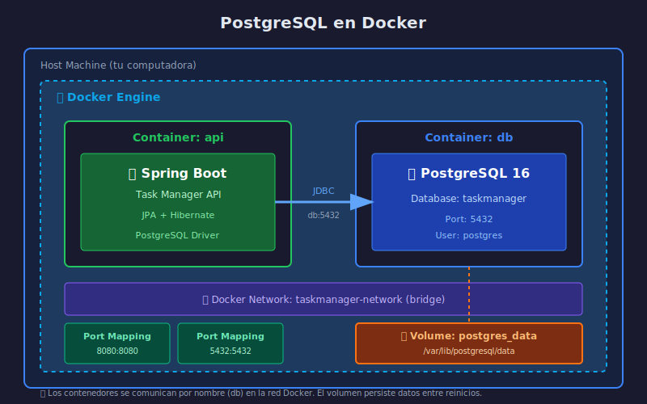

# 🐘 PostgreSQL en Docker

## Objetivos de Aprendizaje

- Entender por qué usar PostgreSQL containerizado
- Configurar PostgreSQL con Docker Compose
- Manejar volúmenes para persistencia de datos
- Conectar desde herramientas externas (psql, pgAdmin)

---

## ¿Por Qué PostgreSQL en Docker?

### Ventajas

| Ventaja | Descripción |
|---------|-------------|
| **Consistencia** | Mismo entorno en todos los equipos |
| **Aislamiento** | No afecta otras instalaciones de BD |
| **Portabilidad** | Funciona igual en Windows, Mac, Linux |
| **Fácil reset** | Borrar contenedor = BD limpia |
| **Versionado** | Cambiar versión es cambiar una línea |

### Sin Docker vs Con Docker

```
❌ SIN DOCKER:
   - Instalar PostgreSQL manualmente
   - Configurar usuarios, puertos, permisos
   - Conflictos con otras versiones
   - "En mi máquina funciona..."

✅ CON DOCKER:
   - docker-compose up
   - Todo configurado automáticamente
   - Mismo entorno para todos
   - Reproducible siempre
```

---

## Diagrama de Arquitectura



---

## Imagen Oficial de PostgreSQL

Docker Hub ofrece la imagen oficial de PostgreSQL:

```bash
# Imagen oficial
postgres:16-alpine    # Recomendada (ligera, ~80MB)
postgres:16           # Completa (~400MB)
postgres:latest       # Última versión (no recomendado para producción)
```

### ¿Por qué Alpine?

- **Tamaño**: ~80MB vs ~400MB
- **Seguridad**: Menos paquetes = menor superficie de ataque
- **Velocidad**: Descarga e inicio más rápidos
- **Funcionalidad**: Mismas características de PostgreSQL

---

## Configuración con Docker Compose

### Servicio Básico

```yaml
services:
  db:
    image: postgres:16-alpine
    container_name: taskmanager-db
    environment:
      POSTGRES_DB: taskmanager      # Nombre de la BD
      POSTGRES_USER: postgres       # Usuario
      POSTGRES_PASSWORD: postgres   # Contraseña
    ports:
      - "5432:5432"                 # Exponer puerto
```

### Con Volumen para Persistencia

```yaml
services:
  db:
    image: postgres:16-alpine
    container_name: taskmanager-db
    environment:
      POSTGRES_DB: taskmanager
      POSTGRES_USER: postgres
      POSTGRES_PASSWORD: ${DB_PASSWORD:-postgres}  # Desde .env
    ports:
      - "5432:5432"
    volumes:
      - postgres_data:/var/lib/postgresql/data     # Persistencia

volumes:
  postgres_data:                                    # Declarar volumen
```

### Con Healthcheck

```yaml
services:
  db:
    image: postgres:16-alpine
    container_name: taskmanager-db
    environment:
      POSTGRES_DB: taskmanager
      POSTGRES_USER: postgres
      POSTGRES_PASSWORD: ${DB_PASSWORD:-postgres}
    ports:
      - "5432:5432"
    volumes:
      - postgres_data:/var/lib/postgresql/data
    healthcheck:
      test: ["CMD-SHELL", "pg_isready -U postgres -d taskmanager"]
      interval: 10s
      timeout: 5s
      retries: 5
      start_period: 10s

volumes:
  postgres_data:
```

---

## Variables de Entorno de PostgreSQL

| Variable | Descripción | Ejemplo |
|----------|-------------|---------|
| `POSTGRES_DB` | Nombre de la base de datos inicial | `taskmanager` |
| `POSTGRES_USER` | Usuario administrador | `postgres` |
| `POSTGRES_PASSWORD` | Contraseña del usuario | `secreto123` |
| `PGDATA` | Directorio de datos | `/var/lib/postgresql/data` |

### Usando archivo .env

```bash
# .env (NO subir a Git)
DB_PASSWORD=mi_password_seguro
DB_NAME=taskmanager
DB_USER=postgres
```

```yaml
# docker-compose.yml
services:
  db:
    environment:
      POSTGRES_DB: ${DB_NAME}
      POSTGRES_USER: ${DB_USER}
      POSTGRES_PASSWORD: ${DB_PASSWORD}
```

---

## Volúmenes Docker

### ¿Por Qué Son Necesarios?

```
SIN VOLUMEN:
┌─────────────────┐
│   Contenedor    │
│  ┌───────────┐  │     docker-compose down
│  │   Datos   │  │  ──────────────────────►  💥 Datos perdidos
│  └───────────┘  │
└─────────────────┘

CON VOLUMEN:
┌─────────────────┐
│   Contenedor    │
│  ┌───────────┐  │     docker-compose down
│  │   Datos   │──┼──┐ ────────────────────►  Contenedor eliminado
│  └───────────┘  │  │
└─────────────────┘  │
                     ▼
              ┌───────────┐
              │  Volumen  │  ────────────────►  ✅ Datos preservados
              │  Docker   │
              └───────────┘
```

### Tipos de Volúmenes

```yaml
# 1. Named Volume (recomendado)
volumes:
  - postgres_data:/var/lib/postgresql/data

# 2. Bind Mount (carpeta del host)
volumes:
  - ./data:/var/lib/postgresql/data

# 3. Anonymous Volume (temporal)
volumes:
  - /var/lib/postgresql/data
```

### Comandos Útiles

```bash
# Listar volúmenes
docker volume ls

# Inspeccionar volumen
docker volume inspect postgres_data

# Eliminar volumen (⚠️ borra datos)
docker volume rm postgres_data

# Eliminar volúmenes no usados
docker volume prune
```

---

## Redes Docker

### Red por Defecto

Docker Compose crea automáticamente una red para los servicios:

```yaml
services:
  api:
    # Puede conectar a 'db' por nombre
    environment:
      DB_HOST: db    # ← Nombre del servicio

  db:
    image: postgres:16-alpine
```

### Red Custom (Recomendado)

```yaml
services:
  api:
    networks:
      - backend

  db:
    networks:
      - backend

networks:
  backend:
    driver: bridge
```

### Comunicación entre Contenedores

```
┌─────────────────────────────────────────────┐
│           Docker Network (bridge)           │
│                                             │
│  ┌─────────┐         ┌─────────┐           │
│  │   api   │ ──────► │   db    │           │
│  │         │  db:5432│         │           │
│  └─────────┘         └─────────┘           │
│                                             │
└─────────────────────────────────────────────┘
              │
              │ localhost:5432
              ▼
        ┌──────────┐
        │   Host   │
        │ (tu PC)  │
        └──────────┘
```

---

## Conectar desde el Host

### Con psql (CLI)

```bash
# Conectar desde terminal del host
psql -h localhost -p 5432 -U postgres -d taskmanager

# O entrar al contenedor
docker exec -it taskmanager-db psql -U postgres -d taskmanager
```

### Con pgAdmin 4 (GUI)

pgAdmin también puede correr en Docker:

```yaml
services:
  db:
    # ... configuración de PostgreSQL

  pgadmin:
    image: dpage/pgadmin4:latest
    container_name: taskmanager-pgadmin
    environment:
      PGADMIN_DEFAULT_EMAIL: admin@admin.com
      PGADMIN_DEFAULT_PASSWORD: admin
    ports:
      - "5050:80"
    depends_on:
      - db
```

Acceder en: http://localhost:5050

---

## Inicialización de la Base de Datos

### Scripts de Inicialización

PostgreSQL ejecuta automáticamente scripts en `/docker-entrypoint-initdb.d/`:

```yaml
services:
  db:
    image: postgres:16-alpine
    volumes:
      - postgres_data:/var/lib/postgresql/data
      - ./init-scripts:/docker-entrypoint-initdb.d  # Scripts SQL
```

```sql
-- init-scripts/01-schema.sql
CREATE TABLE IF NOT EXISTS tasks (
    id UUID PRIMARY KEY DEFAULT gen_random_uuid(),
    title VARCHAR(100) NOT NULL,
    description TEXT,
    completed BOOLEAN DEFAULT FALSE,
    created_at TIMESTAMP DEFAULT CURRENT_TIMESTAMP
);
```

> ⚠️ **Nota**: Con JPA y `ddl-auto=update`, las tablas se crean automáticamente.
> Los scripts de init son útiles para datos semilla o configuración adicional.

---

## Comandos Esenciales

```bash
# Iniciar servicios
docker-compose up -d

# Ver logs de PostgreSQL
docker-compose logs -f db

# Verificar que PostgreSQL está listo
docker-compose exec db pg_isready -U postgres

# Conectar a PostgreSQL
docker-compose exec db psql -U postgres -d taskmanager

# Detener servicios (mantiene datos)
docker-compose down

# Detener y eliminar volúmenes (⚠️ borra datos)
docker-compose down -v

# Reiniciar solo la BD
docker-compose restart db
```

---

## Troubleshooting

### Error: Connection refused

```
Causa: PostgreSQL no ha iniciado completamente
Solución: Usar depends_on con healthcheck o esperar unos segundos
```

### Error: Password authentication failed

```
Causa: Contraseña incorrecta o volumen con datos antiguos
Solución: docker-compose down -v && docker-compose up -d
```

### Error: Port 5432 already in use

```
Causa: PostgreSQL local u otro servicio usando el puerto
Solución: Cambiar puerto en docker-compose: "5433:5432"
```

---

## Resumen

| Concepto | Descripción |
|----------|-------------|
| **Imagen** | `postgres:16-alpine` (ligera, recomendada) |
| **Volumen** | Persiste datos entre reinicios |
| **Red** | Permite comunicación por nombre de servicio |
| **Healthcheck** | Verifica que PostgreSQL está listo |
| **Variables** | POSTGRES_DB, POSTGRES_USER, POSTGRES_PASSWORD |

---

## Siguiente Tema

➡️ [02-introduccion-jpa-hibernate.md](02-introduccion-jpa-hibernate.md) - Fundamentos de JPA e Hibernate
