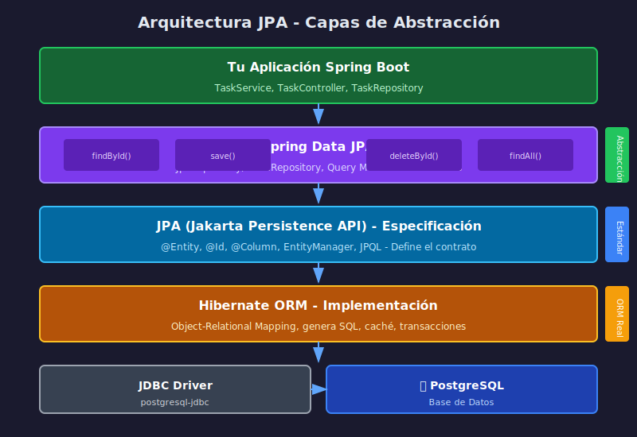

# 🔄 Introducción a JPA e Hibernate

## Objetivos de Aprendizaje

- Entender qué es JPA y por qué existe
- Diferenciar JPA (especificación) de Hibernate (implementación)
- Comprender el concepto de ORM (Object-Relational Mapping)
- Conocer las capas de abstracción en persistencia

---

## El Problema: Impedancia Objeto-Relacional

### Mundo Orientado a Objetos (Java)

```java
public class Task {
    private UUID id;
    private String title;
    private String description;
    private boolean completed;
    private LocalDateTime createdAt;

    // Comportamiento
    public void markAsCompleted() {
        this.completed = true;
    }
}
```

### Mundo Relacional (SQL)

```sql
CREATE TABLE tasks (
    id UUID PRIMARY KEY,
    title VARCHAR(100) NOT NULL,
    description TEXT,
    completed BOOLEAN DEFAULT FALSE,
    created_at TIMESTAMP
);
```

### El Problema

```
┌────────────────────┐                    ┌────────────────────┐
│  Objetos Java      │                    │  Tablas SQL        │
├────────────────────┤                    ├────────────────────┤
│ • Herencia         │      ¿Cómo        │ • Sin herencia     │
│ • Polimorfismo     │   convertir?      │ • Solo relaciones  │
│ • Encapsulación    │  ◄──────────►     │ • Tipos primitivos │
│ • Grafos de objetos│                    │ • Claves foráneas  │
│ • Identidad (==)   │                    │ • Identidad (PK)   │
└────────────────────┘                    └────────────────────┘
```

Este desajuste se llama **"Impedance Mismatch"** (Impedancia Objeto-Relacional).

---

## Diagrama de Arquitectura



---

## Solución: ORM (Object-Relational Mapping)

### ¿Qué es ORM?

ORM es una técnica que **mapea automáticamente** objetos Java a tablas SQL:

```
┌──────────────┐      ORM       ┌──────────────┐
│   Task.java  │ ◄───────────► │ tasks (tabla)│
├──────────────┤   (Hibernate)  ├──────────────┤
│ id           │ ◄───────────► │ id           │
│ title        │ ◄───────────► │ title        │
│ description  │ ◄───────────► │ description  │
│ completed    │ ◄───────────► │ completed    │
│ createdAt    │ ◄───────────► │ created_at   │
└──────────────┘                └──────────────┘
```

### Beneficios de ORM

| Sin ORM (JDBC puro) | Con ORM (JPA/Hibernate) |
|---------------------|-------------------------|
| Escribir SQL manualmente | SQL generado automáticamente |
| Mapear ResultSet a objetos | Objetos mapeados automáticamente |
| Manejar conexiones | Conexiones gestionadas |
| Código repetitivo (boilerplate) | Código conciso |
| Propenso a SQL Injection | Queries parametrizadas |

---

## JPA: La Especificación

### ¿Qué es JPA?

**JPA (Jakarta Persistence API)** es una **especificación** que define:

- Cómo mapear objetos Java a tablas relacionales
- Cómo realizar operaciones CRUD
- Un lenguaje de consultas (JPQL)
- Gestión del ciclo de vida de entidades

### JPA NO es una Implementación

```
JPA = Contrato/Interfaz
     ↓
     Define QUÉ hacer, no CÓMO hacerlo
```

### Componentes de JPA

| Componente | Descripción |
|------------|-------------|
| **@Entity** | Marca una clase como entidad persistente |
| **@Id** | Define la clave primaria |
| **@Column** | Configura el mapeo de columnas |
| **EntityManager** | Interfaz para operaciones CRUD |
| **JPQL** | Java Persistence Query Language |
| **Criteria API** | Queries programáticas type-safe |

---

## Hibernate: La Implementación

### ¿Qué es Hibernate?

**Hibernate** es la implementación más popular de JPA:

```
┌─────────────────────────────────────────┐
│              JPA (Especificación)       │
│  Define: @Entity, @Id, EntityManager... │
└─────────────────────────────────────────┘
                    ▲
                    │ implementa
                    │
┌─────────────────────────────────────────┐
│           Hibernate (Implementación)    │
│  Ejecuta: genera SQL, maneja caché...   │
└─────────────────────────────────────────┘
```

### Otras Implementaciones de JPA

| Implementación | Descripción |
|----------------|-------------|
| **Hibernate** | La más popular, default en Spring |
| **EclipseLink** | Referencia de JPA, usado en Jakarta EE |
| **OpenJPA** | De Apache, menos común |

### ¿Por Qué Hibernate es el Default?

- **Madurez**: 20+ años de desarrollo
- **Comunidad**: Gran soporte y documentación
- **Features**: Caché, lazy loading, batch processing
- **Spring Boot**: Autoconfigurado por defecto

---

## Spring Data JPA: La Abstracción

### Capas de Abstracción

```
┌─────────────────────────────────────────┐
│         Tu Código (TaskRepository)      │  ← Solo defines interfaz
└─────────────────────────────────────────┘
                    │
                    ▼
┌─────────────────────────────────────────┐
│            Spring Data JPA              │  ← Genera implementación
│   JpaRepository, Query Methods, etc.    │
└─────────────────────────────────────────┘
                    │
                    ▼
┌─────────────────────────────────────────┐
│          JPA (Especificación)           │  ← Define el estándar
│    @Entity, EntityManager, JPQL         │
└─────────────────────────────────────────┘
                    │
                    ▼
┌─────────────────────────────────────────┐
│        Hibernate (Implementación)       │  ← Ejecuta las operaciones
│   SessionFactory, SQL Generation        │
└─────────────────────────────────────────┘
                    │
                    ▼
┌─────────────────────────────────────────┐
│              JDBC Driver                │  ← Comunicación con BD
└─────────────────────────────────────────┘
                    │
                    ▼
┌─────────────────────────────────────────┐
│              PostgreSQL                 │  ← Base de datos
└─────────────────────────────────────────┘
```

### ¿Qué Aporta Spring Data JPA?

| Feature | Sin Spring Data | Con Spring Data |
|---------|-----------------|-----------------|
| CRUD básico | Implementar manualmente | Heredado de JpaRepository |
| Queries simples | Escribir JPQL | Query Methods automáticos |
| Paginación | Implementar lógica | Pageable integrado |
| Auditoría | Implementar listeners | @CreatedDate, @LastModifiedDate |

---

## Comparación: JDBC vs JPA vs Spring Data JPA

### JDBC Puro (Bajo Nivel)

```java
// ❌ Mucho código repetitivo
public Task findById(UUID id) throws SQLException {
    String sql = "SELECT * FROM tasks WHERE id = ?";
    try (Connection conn = dataSource.getConnection();
         PreparedStatement ps = conn.prepareStatement(sql)) {
        ps.setObject(1, id);
        try (ResultSet rs = ps.executeQuery()) {
            if (rs.next()) {
                Task task = new Task();
                task.setId(rs.getObject("id", UUID.class));
                task.setTitle(rs.getString("title"));
                task.setDescription(rs.getString("description"));
                task.setCompleted(rs.getBoolean("completed"));
                task.setCreatedAt(rs.getTimestamp("created_at").toLocalDateTime());
                return task;
            }
        }
    }
    return null;
}
```

### JPA con EntityManager

```java
// ✓ Menos código, pero aún manual
@Repository
public class TaskRepository {
    @PersistenceContext
    private EntityManager em;

    public Task findById(UUID id) {
        return em.find(Task.class, id);
    }

    public void save(Task task) {
        em.persist(task);
    }
}
```

### Spring Data JPA

```java
// ✅ Mínimo código, máxima funcionalidad
public interface TaskRepository extends JpaRepository<Task, UUID> {
    // ¡Ya tienes findById, save, delete, findAll... GRATIS!
}
```

---

## Ciclo de Vida de una Entidad

### Estados de una Entidad

```
┌──────────┐     persist()    ┌──────────┐
│   New    │ ───────────────► │ Managed  │
│(Transient)│                  │          │
└──────────┘                  └──────────┘
                                   │  │
                          find()   │  │ remove()
                              ┌────┘  └────┐
                              ▼            ▼
                         ┌──────────┐  ┌──────────┐
                         │ Managed  │  │ Removed  │
                         └──────────┘  └──────────┘
                              │
                    detach() / clear()
                              │
                              ▼
                         ┌──────────┐
                         │ Detached │
                         └──────────┘
```

### Estados Explicados

| Estado | Descripción |
|--------|-------------|
| **New/Transient** | Objeto creado pero no persistido |
| **Managed** | Objeto en el contexto de persistencia, cambios se sincronizan |
| **Detached** | Objeto fuera del contexto, cambios NO se sincronizan |
| **Removed** | Marcado para eliminación |

---

## Configuración en Spring Boot

### Dependencias Maven

```xml
<!-- Spring Data JPA -->
<dependency>
    <groupId>org.springframework.boot</groupId>
    <artifactId>spring-boot-starter-data-jpa</artifactId>
</dependency>

<!-- PostgreSQL Driver -->
<dependency>
    <groupId>org.postgresql</groupId>
    <artifactId>postgresql</artifactId>
    <scope>runtime</scope>
</dependency>
```

### application.yml

```yaml
spring:
  datasource:
    url: jdbc:postgresql://db:5432/taskmanager
    username: postgres
    password: ${DB_PASSWORD}
    driver-class-name: org.postgresql.Driver

  jpa:
    hibernate:
      ddl-auto: update           # Crea/actualiza tablas
    show-sql: true               # Muestra SQL en consola
    properties:
      hibernate:
        format_sql: true         # SQL formateado
        dialect: org.hibernate.dialect.PostgreSQLDialect
```

### Opciones de ddl-auto

| Valor | Descripción | Uso |
|-------|-------------|-----|
| `none` | No hace nada | Producción |
| `validate` | Valida schema sin cambios | Producción |
| `update` | Actualiza schema (no borra) | Desarrollo |
| `create` | Crea schema (borra datos) | Tests |
| `create-drop` | Crea y borra al cerrar | Tests |

---

## Resumen

| Concepto | Descripción |
|----------|-------------|
| **ORM** | Técnica para mapear objetos a tablas |
| **JPA** | Especificación estándar de Java para ORM |
| **Hibernate** | Implementación más popular de JPA |
| **Spring Data JPA** | Abstracción que simplifica aún más el uso de JPA |
| **Entidad** | Clase Java mapeada a una tabla |
| **EntityManager** | Interfaz para operaciones CRUD en JPA |

---

## Siguiente Tema

➡️ [03-entidades-jpa.md](03-entidades-jpa.md) - Crear entidades con anotaciones JPA
