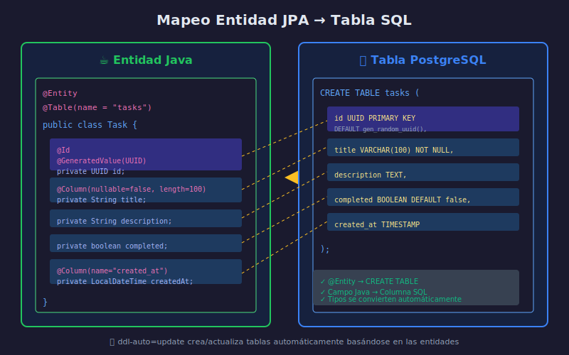

# 🏷️ Entidades JPA

## Objetivos de Aprendizaje

- Crear entidades JPA con anotaciones
- Configurar claves primarias con diferentes estrategias
- Mapear campos a columnas SQL
- Entender las anotaciones más importantes

---

## ¿Qué es una Entidad?

Una **entidad** es una clase Java que representa una tabla en la base de datos:

```
┌──────────────────────┐         ┌──────────────────────┐
│   @Entity Task       │         │   TABLE tasks        │
├──────────────────────┤         ├──────────────────────┤
│ UUID id              │ ◄─────► │ id UUID PK           │
│ String title         │ ◄─────► │ title VARCHAR        │
│ String description   │ ◄─────► │ description TEXT     │
│ boolean completed    │ ◄─────► │ completed BOOLEAN    │
│ LocalDateTime created│ ◄─────► │ created_at TIMESTAMP │
└──────────────────────┘         └──────────────────────┘
```

---

## Diagrama de Mapeo



---

## Anotación @Entity

### Sintaxis Básica

```java
import jakarta.persistence.Entity;
import jakarta.persistence.Id;

@Entity  // Marca la clase como entidad JPA
public class Task {

    @Id  // Marca el campo como clave primaria
    private UUID id;

    private String title;
    private String description;
    private boolean completed;

    // Constructor vacío OBLIGATORIO para JPA
    public Task() {}

    // Getters y setters...
}
```

### Requisitos de una Entidad

| Requisito | Descripción |
|-----------|-------------|
| `@Entity` | Anotación obligatoria |
| `@Id` | Debe tener clave primaria |
| Constructor vacío | Público o protected, sin argumentos |
| No final | La clase no puede ser final |
| Getters/Setters | Para los campos mapeados |

---

## Anotación @Table

Personaliza el nombre y configuración de la tabla:

```java
@Entity
@Table(
    name = "tasks",                    // Nombre de la tabla
    schema = "public",                 // Schema (PostgreSQL)
    uniqueConstraints = {
        @UniqueConstraint(columnNames = {"title", "user_id"})
    },
    indexes = {
        @Index(name = "idx_task_completed", columnList = "completed")
    }
)
public class Task {
    // ...
}
```

### ¿Cuándo Usar @Table?

| Escenario | Necesitas @Table? |
|-----------|-------------------|
| Nombre de tabla = nombre de clase | No |
| Nombre diferente (ej: `tasks` vs `Task`) | Sí |
| Constraints únicos | Sí |
| Índices | Sí |

---

## Anotación @Id y Estrategias de Generación

### @Id - Clave Primaria

```java
@Entity
public class Task {
    @Id
    private UUID id;  // Debes asignar el ID manualmente
}
```

### @GeneratedValue - Generación Automática

```java
@Entity
public class Task {
    @Id
    @GeneratedValue(strategy = GenerationType.UUID)
    private UUID id;  // JPA genera el UUID automáticamente
}
```

### Estrategias de Generación

| Estrategia | Descripción | Uso |
|------------|-------------|-----|
| `UUID` | Genera UUID aleatorio | ✅ Recomendado para distribuidos |
| `IDENTITY` | Auto-increment de la BD | MySQL, PostgreSQL |
| `SEQUENCE` | Usa secuencia de BD | PostgreSQL, Oracle |
| `TABLE` | Usa tabla auxiliar | Portabilidad |
| `AUTO` | JPA decide | No recomendado |

### Ejemplos por Estrategia

```java
// UUID (Recomendado para APIs REST)
@Id
@GeneratedValue(strategy = GenerationType.UUID)
private UUID id;

// IDENTITY (Auto-increment)
@Id
@GeneratedValue(strategy = GenerationType.IDENTITY)
private Long id;

// SEQUENCE (PostgreSQL nativo)
@Id
@GeneratedValue(strategy = GenerationType.SEQUENCE, generator = "task_seq")
@SequenceGenerator(name = "task_seq", sequenceName = "task_sequence", allocationSize = 1)
private Long id;
```

### ¿UUID o Long?

| Aspecto | UUID | Long |
|---------|------|------|
| Unicidad global | ✅ Sí | ❌ No |
| Predecible | ❌ No | ✅ Sí (seguridad) |
| Tamaño | 16 bytes | 8 bytes |
| Rendimiento índice | Menor | Mayor |
| REST APIs | ✅ Recomendado | ⚠️ Expone secuencia |

---

## Anotación @Column

Configura el mapeo de campos a columnas:

```java
@Entity
@Table(name = "tasks")
public class Task {

    @Id
    @GeneratedValue(strategy = GenerationType.UUID)
    private UUID id;

    @Column(
        name = "title",           // Nombre de columna
        nullable = false,         // NOT NULL
        length = 100,             // VARCHAR(100)
        unique = false            // Sin constraint UNIQUE
    )
    private String title;

    @Column(columnDefinition = "TEXT")  // Tipo SQL específico
    private String description;

    @Column(nullable = false)
    private boolean completed = false;

    @Column(name = "created_at", updatable = false)
    private LocalDateTime createdAt;

    @Column(name = "updated_at")
    private LocalDateTime updatedAt;
}
```

### Atributos de @Column

| Atributo | Descripción | Default |
|----------|-------------|---------|
| `name` | Nombre de columna | Nombre del campo |
| `nullable` | Permite NULL | true |
| `length` | Longitud para String | 255 |
| `unique` | Constraint UNIQUE | false |
| `insertable` | Incluir en INSERT | true |
| `updatable` | Incluir en UPDATE | true |
| `columnDefinition` | DDL específico | (automático) |
| `precision` | Dígitos totales (decimal) | 0 |
| `scale` | Dígitos decimales | 0 |

---

## Tipos de Datos Java → SQL

### Mapeo Automático

| Java | PostgreSQL | Notas |
|------|------------|-------|
| `String` | VARCHAR(255) | Usar `length` para cambiar |
| `String` + `@Lob` | TEXT | Para textos largos |
| `int` / `Integer` | INTEGER | |
| `long` / `Long` | BIGINT | |
| `boolean` / `Boolean` | BOOLEAN | |
| `double` / `Double` | DOUBLE PRECISION | |
| `BigDecimal` | NUMERIC | Usar con `precision` y `scale` |
| `LocalDate` | DATE | |
| `LocalDateTime` | TIMESTAMP | |
| `LocalTime` | TIME | |
| `UUID` | UUID | Nativo en PostgreSQL |
| `byte[]` | BYTEA | Para archivos binarios |

### Ejemplo con Diferentes Tipos

```java
@Entity
public class Product {
    @Id
    @GeneratedValue(strategy = GenerationType.UUID)
    private UUID id;

    @Column(nullable = false, length = 100)
    private String name;

    @Column(precision = 10, scale = 2)  // NUMERIC(10,2)
    private BigDecimal price;

    private Integer stock;

    private LocalDate releaseDate;

    @Column(columnDefinition = "TEXT")
    private String description;
}
```

---

## Anotaciones de Auditoría

### Timestamps Automáticos

```java
@Entity
@EntityListeners(AuditingEntityListener.class)  // Habilitar auditoría
public class Task {

    @Id
    @GeneratedValue(strategy = GenerationType.UUID)
    private UUID id;

    // ... otros campos

    @CreatedDate
    @Column(name = "created_at", updatable = false)
    private LocalDateTime createdAt;

    @LastModifiedDate
    @Column(name = "updated_at")
    private LocalDateTime updatedAt;
}
```

### Habilitar Auditoría en Spring Boot

```java
@SpringBootApplication
@EnableJpaAuditing  // Agregar esta anotación
public class TaskManagerApplication {
    public static void main(String[] args) {
        SpringApplication.run(TaskManagerApplication.class, args);
    }
}
```

### Alternativa: @PrePersist y @PreUpdate

```java
@Entity
public class Task {
    // ... campos

    @Column(name = "created_at", updatable = false)
    private LocalDateTime createdAt;

    @Column(name = "updated_at")
    private LocalDateTime updatedAt;

    @PrePersist  // Antes de INSERT
    protected void onCreate() {
        this.createdAt = LocalDateTime.now();
        this.updatedAt = LocalDateTime.now();
    }

    @PreUpdate  // Antes de UPDATE
    protected void onUpdate() {
        this.updatedAt = LocalDateTime.now();
    }
}
```

---

## Entidad Completa: Task

```java
package com.bootcamp.taskmanager.model;

import jakarta.persistence.*;
import java.time.LocalDateTime;
import java.util.UUID;

@Entity
@Table(name = "tasks")
public class Task {

    @Id
    @GeneratedValue(strategy = GenerationType.UUID)
    private UUID id;

    @Column(nullable = false, length = 100)
    private String title;

    @Column(columnDefinition = "TEXT")
    private String description;

    @Column(nullable = false)
    private boolean completed = false;

    @Column(name = "created_at", updatable = false)
    private LocalDateTime createdAt;

    @Column(name = "updated_at")
    private LocalDateTime updatedAt;

    // Constructor vacío (requerido por JPA)
    public Task() {
    }

    // Constructor con campos
    public Task(String title, String description) {
        this.title = title;
        this.description = description;
        this.completed = false;
    }

    // Callbacks de ciclo de vida
    @PrePersist
    protected void onCreate() {
        this.createdAt = LocalDateTime.now();
        this.updatedAt = LocalDateTime.now();
    }

    @PreUpdate
    protected void onUpdate() {
        this.updatedAt = LocalDateTime.now();
    }

    // Getters y Setters
    public UUID getId() {
        return id;
    }

    public void setId(UUID id) {
        this.id = id;
    }

    public String getTitle() {
        return title;
    }

    public void setTitle(String title) {
        this.title = title;
    }

    public String getDescription() {
        return description;
    }

    public void setDescription(String description) {
        this.description = description;
    }

    public boolean isCompleted() {
        return completed;
    }

    public void setCompleted(boolean completed) {
        this.completed = completed;
    }

    public LocalDateTime getCreatedAt() {
        return createdAt;
    }

    public LocalDateTime getUpdatedAt() {
        return updatedAt;
    }
}
```

---

## Anotaciones Avanzadas (Preview)

Estas anotaciones se verán en detalle en la Semana 05:

```java
// Relación One-to-Many
@OneToMany(mappedBy = "user")
private List<Task> tasks;

// Relación Many-to-One
@ManyToOne
@JoinColumn(name = "user_id")
private User user;

// Enumeraciones
@Enumerated(EnumType.STRING)
private TaskStatus status;

// Campos embebidos
@Embedded
private Address address;

// Campos transitorios (no persistidos)
@Transient
private int tempCalculation;
```

---

## Resumen de Anotaciones

| Anotación | Propósito |
|-----------|-----------|
| `@Entity` | Marca clase como entidad |
| `@Table` | Configura nombre de tabla |
| `@Id` | Define clave primaria |
| `@GeneratedValue` | Auto-genera el ID |
| `@Column` | Configura columna |
| `@PrePersist` | Callback antes de INSERT |
| `@PreUpdate` | Callback antes de UPDATE |
| `@CreatedDate` | Fecha de creación automática |
| `@LastModifiedDate` | Fecha de modificación automática |

---

## Siguiente Tema

➡️ [04-spring-data-jpa.md](04-spring-data-jpa.md) - Spring Data JPA y JpaRepository
