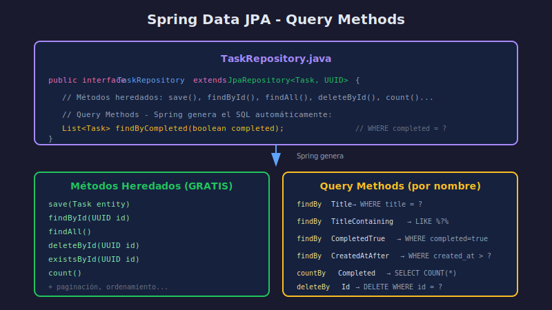

# 🗄️ Spring Data JPA

## Objetivos de Aprendizaje

- Entender qué es Spring Data JPA y sus beneficios
- Crear repositorios extendiendo JpaRepository
- Usar Query Methods para consultas automáticas
- Implementar paginación y ordenamiento

---

## ¿Qué es Spring Data JPA?

**Spring Data JPA** es una capa de abstracción sobre JPA que:

- **Elimina boilerplate**: No escribes implementaciones de repositorio
- **Query Methods**: Genera consultas basándose en nombres de métodos
- **Paginación incluida**: Soporte integrado para paginar resultados
- **Auditoría**: Timestamps automáticos (@CreatedDate, @LastModifiedDate)

---

## Diagrama de Spring Data JPA



---

## JpaRepository: La Interfaz Mágica

### Crear un Repositorio

```java
import org.springframework.data.jpa.repository.JpaRepository;
import java.util.UUID;

public interface TaskRepository extends JpaRepository<Task, UUID> {
    // ¡Ya tienes 15+ métodos GRATIS!
}
```

### Métodos Heredados

| Método | Descripción |
|--------|-------------|
| `save(S entity)` | Guarda o actualiza |
| `saveAll(Iterable<S>)` | Guarda múltiples |
| `findById(ID id)` | Busca por ID (Optional) |
| `existsById(ID id)` | Verifica existencia |
| `findAll()` | Obtiene todos |
| `findAllById(Iterable<ID>)` | Busca por múltiples IDs |
| `count()` | Cuenta registros |
| `deleteById(ID id)` | Elimina por ID |
| `delete(T entity)` | Elimina entidad |
| `deleteAll()` | Elimina todos |
| `flush()` | Sincroniza con BD |
| `findAll(Sort sort)` | Todos ordenados |
| `findAll(Pageable)` | Paginado |

### Jerarquía de Interfaces

```
Repository<T, ID>                    (Marcador vacío)
    │
    └── CrudRepository<T, ID>        (CRUD básico)
            │
            └── ListCrudRepository   (Retorna List en vez de Iterable)
                    │
                    └── JpaRepository<T, ID>  (JPA específico + paginación)
```

---

## Query Methods: Consultas Automáticas

### ¿Cómo Funcionan?

Spring analiza el nombre del método y genera la consulta SQL:

```java
public interface TaskRepository extends JpaRepository<Task, UUID> {

    // SELECT * FROM tasks WHERE completed = ?
    List<Task> findByCompleted(boolean completed);

    // SELECT * FROM tasks WHERE title = ?
    List<Task> findByTitle(String title);

    // SELECT * FROM tasks WHERE title LIKE %?%
    List<Task> findByTitleContaining(String title);
}
```

### Palabras Clave Soportadas

| Keyword | Ejemplo | SQL Generado |
|---------|---------|--------------|
| `findBy` | `findByTitle(String)` | `WHERE title = ?` |
| `readBy` | `readByTitle(String)` | `WHERE title = ?` |
| `queryBy` | `queryByTitle(String)` | `WHERE title = ?` |
| `countBy` | `countByCompleted(boolean)` | `SELECT COUNT(*)` |
| `existsBy` | `existsByTitle(String)` | `SELECT EXISTS(...)` |
| `deleteBy` | `deleteByCompleted(boolean)` | `DELETE WHERE...` |

### Operadores de Comparación

| Operador | Ejemplo | SQL |
|----------|---------|-----|
| `Is`, `Equals` | `findByTitleIs(String)` | `= ?` |
| `IsNot`, `Not` | `findByTitleNot(String)` | `<> ?` |
| `IsNull` | `findByDescriptionIsNull()` | `IS NULL` |
| `IsNotNull` | `findByDescriptionIsNotNull()` | `IS NOT NULL` |
| `True` | `findByCompletedTrue()` | `= TRUE` |
| `False` | `findByCompletedFalse()` | `= FALSE` |

### Operadores de Texto

| Operador | Ejemplo | SQL |
|----------|---------|-----|
| `Containing` | `findByTitleContaining(String)` | `LIKE %?%` |
| `StartingWith` | `findByTitleStartingWith(String)` | `LIKE ?%` |
| `EndingWith` | `findByTitleEndingWith(String)` | `LIKE %?` |
| `Like` | `findByTitleLike(String)` | `LIKE ?` |
| `IgnoreCase` | `findByTitleIgnoreCase(String)` | `LOWER(...) = LOWER(?)` |

### Operadores de Rango

| Operador | Ejemplo | SQL |
|----------|---------|-----|
| `LessThan` | `findByCreatedAtLessThan(LocalDateTime)` | `< ?` |
| `LessThanEqual` | `findByCreatedAtLessThanEqual(...)` | `<= ?` |
| `GreaterThan` | `findByCreatedAtGreaterThan(...)` | `> ?` |
| `GreaterThanEqual` | `findByCreatedAtGreaterThanEqual(...)` | `>= ?` |
| `Between` | `findByCreatedAtBetween(start, end)` | `BETWEEN ? AND ?` |

### Combinaciones con AND/OR

```java
// AND
List<Task> findByTitleAndCompleted(String title, boolean completed);
// WHERE title = ? AND completed = ?

// OR
List<Task> findByTitleOrDescription(String title, String desc);
// WHERE title = ? OR description = ?

// Combinación
List<Task> findByCompletedFalseAndTitleContaining(String title);
// WHERE completed = FALSE AND title LIKE %?%
```

### Ordenamiento en Query Methods

```java
// ORDER BY createdAt DESC
List<Task> findByCompletedOrderByCreatedAtDesc(boolean completed);

// ORDER BY title ASC
List<Task> findByCompletedOrderByTitleAsc(boolean completed);

// Múltiple ordenamiento
List<Task> findByCompletedOrderByCreatedAtDescTitleAsc(boolean completed);
```

### Limitar Resultados

```java
// LIMIT 1 (retorna Optional)
Optional<Task> findFirstByCompletedOrderByCreatedAtDesc(boolean completed);

// LIMIT 5
List<Task> findTop5ByCompletedOrderByCreatedAtDesc(boolean completed);

// LIMIT 10
List<Task> findFirst10ByOrderByCreatedAtDesc();
```

---

## Ejemplo Completo: TaskRepository

```java
package com.bootcamp.taskmanager.repository;

import com.bootcamp.taskmanager.model.Task;
import org.springframework.data.jpa.repository.JpaRepository;
import org.springframework.stereotype.Repository;

import java.time.LocalDateTime;
import java.util.List;
import java.util.Optional;
import java.util.UUID;

@Repository  // Opcional pero recomendado para semántica
public interface TaskRepository extends JpaRepository<Task, UUID> {

    // Buscar por estado de completado
    List<Task> findByCompleted(boolean completed);

    // Buscar por título (exacto)
    Optional<Task> findByTitle(String title);

    // Buscar por título conteniendo texto (case insensitive)
    List<Task> findByTitleContainingIgnoreCase(String title);

    // Tareas completadas/pendientes ordenadas por fecha
    List<Task> findByCompletedOrderByCreatedAtDesc(boolean completed);

    // Tareas creadas después de cierta fecha
    List<Task> findByCreatedAtAfter(LocalDateTime date);

    // Tareas creadas en un rango de fechas
    List<Task> findByCreatedAtBetween(LocalDateTime start, LocalDateTime end);

    // Contar tareas por estado
    long countByCompleted(boolean completed);

    // Verificar si existe tarea con título
    boolean existsByTitle(String title);

    // Última tarea creada
    Optional<Task> findFirstByOrderByCreatedAtDesc();

    // Top 5 tareas más recientes
    List<Task> findTop5ByOrderByCreatedAtDesc();
}
```

---

## @Query: Consultas Personalizadas

Cuando los Query Methods no son suficientes:

### JPQL (Java Persistence Query Language)

```java
public interface TaskRepository extends JpaRepository<Task, UUID> {

    // JPQL - orientado a objetos
    @Query("SELECT t FROM Task t WHERE t.completed = false AND t.createdAt < :date")
    List<Task> findOldPendingTasks(@Param("date") LocalDateTime date);

    // JPQL con LIKE
    @Query("SELECT t FROM Task t WHERE LOWER(t.title) LIKE LOWER(CONCAT('%', :keyword, '%'))")
    List<Task> searchByKeyword(@Param("keyword") String keyword);

    // JPQL para actualizar
    @Modifying
    @Query("UPDATE Task t SET t.completed = true WHERE t.id = :id")
    int markAsCompleted(@Param("id") UUID id);
}
```

### SQL Nativo

```java
public interface TaskRepository extends JpaRepository<Task, UUID> {

    // SQL nativo de PostgreSQL
    @Query(value = "SELECT * FROM tasks WHERE created_at > NOW() - INTERVAL '7 days'",
           nativeQuery = true)
    List<Task> findTasksFromLastWeek();

    // SQL con parámetro
    @Query(value = "SELECT * FROM tasks WHERE title ILIKE %:title%",
           nativeQuery = true)
    List<Task> searchByTitleNative(@Param("title") String title);
}
```

---

## Paginación y Ordenamiento

### Usando Pageable

```java
// En el Repository (ya heredado de JpaRepository)
Page<Task> findAll(Pageable pageable);
Page<Task> findByCompleted(boolean completed, Pageable pageable);

// En el Service
public Page<Task> getTasks(int page, int size, String sortBy) {
    Pageable pageable = PageRequest.of(page, size, Sort.by(sortBy).descending());
    return taskRepository.findAll(pageable);
}

// En el Controller
@GetMapping
public ResponseEntity<Page<TaskResponse>> findAll(
        @RequestParam(defaultValue = "0") int page,
        @RequestParam(defaultValue = "10") int size,
        @RequestParam(defaultValue = "createdAt") String sortBy) {

    Page<Task> tasks = taskService.getTasks(page, size, sortBy);
    Page<TaskResponse> response = tasks.map(this::toResponse);
    return ResponseEntity.ok(response);
}
```

### Objeto Page

```java
Page<Task> page = taskRepository.findAll(PageRequest.of(0, 10));

page.getContent();         // List<Task> - los datos
page.getTotalElements();   // Total de registros
page.getTotalPages();      // Total de páginas
page.getNumber();          // Página actual (0-based)
page.getSize();            // Tamaño de página
page.hasNext();            // ¿Hay siguiente página?
page.hasPrevious();        // ¿Hay página anterior?
```

### Ordenamiento con Sort

```java
// Un campo
Sort sort = Sort.by("createdAt").descending();

// Múltiples campos
Sort sort = Sort.by(
    Sort.Order.desc("completed"),
    Sort.Order.asc("title")
);

// Aplicar
List<Task> tasks = taskRepository.findAll(sort);
```

---

## Uso en el Service

### Migración desde Semana 03

```java
// ANTES (Semana 03 - repositorio en memoria)
@Service
public class TaskServiceImpl implements TaskService {

    private final TaskRepository taskRepository;  // Era clase con Map

    @Override
    public TaskResponse create(TaskRequest request) {
        Task task = new Task();
        task.setId(UUID.randomUUID().toString());  // Generábamos ID
        task.setTitle(request.getTitle());
        task.setCreatedAt(LocalDateTime.now());    // Asignábamos fecha

        Task saved = taskRepository.save(task);
        return toResponse(saved);
    }
}

// DESPUÉS (Semana 04 - JPA)
@Service
public class TaskServiceImpl implements TaskService {

    private final TaskRepository taskRepository;  // Ahora es JpaRepository

    @Override
    public TaskResponse create(TaskRequest request) {
        Task task = new Task();
        // NO asignamos ID - JPA lo genera con @GeneratedValue
        // NO asignamos createdAt - @PrePersist lo hace
        task.setTitle(request.getTitle());
        task.setDescription(request.getDescription());

        Task saved = taskRepository.save(task);  // Mismo método, ahora persiste en PostgreSQL
        return toResponse(saved);
    }
}
```

### Cambios Principales

| Aspecto | Semana 03 | Semana 04 |
|---------|-----------|-----------|
| ID | String, generado manualmente | UUID, @GeneratedValue |
| Fechas | Asignadas manualmente | @PrePersist/@PreUpdate |
| Repository | Clase con ConcurrentHashMap | Interface + JpaRepository |
| Persistencia | En memoria (se pierde) | PostgreSQL (persiste) |
| Query Methods | Implementados manualmente | Automáticos |

---

## Transacciones

### @Transactional

```java
@Service
public class TaskServiceImpl implements TaskService {

    @Transactional  // Todo el método es una transacción
    public void completeBatch(List<UUID> taskIds) {
        for (UUID id : taskIds) {
            Task task = taskRepository.findById(id)
                .orElseThrow(() -> new ResourceNotFoundException("Task", "id", id));
            task.setCompleted(true);
            taskRepository.save(task);
        }
        // Si falla alguno, se hace rollback de todos
    }

    @Transactional(readOnly = true)  // Optimización para lecturas
    public List<Task> findAll() {
        return taskRepository.findAll();
    }
}
```

### ¿Cuándo Usar @Transactional?

| Operación | ¿@Transactional? |
|-----------|------------------|
| Lectura simple | `readOnly = true` (opcional) |
| Escritura simple | Automático por Spring Data |
| Múltiples escrituras | ✅ Obligatorio |
| Llamadas a múltiples repos | ✅ Obligatorio |

---

## Resumen

| Concepto | Descripción |
|----------|-------------|
| **JpaRepository** | Interfaz base con CRUD + paginación |
| **Query Methods** | Consultas generadas por nombre de método |
| **@Query** | Consultas JPQL o SQL personalizadas |
| **Pageable** | Soporte para paginación |
| **Sort** | Ordenamiento de resultados |
| **@Transactional** | Control de transacciones |

---

## Siguiente Tema

➡️ [05-multi-stage-builds.md](05-multi-stage-builds.md) - Optimización de imágenes Docker
