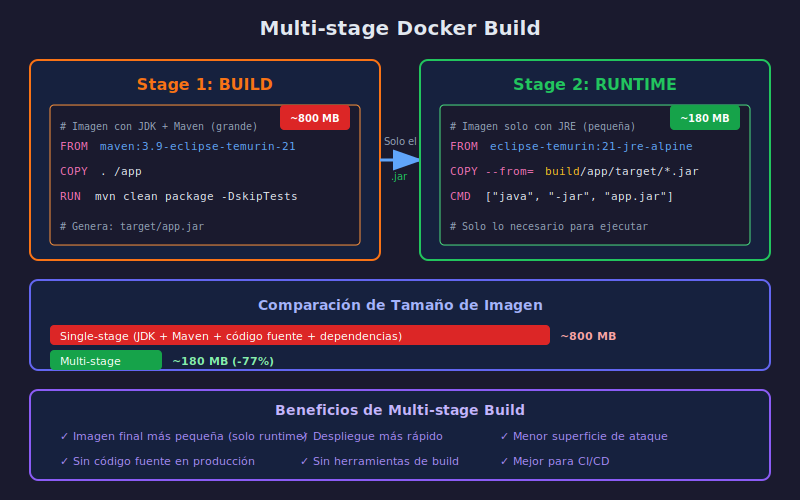

# 🐳 Multi-Stage Docker Builds

## Objetivos de Aprendizaje

- Entender qué son los multi-stage builds
- Reducir el tamaño de las imágenes Docker
- Separar el entorno de build del runtime
- Aplicar mejores prácticas de seguridad

---

## El Problema: Imágenes Grandes

### Dockerfile Single-Stage (Problemático)

```dockerfile
# ❌ Imagen GRANDE (~800MB)
FROM eclipse-temurin:21-jdk-alpine

WORKDIR /app
COPY . .
RUN ./mvnw clean package -DskipTests

# La imagen final incluye:
# - JDK completo (no solo JRE)
# - Maven y todas sus dependencias
# - Código fuente
# - Archivos de compilación intermedios

CMD ["java", "-jar", "target/app.jar"]
```

### ¿Por Qué Es un Problema?

| Aspecto | Impacto |
|---------|---------|
| **Tamaño** | ~800MB vs ~180MB |
| **Despliegue** | Más lento de subir/bajar |
| **Seguridad** | Más superficie de ataque |
| **Almacenamiento** | Más costo en registries |
| **Código fuente** | Expuesto en la imagen |

---

## Diagrama Multi-Stage Build



---

## La Solución: Multi-Stage Build

### Concepto

Un multi-stage build usa **múltiples instrucciones `FROM`**:

1. **Stage 1 (Build)**: Compila la aplicación
2. **Stage 2 (Runtime)**: Solo contiene lo necesario para ejecutar

```dockerfile
# ══════════════════════════════════════════════════════════════
# STAGE 1: BUILD
# ══════════════════════════════════════════════════════════════
FROM maven:3.9-eclipse-temurin-21-alpine AS build

WORKDIR /app
COPY pom.xml .
COPY src ./src

RUN mvn clean package -DskipTests

# Genera: /app/target/taskmanager-0.0.1-SNAPSHOT.jar

# ══════════════════════════════════════════════════════════════
# STAGE 2: RUNTIME
# ══════════════════════════════════════════════════════════════
FROM eclipse-temurin:21-jre-alpine

WORKDIR /app

# Solo copiamos el JAR del stage anterior
COPY --from=build /app/target/*.jar app.jar

EXPOSE 8080

CMD ["java", "-jar", "app.jar"]
```

### ¿Qué Sucede?

```
Stage BUILD:                          Stage RUNTIME:
┌─────────────────────┐              ┌─────────────────────┐
│ maven:3.9-jdk-21    │              │ temurin:21-jre      │
│ (~600MB)            │              │ (~150MB)            │
├─────────────────────┤              ├─────────────────────┤
│ - Maven             │              │ - Solo JRE          │
│ - JDK completo      │     ───►     │ - app.jar           │
│ - Código fuente     │   (copia     │                     │
│ - Dependencias      │    solo      │ Total: ~180MB       │
│ - target/*.jar      │    el JAR)   │                     │
└─────────────────────┘              └─────────────────────┘
       ↓                                    ↓
   DESCARTADO                         IMAGEN FINAL
```

---

## Dockerfile Optimizado Completo

```dockerfile
# ══════════════════════════════════════════════════════════════
# STAGE 1: BUILD
# Imagen con Maven + JDK para compilar
# ══════════════════════════════════════════════════════════════
FROM maven:3.9-eclipse-temurin-21-alpine AS build

WORKDIR /app

# 1. Copiar solo pom.xml primero (para cachear dependencias)
COPY pom.xml .

# 2. Descargar dependencias (se cachea si pom.xml no cambia)
RUN mvn dependency:go-offline -B

# 3. Copiar código fuente
COPY src ./src

# 4. Compilar
RUN mvn clean package -DskipTests -B

# ══════════════════════════════════════════════════════════════
# STAGE 2: RUNTIME
# Imagen mínima solo con JRE
# ══════════════════════════════════════════════════════════════
FROM eclipse-temurin:21-jre-alpine

# Usuario no-root para seguridad
RUN addgroup -S spring && adduser -S spring -G spring
USER spring:spring

WORKDIR /app

# Copiar JAR desde el stage de build
COPY --from=build /app/target/*.jar app.jar

# Puerto de la aplicación
EXPOSE 8080

# Configuración de JVM para contenedores
ENV JAVA_OPTS="-XX:+UseContainerSupport -XX:MaxRAMPercentage=75.0"

# Health check
HEALTHCHECK --interval=30s --timeout=3s --start-period=30s --retries=3 \
  CMD wget --no-verbose --tries=1 --spider http://localhost:8080/actuator/health || exit 1

# Comando de inicio
ENTRYPOINT ["sh", "-c", "java $JAVA_OPTS -jar app.jar"]
```

---

## Optimización de Caché de Docker

### Orden de las Instrucciones

Docker cachea cada capa. El orden importa:

```dockerfile
# ✅ CORRECTO: Dependencias primero (cambian poco)
COPY pom.xml .
RUN mvn dependency:go-offline
COPY src ./src              # Código cambia frecuentemente
RUN mvn package

# ❌ INCORRECTO: Todo junto
COPY . .                    # Cualquier cambio invalida caché
RUN mvn package             # Siempre descarga dependencias
```

### Beneficio

```
Primer build:     Rebuild (solo código):
────────────────  ──────────────────────
COPY pom.xml      COPY pom.xml ✓ (cached)
  ↓ 30s
mvn dependency    mvn dependency ✓ (cached)
  ↓ 2min
COPY src          COPY src ← cambiado
  ↓ 1s              ↓ 1s
mvn package       mvn package
  ↓ 1min            ↓ 1min
────────────────  ──────────────────────
Total: ~3.5min    Total: ~1min
```

---

## JDK vs JRE

### ¿Cuál Usar?

| Imagen | Contiene | Tamaño | Uso |
|--------|----------|--------|-----|
| `eclipse-temurin:21-jdk` | JDK completo | ~400MB | Build |
| `eclipse-temurin:21-jre` | Solo runtime | ~150MB | Runtime |
| `eclipse-temurin:21-jdk-alpine` | JDK + Alpine | ~300MB | Build |
| `eclipse-temurin:21-jre-alpine` | JRE + Alpine | ~100MB | Runtime ✅ |

### ¿Por Qué Alpine?

Alpine Linux es una distribución minimalista:

```
Imagen normal:     Imagen Alpine:
────────────────   ────────────────
Ubuntu base        Alpine base
  ~70MB              ~5MB
+ JRE               + JRE
  ~150MB             ~100MB
────────────────   ────────────────
Total: ~220MB      Total: ~105MB
```

---

## Seguridad: Usuario No-Root

### Por Qué Es Importante

```dockerfile
# ❌ Corre como root (peligroso)
FROM eclipse-temurin:21-jre-alpine
CMD ["java", "-jar", "app.jar"]

# ✅ Corre como usuario spring (seguro)
FROM eclipse-temurin:21-jre-alpine
RUN addgroup -S spring && adduser -S spring -G spring
USER spring:spring
CMD ["java", "-jar", "app.jar"]
```

### Riesgos de Root

| Riesgo | Consecuencia |
|--------|--------------|
| Vulnerabilidad explotada | Acceso root al contenedor |
| Escape de contenedor | Posible acceso root al host |
| Archivos sensibles | Pueden ser modificados |

---

## Configuración de JVM para Contenedores

### Opciones Importantes

```dockerfile
ENV JAVA_OPTS="\
  -XX:+UseContainerSupport \
  -XX:MaxRAMPercentage=75.0 \
  -XX:InitialRAMPercentage=50.0 \
  -Djava.security.egd=file:/dev/./urandom"
```

| Opción | Descripción |
|--------|-------------|
| `UseContainerSupport` | JVM reconoce límites del contenedor |
| `MaxRAMPercentage=75` | Usa máximo 75% de RAM asignada |
| `InitialRAMPercentage=50` | Inicia con 50% de RAM |
| `java.security.egd` | Acelera generación de números aleatorios |

### Sin UseContainerSupport

```
Contenedor con límite de 512MB:

❌ Sin flag:
   JVM ve 16GB del host → asigna 4GB heap → OOM killed

✅ Con flag:
   JVM ve 512MB del contenedor → asigna ~380MB heap → funciona
```

---

## Comparación de Tamaños

### Single-Stage vs Multi-Stage

```bash
# Construir ambas versiones
docker build -t app:single -f Dockerfile.single .
docker build -t app:multi -f Dockerfile.multi .

# Comparar tamaños
docker images | grep app
```

| Versión | Tamaño | Contenido |
|---------|--------|-----------|
| Single-stage | ~800MB | JDK + Maven + código + JAR |
| Multi-stage | ~180MB | Solo JRE + JAR |

### Ahorro

```
Reducción: 800MB - 180MB = 620MB (-77%)

En un registry con 100 versiones:
  Single: 80GB de almacenamiento
  Multi:  18GB de almacenamiento
  Ahorro: 62GB
```

---

## docker-compose con Multi-Stage

```yaml
services:
  api:
    build:
      context: .
      dockerfile: Dockerfile
      # Puedes especificar target si quieres solo el build stage
      # target: build
    container_name: taskmanager-api
    ports:
      - "8080:8080"
    environment:
      - SPRING_PROFILES_ACTIVE=dev
      - JAVA_OPTS=-Xmx256m
    depends_on:
      db:
        condition: service_healthy
    networks:
      - backend

  db:
    image: postgres:16-alpine
    # ... resto de configuración
```

---

## Comandos Útiles

```bash
# Construir imagen
docker build -t taskmanager:latest .

# Ver tamaño de imagen
docker images taskmanager

# Ver capas de la imagen
docker history taskmanager:latest

# Inspeccionar imagen
docker inspect taskmanager:latest

# Limpiar imágenes intermedias
docker image prune -f

# Build con caché limpio (forzar rebuild)
docker build --no-cache -t taskmanager:latest .
```

---

## Dockerfile Final para el Proyecto

```dockerfile
# ══════════════════════════════════════════════════════════════
# Task Manager API - Multi-Stage Dockerfile
# ══════════════════════════════════════════════════════════════

# Stage 1: Build
FROM maven:3.9-eclipse-temurin-21-alpine AS build
WORKDIR /app
COPY pom.xml .
RUN mvn dependency:go-offline -B
COPY src ./src
RUN mvn clean package -DskipTests -B

# Stage 2: Runtime
FROM eclipse-temurin:21-jre-alpine
RUN addgroup -S spring && adduser -S spring -G spring
USER spring:spring
WORKDIR /app
COPY --from=build /app/target/*.jar app.jar
EXPOSE 8080
ENV JAVA_OPTS="-XX:+UseContainerSupport -XX:MaxRAMPercentage=75.0"
ENTRYPOINT ["sh", "-c", "java $JAVA_OPTS -jar app.jar"]
```

---

## Resumen

| Concepto | Descripción |
|----------|-------------|
| **Multi-stage** | Múltiples FROM, solo última imagen se usa |
| **Stage BUILD** | Compila con Maven + JDK |
| **Stage RUNTIME** | Solo JRE + JAR compilado |
| **Alpine** | Imagen base ligera (~5MB) |
| **Usuario no-root** | Seguridad en producción |
| **Caché de Docker** | Orden de COPY importa |
| **JVM Container** | UseContainerSupport para límites |

---

## Checklist de Optimización

- [ ] Usar multi-stage build
- [ ] Separar COPY de dependencias y código
- [ ] Usar imagen Alpine para runtime
- [ ] Crear usuario no-root
- [ ] Configurar JVM para contenedores
- [ ] Agregar HEALTHCHECK
- [ ] Usar .dockerignore

---

## Archivo .dockerignore

```
# .dockerignore
target/
!target/*.jar
*.md
.git
.gitignore
.idea
*.iml
.vscode
.env
docker-compose*.yml
Dockerfile*
```

---

## Siguiente Paso

➡️ Ir a las prácticas para implementar todo esto en el proyecto.
