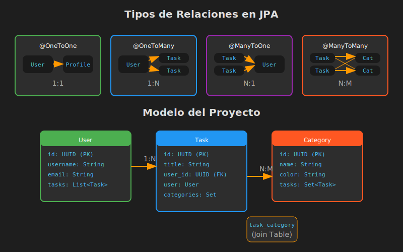

# Relaciones entre Entidades en JPA

## 📚 Introducción

En aplicaciones reales, las entidades raramente existen de forma aislada. Un **usuario** tiene **tareas**, una **tarea** pertenece a **categorías**, un **pedido** contiene **productos**. JPA nos permite modelar estas relaciones de forma elegante mediante anotaciones.

---

## 🎯 Objetivos de Aprendizaje

- Comprender los tipos de relaciones en bases de datos relacionales
- Aprender a mapear relaciones con anotaciones JPA
- Entender el concepto de "lado propietario" de la relación
- Conocer cuándo usar cada tipo de relación

---

## 📊 Tipos de Relaciones



### Cardinalidad en Bases de Datos

| Relación | Descripción | Ejemplo |
|----------|-------------|---------|
| **1:1** (Uno a Uno) | Una entidad se relaciona con exactamente una | User ↔ Profile |
| **1:N** (Uno a Muchos) | Una entidad se relaciona con muchas | User → Tasks |
| **N:1** (Muchos a Uno) | Muchas entidades se relacionan con una | Tasks → User |
| **N:M** (Muchos a Muchos) | Muchas entidades con muchas | Tasks ↔ Categories |

---

## 🏷️ Anotaciones JPA para Relaciones

### @OneToOne

Relación uno a uno entre dos entidades.

```java
@Entity
public class User {
    @Id
    @GeneratedValue(strategy = GenerationType.UUID)
    private UUID id;

    @OneToOne(cascade = CascadeType.ALL)
    @JoinColumn(name = "profile_id")
    private Profile profile;
}

@Entity
public class Profile {
    @Id
    @GeneratedValue(strategy = GenerationType.UUID)
    private UUID id;

    private String biography;
    private String avatarUrl;

    @OneToOne(mappedBy = "profile")
    private User user;
}
```

### @OneToMany y @ManyToOne

La relación más común. Un usuario puede tener muchas tareas.

```java
// Lado "One" (User)
@Entity
public class User {
    @Id
    @GeneratedValue(strategy = GenerationType.UUID)
    private UUID id;

    private String username;

    @OneToMany(mappedBy = "user", cascade = CascadeType.ALL)
    private List<Task> tasks = new ArrayList<>();
}

// Lado "Many" (Task) - DUEÑO de la relación
@Entity
public class Task {
    @Id
    @GeneratedValue(strategy = GenerationType.UUID)
    private UUID id;

    private String title;

    @ManyToOne
    @JoinColumn(name = "user_id")  // FK en tabla tasks
    private User user;
}
```

### @ManyToMany

Relación muchos a muchos. Requiere tabla intermedia.

```java
// Lado propietario (Task)
@Entity
public class Task {
    @ManyToMany
    @JoinTable(
        name = "task_category",
        joinColumns = @JoinColumn(name = "task_id"),
        inverseJoinColumns = @JoinColumn(name = "category_id")
    )
    private Set<Category> categories = new HashSet<>();
}

// Lado inverso (Category)
@Entity
public class Category {
    @ManyToMany(mappedBy = "categories")
    private Set<Task> tasks = new HashSet<>();
}
```

---

## 🎯 ¿Quién es el Dueño de la Relación?

En relaciones bidireccionales, JPA necesita saber qué lado "controla" la relación (dónde está la FK).

### Reglas:

| Relación | Dueño (owning side) | Inverso (mappedBy) |
|----------|---------------------|-------------------|
| @OneToMany/@ManyToOne | El lado @ManyToOne | El lado @OneToMany |
| @ManyToMany | El lado con @JoinTable | El lado con mappedBy |
| @OneToOne | El lado con @JoinColumn | El lado con mappedBy |

### ⚠️ Importante:

```java
// ❌ ERROR COMÚN: Solo agregar al lado inverso
user.getTasks().add(task);  // ¡NO persiste!

// ✅ CORRECTO: Agregar al lado propietario
task.setUser(user);  // Esto SÍ persiste
user.getTasks().add(task);  // Para mantener consistencia en memoria
```

---

## 📋 Tabla en Base de Datos

### Para @OneToMany/@ManyToOne

```sql
-- Tabla users (no tiene FK)
CREATE TABLE users (
    id UUID PRIMARY KEY,
    username VARCHAR(100),
    email VARCHAR(255)
);

-- Tabla tasks (tiene FK a users)
CREATE TABLE tasks (
    id UUID PRIMARY KEY,
    title VARCHAR(255),
    user_id UUID REFERENCES users(id)  -- FK aquí
);
```

### Para @ManyToMany

```sql
-- Tabla intermedia generada automáticamente
CREATE TABLE task_category (
    task_id UUID REFERENCES tasks(id),
    category_id UUID REFERENCES categories(id),
    PRIMARY KEY (task_id, category_id)
);
```

---

## 🔑 Conceptos Clave

| Concepto | Descripción |
|----------|-------------|
| **Owning Side** | El lado que tiene la FK en la base de datos |
| **Inverse Side** | El lado con `mappedBy`, solo lectura |
| **Join Column** | Define el nombre de la columna FK |
| **Join Table** | Tabla intermedia para @ManyToMany |
| **Bidireccional** | Ambas entidades conocen la relación |
| **Unidireccional** | Solo una entidad conoce la relación |

---

## 💡 Buenas Prácticas

1. **Preferir relaciones bidireccionales** para navegación flexible
2. **El lado @ManyToOne siempre es el dueño** en 1:N
3. **Usar Set para @ManyToMany** para evitar duplicados
4. **Inicializar colecciones** para evitar NullPointerException
5. **Mantener sincronizados ambos lados** de la relación

```java
// Método helper para mantener sincronía
public void addTask(Task task) {
    tasks.add(task);
    task.setUser(this);
}

public void removeTask(Task task) {
    tasks.remove(task);
    task.setUser(null);
}
```

---

## 📚 Recursos Adicionales

- [JPA Relationships - Baeldung](https://www.baeldung.com/jpa-hibernate-associations)
- [Hibernate ORM Documentation](https://docs.jboss.org/hibernate/orm/current/userguide/html_single/Hibernate_User_Guide.html#associations)

---

## ⏭️ Siguiente

Continúa con [02-one-to-many-bidireccional.md](./02-one-to-many-bidireccional.md) para profundizar en relaciones @OneToMany/@ManyToOne bidireccionales.
