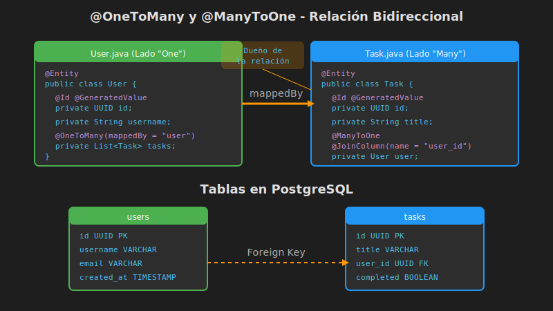

# Relaciones @OneToMany y @ManyToOne Bidireccionales

## 📚 Introducción

La relación **@OneToMany/@ManyToOne** es la más utilizada en aplicaciones empresariales. En nuestro proyecto, un **Usuario** puede tener muchas **Tareas**, y cada **Tarea** pertenece a un único **Usuario**.

---

## 🎯 Objetivos de Aprendizaje

- Implementar relaciones 1:N bidireccionales completas
- Entender `mappedBy` y `@JoinColumn`
- Aprender a sincronizar ambos lados de la relación
- Evitar problemas comunes como N+1 y referencias circulares

---

## 📊 Modelo de Datos



---

## 🛠️ Implementación Completa

### Entidad User (Lado "One")

```java
package com.bootcamp.week05.entity;

import jakarta.persistence.*;
import java.util.*;

@Entity
@Table(name = "users")
public class User {

    @Id
    @GeneratedValue(strategy = GenerationType.UUID)
    private UUID id;

    @Column(nullable = false, unique = true, length = 50)
    private String username;

    @Column(nullable = false, unique = true)
    private String email;

    @Column(name = "created_at")
    private LocalDateTime createdAt;

    // ========== RELACIÓN 1:N ==========
    @OneToMany(
        mappedBy = "user",           // Campo en Task que tiene la FK
        cascade = CascadeType.ALL,   // Propagar operaciones
        orphanRemoval = true,        // Eliminar huérfanos
        fetch = FetchType.LAZY       // Carga perezosa (default)
    )
    private List<Task> tasks = new ArrayList<>();

    // ========== MÉTODOS HELPER ==========
    // Mantienen sincronizados ambos lados

    public void addTask(Task task) {
        tasks.add(task);
        task.setUser(this);
    }

    public void removeTask(Task task) {
        tasks.remove(task);
        task.setUser(null);
    }

    // Constructor, getters, setters...

    @PrePersist
    protected void onCreate() {
        this.createdAt = LocalDateTime.now();
    }
}
```

### Entidad Task (Lado "Many" - Dueño)

```java
package com.bootcamp.week05.entity;

import jakarta.persistence.*;
import java.util.UUID;

@Entity
@Table(name = "tasks")
public class Task {

    @Id
    @GeneratedValue(strategy = GenerationType.UUID)
    private UUID id;

    @Column(nullable = false)
    private String title;

    private String description;

    @Column(nullable = false)
    private Boolean completed = false;

    // ========== RELACIÓN N:1 (DUEÑO) ==========
    @ManyToOne(fetch = FetchType.LAZY)
    @JoinColumn(
        name = "user_id",            // Nombre de la columna FK
        nullable = false             // Toda tarea debe tener usuario
    )
    private User user;

    // Constructor, getters, setters...
}
```

---

## 🔍 Atributos de @OneToMany

| Atributo | Descripción | Ejemplo |
|----------|-------------|---------|
| `mappedBy` | Nombre del campo en la entidad relacionada | `"user"` |
| `cascade` | Propagar operaciones CRUD | `CascadeType.ALL` |
| `orphanRemoval` | Eliminar entidades huérfanas | `true` |
| `fetch` | Estrategia de carga | `FetchType.LAZY` |

---

## 🔍 Atributos de @ManyToOne

| Atributo | Descripción | Ejemplo |
|----------|-------------|---------|
| `fetch` | Estrategia de carga | `FetchType.LAZY` |
| `optional` | Si la relación es obligatoria | `false` |

---

## 🔍 Atributos de @JoinColumn

| Atributo | Descripción | Ejemplo |
|----------|-------------|---------|
| `name` | Nombre de la columna FK | `"user_id"` |
| `nullable` | Si permite NULL | `false` |
| `referencedColumnName` | Columna referenciada (default: PK) | `"id"` |

---

## ⚡ Cascade Types

| Tipo | Descripción |
|------|-------------|
| `PERSIST` | Al guardar User, guarda sus Tasks |
| `MERGE` | Al actualizar User, actualiza sus Tasks |
| `REMOVE` | Al eliminar User, elimina sus Tasks |
| `REFRESH` | Al refrescar User, refresca sus Tasks |
| `DETACH` | Al desadjuntar User, desadjunta sus Tasks |
| `ALL` | Todos los anteriores |

```java
// Con cascade = ALL, esto guarda User Y sus Tasks
User user = new User();
user.setUsername("john");

Task task1 = new Task();
task1.setTitle("Estudiar JPA");

user.addTask(task1);  // Sincroniza ambos lados

userRepository.save(user);  // Guarda user Y task1
```

---

## 🗑️ Orphan Removal

Cuando `orphanRemoval = true`, eliminar una tarea de la lista la borra de la BD:

```java
// Sin orphanRemoval: task queda en BD con user_id = NULL
user.getTasks().remove(task);

// Con orphanRemoval: task se elimina de la BD
user.getTasks().remove(task);  // DELETE FROM tasks WHERE id = ?
```

---

## 🚨 Errores Comunes

### ❌ Error 1: Solo agregar al lado inverso

```java
// ¡NO PERSISTE! La FK está en Task, no en User
user.getTasks().add(task);
userRepository.save(user);

// ✅ CORRECTO
task.setUser(user);
taskRepository.save(task);

// ✅ MEJOR: Usar método helper
user.addTask(task);
userRepository.save(user);  // Con cascade
```

### ❌ Error 2: Recursión infinita en JSON

```java
// User tiene List<Task>
// Task tiene User
// → Serialización infinita!

// ✅ Solución: @JsonIgnore o DTOs
@JsonIgnore
@OneToMany(mappedBy = "user")
private List<Task> tasks;
```

### ❌ Error 3: N+1 Queries

```java
// 1 query para users + N queries para tasks de cada user
List<User> users = userRepository.findAll();
for (User u : users) {
    System.out.println(u.getTasks().size());  // ¡Query por cada user!
}

// ✅ Solución: JOIN FETCH
@Query("SELECT u FROM User u LEFT JOIN FETCH u.tasks")
List<User> findAllWithTasks();
```

---

## 📝 Consultas Útiles

### En TaskRepository

```java
public interface TaskRepository extends JpaRepository<Task, UUID> {

    // Tareas de un usuario
    List<Task> findByUserId(UUID userId);

    // Tareas de un usuario por username
    List<Task> findByUserUsername(String username);

    // Tareas completadas de un usuario
    List<Task> findByUserIdAndCompleted(UUID userId, Boolean completed);

    // Con JOIN FETCH para evitar N+1
    @Query("SELECT t FROM Task t JOIN FETCH t.user WHERE t.id = :id")
    Optional<Task> findByIdWithUser(@Param("id") UUID id);
}
```

### En UserRepository

```java
public interface UserRepository extends JpaRepository<User, UUID> {

    // Usuario con sus tareas (JOIN FETCH)
    @Query("SELECT u FROM User u LEFT JOIN FETCH u.tasks WHERE u.id = :id")
    Optional<User> findByIdWithTasks(@Param("id") UUID id);

    // Usuarios que tienen tareas pendientes
    @Query("SELECT DISTINCT u FROM User u JOIN u.tasks t WHERE t.completed = false")
    List<User> findUsersWithPendingTasks();
}
```

---

## 💡 Buenas Prácticas

1. **Siempre usar métodos helper** para sincronizar relaciones
2. **Usar DTOs** para respuestas API (evitar recursión JSON)
3. **Preferir LAZY** y usar JOIN FETCH cuando necesites datos relacionados
4. **Usar orphanRemoval** con cuidado (elimina permanentemente)
5. **Considerar cascade** según el ciclo de vida de las entidades

---

## 📚 Recursos Adicionales

- [Bidirectional Associations - Vlad Mihalcea](https://vladmihalcea.com/jpa-hibernate-synchronize-bidirectional-entity-associations/)
- [Best Practices for Many-To-One](https://vladmihalcea.com/manytoone-jpa-hibernate/)

---

## ⏭️ Siguiente

Continúa con [03-many-to-many.md](./03-many-to-many.md) para aprender relaciones @ManyToMany con tabla intermedia.
