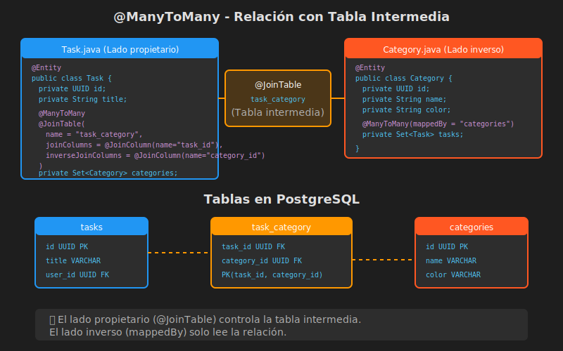

# Relaciones @ManyToMany con Tabla Intermedia

## 📚 Introducción

Las relaciones **muchos a muchos** son comunes en el mundo real: una tarea puede tener varias categorías, y una categoría puede agrupar varias tareas. JPA las implementa mediante una **tabla intermedia** (join table).

---

## 🎯 Objetivos de Aprendizaje

- Implementar relaciones N:M con @ManyToMany
- Entender @JoinTable y su configuración
- Aprender a agregar/remover elementos de forma correcta
- Conocer cuándo usar una entidad intermedia explícita

---

## 📊 Modelo de Datos



---

## 🛠️ Implementación Completa

### Entidad Task (Lado Propietario)

```java
package com.bootcamp.week05.entity;

import jakarta.persistence.*;
import java.util.*;

@Entity
@Table(name = "tasks")
public class Task {

    @Id
    @GeneratedValue(strategy = GenerationType.UUID)
    private UUID id;

    @Column(nullable = false)
    private String title;

    private String description;

    @Column(nullable = false)
    private Boolean completed = false;

    @ManyToOne(fetch = FetchType.LAZY)
    @JoinColumn(name = "user_id", nullable = false)
    private User user;

    // ========== RELACIÓN N:M (PROPIETARIO) ==========
    @ManyToMany(
        cascade = {CascadeType.PERSIST, CascadeType.MERGE},
        fetch = FetchType.LAZY
    )
    @JoinTable(
        name = "task_category",                              // Nombre tabla intermedia
        joinColumns = @JoinColumn(name = "task_id"),         // FK a esta entidad
        inverseJoinColumns = @JoinColumn(name = "category_id") // FK a la otra entidad
    )
    private Set<Category> categories = new HashSet<>();

    // ========== MÉTODOS HELPER ==========
    public void addCategory(Category category) {
        this.categories.add(category);
        category.getTasks().add(this);
    }

    public void removeCategory(Category category) {
        this.categories.remove(category);
        category.getTasks().remove(this);
    }

    // Constructor, getters, setters...
}
```

### Entidad Category (Lado Inverso)

```java
package com.bootcamp.week05.entity;

import jakarta.persistence.*;
import java.util.*;

@Entity
@Table(name = "categories")
public class Category {

    @Id
    @GeneratedValue(strategy = GenerationType.UUID)
    private UUID id;

    @Column(nullable = false, unique = true, length = 50)
    private String name;

    @Column(length = 7)  // Formato: #RRGGBB
    private String color = "#808080";

    private String description;

    // ========== RELACIÓN N:M (INVERSO) ==========
    @ManyToMany(mappedBy = "categories", fetch = FetchType.LAZY)
    private Set<Task> tasks = new HashSet<>();

    // Constructor, getters, setters...

    // ⚠️ IMPORTANTE: equals() y hashCode() basados en id o campos de negocio
    @Override
    public boolean equals(Object o) {
        if (this == o) return true;
        if (!(o instanceof Category)) return false;
        Category category = (Category) o;
        return id != null && Objects.equals(id, category.id);
    }

    @Override
    public int hashCode() {
        return getClass().hashCode();
    }
}
```

---

## 🔍 @JoinTable Explicado

```java
@JoinTable(
    name = "task_category",              // 1. Nombre de la tabla intermedia

    joinColumns = @JoinColumn(           // 2. FK hacia esta entidad (Task)
        name = "task_id",                //    Nombre de la columna
        referencedColumnName = "id"      //    Columna referenciada (default: PK)
    ),

    inverseJoinColumns = @JoinColumn(    // 3. FK hacia la otra entidad (Category)
        name = "category_id",
        referencedColumnName = "id"
    )
)
```

### SQL Generado

```sql
CREATE TABLE task_category (
    task_id UUID NOT NULL,
    category_id UUID NOT NULL,
    PRIMARY KEY (task_id, category_id),
    FOREIGN KEY (task_id) REFERENCES tasks(id),
    FOREIGN KEY (category_id) REFERENCES categories(id)
);
```

---

## ⚡ Cascade en @ManyToMany

| Recomendado | No Recomendado | Razón |
|-------------|----------------|-------|
| `PERSIST` | `REMOVE` | Eliminar Task no debe eliminar Category |
| `MERGE` | `ALL` | Category puede pertenecer a otras Tasks |

```java
// ⚠️ PELIGROSO: cascade = ALL en ManyToMany
@ManyToMany(cascade = CascadeType.ALL)  // ❌ Eliminar task elimina categories

// ✅ SEGURO: solo PERSIST y MERGE
@ManyToMany(cascade = {CascadeType.PERSIST, CascadeType.MERGE})
```

---

## 🔄 Operaciones CRUD

### Crear Task con Categorías

```java
// Opción 1: Categorías existentes
Task task = new Task();
task.setTitle("Nueva tarea");
task.setUser(user);

Category cat1 = categoryRepository.findById(catId1).orElseThrow();
Category cat2 = categoryRepository.findById(catId2).orElseThrow();

task.addCategory(cat1);
task.addCategory(cat2);

taskRepository.save(task);
```

```java
// Opción 2: Nuevas categorías (con cascade PERSIST)
Task task = new Task();
task.setTitle("Nueva tarea");
task.setUser(user);

Category newCat = new Category();
newCat.setName("Nueva Categoría");
newCat.setColor("#FF5722");

task.addCategory(newCat);  // Se persiste por cascade

taskRepository.save(task);
```

### Modificar Categorías de una Task

```java
Task task = taskRepository.findByIdWithCategories(taskId).orElseThrow();

// Agregar categoría
Category cat = categoryRepository.findById(catId).orElseThrow();
task.addCategory(cat);

// Remover categoría
task.removeCategory(cat);

taskRepository.save(task);
```

### Eliminar Task (no elimina categorías)

```java
// Solo elimina la task y las filas en task_category
// Las categorías permanecen intactas
taskRepository.deleteById(taskId);
```

---

## 📝 Consultas Útiles

### En TaskRepository

```java
public interface TaskRepository extends JpaRepository<Task, UUID> {

    // Task con sus categorías (evita N+1)
    @Query("SELECT t FROM Task t LEFT JOIN FETCH t.categories WHERE t.id = :id")
    Optional<Task> findByIdWithCategories(@Param("id") UUID id);

    // Tasks de una categoría específica
    @Query("SELECT t FROM Task t JOIN t.categories c WHERE c.id = :categoryId")
    List<Task> findByCategoryId(@Param("categoryId") UUID categoryId);

    // Tasks que tienen TODAS las categorías indicadas
    @Query("""
        SELECT t FROM Task t
        JOIN t.categories c
        WHERE c.id IN :categoryIds
        GROUP BY t.id
        HAVING COUNT(DISTINCT c.id) = :count
    """)
    List<Task> findByAllCategoryIds(
        @Param("categoryIds") Set<UUID> categoryIds,
        @Param("count") long count
    );
}
```

### En CategoryRepository

```java
public interface CategoryRepository extends JpaRepository<Category, UUID> {

    // Categoría con sus tareas
    @Query("SELECT c FROM Category c LEFT JOIN FETCH c.tasks WHERE c.id = :id")
    Optional<Category> findByIdWithTasks(@Param("id") UUID id);

    // Categorías que tienen al menos una tarea
    @Query("SELECT DISTINCT c FROM Category c JOIN c.tasks")
    List<Category> findCategoriesWithTasks();

    // Contar tareas por categoría
    @Query("SELECT c.name, COUNT(t) FROM Category c LEFT JOIN c.tasks t GROUP BY c.id")
    List<Object[]> countTasksByCategory();
}
```

---

## ⚠️ Set vs List en @ManyToMany

### ¿Por qué Set?

```java
// ✅ RECOMENDADO: Set evita duplicados y es más eficiente
@ManyToMany
private Set<Category> categories = new HashSet<>();

// ⚠️ CUIDADO: List puede tener duplicados
@ManyToMany
private List<Category> categories = new ArrayList<>();
```

### Hibernate elimina de forma diferente:

```java
// Con List: DELETE ALL + INSERT nuevos
task.getCategories().remove(cat);
// DELETE FROM task_category WHERE task_id = ?
// INSERT INTO task_category (task_id, category_id) VALUES (?, ?), (?, ?)...

// Con Set: DELETE específico
task.getCategories().remove(cat);
// DELETE FROM task_category WHERE task_id = ? AND category_id = ?
```

---

## 🎯 Cuándo Usar Entidad Intermedia Explícita

Si la relación necesita **atributos adicionales**, crea una entidad:

```java
// Ejemplo: fecha de asignación de categoría
@Entity
@Table(name = "task_category")
public class TaskCategory {

    @EmbeddedId
    private TaskCategoryId id;

    @ManyToOne
    @MapsId("taskId")
    private Task task;

    @ManyToOne
    @MapsId("categoryId")
    private Category category;

    private LocalDateTime assignedAt;  // Atributo adicional
    private String assignedBy;         // Atributo adicional
}

@Embeddable
public class TaskCategoryId implements Serializable {
    private UUID taskId;
    private UUID categoryId;
    // equals, hashCode...
}
```

---

## 💡 Buenas Prácticas

1. **Usar Set** en lugar de List para @ManyToMany
2. **Implementar equals() y hashCode()** correctamente
3. **No usar CascadeType.REMOVE** en @ManyToMany
4. **Usar JOIN FETCH** en consultas para evitar N+1
5. **Crear métodos helper** para sincronizar ambos lados
6. **Usar DTOs** para evitar recursión JSON

---

## 📚 Recursos Adicionales

- [ManyToMany Best Practices - Vlad Mihalcea](https://vladmihalcea.com/the-best-way-to-use-the-manytomany-annotation-with-jpa-and-hibernate/)
- [Set vs List in Hibernate](https://vladmihalcea.com/hibernate-facts-favoring-sets-vs-bags/)

---

## ⏭️ Siguiente

Continúa con [04-fetch-types-lazy-eager.md](./04-fetch-types-lazy-eager.md) para entender estrategias de carga y el problema N+1.
