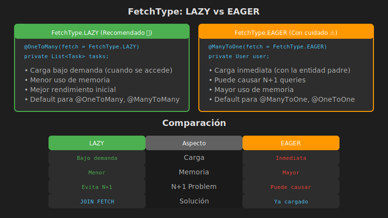

# FetchType: LAZY vs EAGER y el Problema N+1

## 📚 Introducción

Una de las decisiones más importantes al diseñar relaciones JPA es la **estrategia de carga**: ¿cuándo debe Hibernate cargar las entidades relacionadas? Una mala decisión puede degradar dramáticamente el rendimiento de tu aplicación.

---

## 🎯 Objetivos de Aprendizaje

- Comprender la diferencia entre LAZY y EAGER loading
- Identificar y solucionar el problema N+1 queries
- Usar JOIN FETCH correctamente
- Aplicar buenas prácticas de rendimiento

---

## ⚡ FetchType.LAZY vs FetchType.EAGER



### FetchType.LAZY (Carga Perezosa)

Los datos relacionados se cargan **solo cuando se accede a ellos**.

```java
@OneToMany(mappedBy = "user", fetch = FetchType.LAZY)
private List<Task> tasks;

// Uso:
User user = userRepository.findById(id).orElseThrow();
// Query: SELECT * FROM users WHERE id = ?

System.out.println(user.getUsername());  // ✅ No hay query adicional

user.getTasks().size();  // 🔄 AHORA se ejecuta query
// Query: SELECT * FROM tasks WHERE user_id = ?
```

### FetchType.EAGER (Carga Inmediata)

Los datos relacionados se cargan **junto con la entidad principal**.

```java
@ManyToOne(fetch = FetchType.EAGER)
private User user;

// Uso:
Task task = taskRepository.findById(id).orElseThrow();
// Query: SELECT t.*, u.* FROM tasks t
//        LEFT JOIN users u ON t.user_id = u.id
//        WHERE t.id = ?

System.out.println(task.getUser().getUsername());  // ✅ Ya está cargado
```

---

## 📊 Valores por Defecto

| Anotación | FetchType por Defecto | Razón |
|-----------|----------------------|-------|
| `@OneToOne` | EAGER | Generalmente necesitas los datos |
| `@ManyToOne` | EAGER | Un registro, poco impacto |
| `@OneToMany` | LAZY | Muchos registros, alto impacto |
| `@ManyToMany` | LAZY | Muchos registros, alto impacto |

### ⚠️ Recomendación General

```java
// ✅ RECOMENDADO: Siempre usar LAZY explícitamente
@ManyToOne(fetch = FetchType.LAZY)
private User user;

@OneToMany(mappedBy = "user", fetch = FetchType.LAZY)
private List<Task> tasks;

@ManyToMany(fetch = FetchType.LAZY)
private Set<Category> categories;
```

---

## 🐛 El Problema N+1 Queries

### ¿Qué es?

Cuando cargas N entidades y para cada una ejecutas una query adicional para obtener sus relaciones.

### Ejemplo del Problema

```java
// 1 query para obtener todos los usuarios
List<User> users = userRepository.findAll();
// Query: SELECT * FROM users  (devuelve 100 usuarios)

// N queries (una por cada usuario) para obtener sus tareas
for (User user : users) {
    System.out.println(user.getTasks().size());
    // Query: SELECT * FROM tasks WHERE user_id = ?
    // ... se repite 100 veces!
}

// TOTAL: 1 + 100 = 101 queries! 😱
```

### Detección en Logs

```properties
# application.properties - Habilitar logs de queries
spring.jpa.show-sql=true
spring.jpa.properties.hibernate.format_sql=true
logging.level.org.hibernate.SQL=DEBUG
logging.level.org.hibernate.orm.jdbc.bind=TRACE
```

Verás algo como:

```sql
-- 1 query inicial
SELECT * FROM users

-- N queries adicionales
SELECT * FROM tasks WHERE user_id = 'uuid-1'
SELECT * FROM tasks WHERE user_id = 'uuid-2'
SELECT * FROM tasks WHERE user_id = 'uuid-3'
-- ... 97 más
```

---

## ✅ Soluciones al Problema N+1

### 1. JOIN FETCH en JPQL

```java
// ✅ UNA sola query con JOIN
@Query("SELECT u FROM User u LEFT JOIN FETCH u.tasks")
List<User> findAllWithTasks();

// Query generada:
// SELECT u.*, t.* FROM users u LEFT JOIN tasks t ON u.id = t.user_id
```

### 2. @EntityGraph

```java
// En el Repository
@EntityGraph(attributePaths = {"tasks"})
@Query("SELECT u FROM User u")
List<User> findAllWithTasksGraph();

// O en la entidad
@NamedEntityGraph(
    name = "User.withTasks",
    attributeNodes = @NamedAttributeNode("tasks")
)
@Entity
public class User { ... }

// Uso en repository
@EntityGraph(value = "User.withTasks")
List<User> findAll();
```

### 3. JOIN FETCH con Múltiples Relaciones

```java
// ⚠️ CUIDADO: No usar JOIN FETCH con múltiples colecciones
// Causa producto cartesiano

// ❌ INCORRECTO
@Query("SELECT u FROM User u JOIN FETCH u.tasks JOIN FETCH u.orders")
List<User> findAllWithTasksAndOrders();  // MultipleBagFetchException!

// ✅ CORRECTO: Cargar en queries separadas o usar Set
@Query("SELECT u FROM User u LEFT JOIN FETCH u.tasks WHERE u.id IN :ids")
List<User> findByIdsWithTasks(@Param("ids") List<UUID> ids);

@Query("SELECT u FROM User u LEFT JOIN FETCH u.orders WHERE u.id IN :ids")
List<User> findByIdsWithOrders(@Param("ids") List<UUID> ids);
```

### 4. Batch Fetching

```java
// En application.properties
spring.jpa.properties.hibernate.default_batch_fetch_size=25

// O en la entidad
@BatchSize(size = 25)
@OneToMany(mappedBy = "user")
private List<Task> tasks;

// Resultado: En lugar de N queries, hace N/25 queries
// 100 usuarios = 4 queries de tasks en lugar de 100
```

---

## 🔍 JOIN FETCH en Detalle

### Sintaxis Básica

```java
// LEFT JOIN FETCH - incluye entidades sin relaciones
@Query("SELECT t FROM Task t LEFT JOIN FETCH t.user")
List<Task> findAllWithUser();

// JOIN FETCH - solo entidades CON relaciones
@Query("SELECT t FROM Task t JOIN FETCH t.user")
List<Task> findAllWithUserRequired();
```

### Con Condiciones

```java
// Filtrar por la entidad principal
@Query("SELECT t FROM Task t LEFT JOIN FETCH t.user WHERE t.completed = false")
List<Task> findPendingWithUser();

// Filtrar por la relación
@Query("SELECT t FROM Task t JOIN FETCH t.user u WHERE u.username = :username")
List<Task> findByUsernameWithUser(@Param("username") String username);
```

### Con @ManyToMany

```java
// Task con sus categorías
@Query("SELECT t FROM Task t LEFT JOIN FETCH t.categories WHERE t.id = :id")
Optional<Task> findByIdWithCategories(@Param("id") UUID id);

// Task con usuario Y categorías
@Query("""
    SELECT DISTINCT t FROM Task t
    LEFT JOIN FETCH t.user
    LEFT JOIN FETCH t.categories
    WHERE t.id = :id
""")
Optional<Task> findByIdWithUserAndCategories(@Param("id") UUID id);
```

---

## ⚠️ LazyInitializationException

### El Problema

```java
@Transactional  // Sesión abierta
public User getUser(UUID id) {
    return userRepository.findById(id).orElseThrow();
}  // Sesión cerrada

// En el controller (fuera de transacción)
User user = userService.getUser(id);
user.getTasks().size();  // 💥 LazyInitializationException!
```

### Soluciones

```java
// ✅ Solución 1: JOIN FETCH en el servicio
@Transactional(readOnly = true)
public User getUserWithTasks(UUID id) {
    return userRepository.findByIdWithTasks(id).orElseThrow();
}

// ✅ Solución 2: Inicializar dentro de la transacción
@Transactional(readOnly = true)
public User getUserWithTasks(UUID id) {
    User user = userRepository.findById(id).orElseThrow();
    Hibernate.initialize(user.getTasks());  // Forzar carga
    return user;
}

// ✅ Solución 3: Usar DTO (RECOMENDADO para APIs)
@Transactional(readOnly = true)
public UserDTO getUserDTO(UUID id) {
    User user = userRepository.findByIdWithTasks(id).orElseThrow();
    return UserDTO.fromEntity(user);  // Mapear a DTO dentro de transacción
}
```

---

## 📊 Comparación de Rendimiento

| Escenario | EAGER | LAZY sin fetch | LAZY + JOIN FETCH |
|-----------|-------|----------------|-------------------|
| Listar 100 users | 1 query (con JOIN) | 1 query | 1 query |
| Acceder a tasks de cada user | Ya cargado | 100 queries 😱 | Ya cargado |
| **Total queries** | 1 | 101 | 1 |
| **Memoria** | Alta (siempre carga) | Baja inicial | Óptima |

---

## 💡 Buenas Prácticas

### 1. Siempre LAZY por Defecto

```java
@ManyToOne(fetch = FetchType.LAZY)
@OneToMany(fetch = FetchType.LAZY)
@ManyToMany(fetch = FetchType.LAZY)
```

### 2. JOIN FETCH Cuando Necesites los Datos

```java
// Crear métodos específicos según el caso de uso
Optional<Task> findById(UUID id);                    // Solo task
Optional<Task> findByIdWithUser(UUID id);            // Task + user
Optional<Task> findByIdWithCategories(UUID id);      // Task + categories
Optional<Task> findByIdWithUserAndCategories(UUID id); // Todo
```

### 3. Usar DTOs para APIs

```java
// En lugar de retornar entidades
@GetMapping("/{id}")
public TaskDTO getTask(@PathVariable UUID id) {
    Task task = taskService.findByIdWithUserAndCategories(id);
    return TaskDTO.fromEntity(task);  // Sin problemas de LAZY
}
```

### 4. Monitorear Queries en Desarrollo

```properties
# Detectar N+1 durante desarrollo
spring.jpa.show-sql=true
logging.level.org.hibernate.stat=DEBUG
spring.jpa.properties.hibernate.generate_statistics=true
```

---

## 📚 Recursos Adicionales

- [N+1 Query Problem - Vlad Mihalcea](https://vladmihalcea.com/n-plus-1-query-problem/)
- [Hibernate Performance Tuning](https://vladmihalcea.com/tutorials/hibernate/)
- [Entity Graph Tutorial](https://www.baeldung.com/jpa-entity-graph)

---

## ⏭️ Siguiente

Continúa con [05-docker-networks.md](./05-docker-networks.md) para aprender sobre comunicación entre contenedores en Docker.
