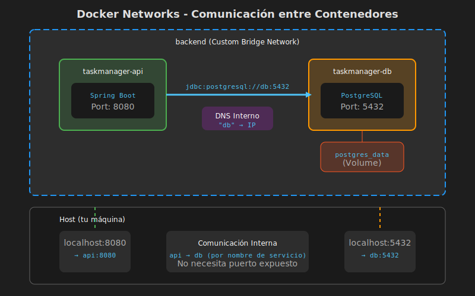

# Docker Networks: Comunicación entre Contenedores

## 📚 Introducción

Cuando tenemos múltiples contenedores (aplicación Spring Boot + PostgreSQL), necesitan comunicarse entre sí. Docker proporciona **redes virtuales** que permiten esta comunicación de forma aislada y segura.

---

## 🎯 Objetivos de Aprendizaje

- Comprender los tipos de redes en Docker
- Crear y configurar redes custom
- Usar DNS interno de Docker para comunicación entre servicios
- Configurar Docker Compose con redes

---

## 🌐 Tipos de Redes en Docker



### 1. Bridge (Por Defecto)

Red privada interna en el host. Contenedores pueden comunicarse por IP.

```bash
# Crear red bridge
docker network create my-network

# Conectar contenedor a red
docker run --network my-network --name my-app my-image
```

### 2. Host

El contenedor usa la red del host directamente (sin aislamiento).

```bash
docker run --network host my-app
# El contenedor usa localhost del host
```

### 3. None

Sin conectividad de red.

```bash
docker run --network none my-app
```

### 4. Custom Bridge (Recomendado)

Red bridge personalizada con DNS interno automático.

```bash
# Los contenedores se comunican por NOMBRE
docker network create backend
docker run --network backend --name db postgres
docker run --network backend --name api my-app

# Desde api: jdbc:postgresql://db:5432/mydb ✅
```

---

## 🔧 Comandos de Red Docker

```bash
# Listar redes
docker network ls

# Crear red
docker network create backend

# Inspeccionar red
docker network inspect backend

# Conectar contenedor existente a red
docker network connect backend my-container

# Desconectar contenedor de red
docker network disconnect backend my-container

# Eliminar red
docker network rm backend

# Eliminar redes sin usar
docker network prune
```

---

## 📝 Docker Compose con Redes

### Configuración Básica

```yaml
# docker-compose.yml
version: '3.8'

services:
  api:
    build: .
    ports:
      - "8080:8080"
    environment:
      - SPRING_DATASOURCE_URL=jdbc:postgresql://db:5432/taskmanager
    depends_on:
      db:
        condition: service_healthy
    networks:
      - backend

  db:
    image: postgres:16-alpine
    environment:
      POSTGRES_DB: taskmanager
      POSTGRES_USER: dev
      POSTGRES_PASSWORD: dev123
    volumes:
      - postgres_data:/var/lib/postgresql/data
    healthcheck:
      test: ["CMD-SHELL", "pg_isready -U dev -d taskmanager"]
      interval: 5s
      timeout: 5s
      retries: 5
    networks:
      - backend

networks:
  backend:
    driver: bridge

volumes:
  postgres_data:
```

### Red por Defecto vs Custom

```yaml
# ❌ Sin definir networks: Docker Compose crea una red default
# Nombre: <directorio>_default

# ✅ Con networks custom: Control total
networks:
  backend:      # Red para API + DB
    driver: bridge
  frontend:     # Red para servicios web
    driver: bridge
```

---

## 🔍 DNS Interno de Docker

En redes custom, Docker proporciona **DNS automático** usando el nombre del servicio.

```yaml
services:
  api:
    # Puede conectar a "db" por nombre
    environment:
      - DB_HOST=db        # ✅ Resuelve a IP del contenedor db

  db:
    # Nombre del servicio = hostname en la red
```

### Resolución DNS

```bash
# Desde dentro del contenedor api
ping db
# PING db (172.18.0.2): 56 data bytes
# 64 bytes from 172.18.0.2: icmp_seq=0 ttl=64

nslookup db
# Server:    127.0.0.11
# Address:   127.0.0.11#53
# Name: db
# Address: 172.18.0.2
```

---

## 🔗 Comunicación en Nuestro Proyecto

### application.properties

```properties
# ✅ CORRECTO: Usar nombre de servicio Docker
spring.datasource.url=jdbc:postgresql://db:5432/taskmanager

# ❌ INCORRECTO: localhost no funciona entre contenedores
spring.datasource.url=jdbc:postgresql://localhost:5432/taskmanager
```

### docker-compose.yml Completo

```yaml
version: '3.8'

services:
  # ========== APLICACIÓN ==========
  api:
    build:
      context: .
      dockerfile: Dockerfile
    container_name: taskmanager-api
    ports:
      - "8080:8080"
    environment:
      - SPRING_PROFILES_ACTIVE=docker
      - SPRING_DATASOURCE_URL=jdbc:postgresql://db:5432/taskmanager
      - SPRING_DATASOURCE_USERNAME=dev
      - SPRING_DATASOURCE_PASSWORD=dev123
    depends_on:
      db:
        condition: service_healthy
    networks:
      - backend
    restart: unless-stopped

  # ========== BASE DE DATOS ==========
  db:
    image: postgres:16-alpine
    container_name: taskmanager-db
    environment:
      POSTGRES_DB: taskmanager
      POSTGRES_USER: dev
      POSTGRES_PASSWORD: dev123
    ports:
      - "5432:5432"  # Opcional: para conectar desde host
    volumes:
      - postgres_data:/var/lib/postgresql/data
      - ./init-db:/docker-entrypoint-initdb.d  # Scripts iniciales
    healthcheck:
      test: ["CMD-SHELL", "pg_isready -U dev -d taskmanager"]
      interval: 5s
      timeout: 5s
      retries: 5
    networks:
      - backend
    restart: unless-stopped

  # ========== PGADMIN (Opcional) ==========
  pgadmin:
    image: dpage/pgadmin4:latest
    container_name: taskmanager-pgadmin
    environment:
      PGADMIN_DEFAULT_EMAIL: admin@local.com
      PGADMIN_DEFAULT_PASSWORD: admin123
    ports:
      - "5050:80"
    depends_on:
      - db
    networks:
      - backend
    restart: unless-stopped

# ========== REDES ==========
networks:
  backend:
    driver: bridge
    name: taskmanager-network

# ========== VOLÚMENES ==========
volumes:
  postgres_data:
    name: taskmanager-pgdata
```

---

## 🩺 Healthchecks

Verificar que un servicio esté listo antes de que otros dependan de él.

### PostgreSQL Healthcheck

```yaml
db:
  healthcheck:
    test: ["CMD-SHELL", "pg_isready -U dev -d taskmanager"]
    interval: 5s      # Cada 5 segundos
    timeout: 5s       # Máximo 5 segundos para responder
    retries: 5        # 5 intentos antes de marcar unhealthy
    start_period: 10s # Esperar 10s antes de empezar checks
```

### Dependencias con Condición

```yaml
api:
  depends_on:
    db:
      condition: service_healthy  # Espera a que db esté healthy
```

---

## 🔒 Puertos: Exponer vs Publicar

### `expose` - Solo Interno

```yaml
db:
  expose:
    - "5432"  # Solo accesible desde otros contenedores en la red
```

### `ports` - Publicar al Host

```yaml
db:
  ports:
    - "5432:5432"   # host:container - Accesible desde localhost
    - "127.0.0.1:5432:5432"  # Solo desde localhost del host
```

### Recomendación de Seguridad

```yaml
# ✅ Producción: No exponer DB al host
db:
  expose:
    - "5432"
  # Sin 'ports' - Solo accesible desde la red interna

# ⚠️ Desarrollo: Puede exponer para herramientas como DBeaver
db:
  ports:
    - "5432:5432"
```

---

## 🔍 Debugging de Redes

### Inspeccionar Red

```bash
docker network inspect taskmanager-network
```

```json
{
    "Name": "taskmanager-network",
    "Containers": {
        "abc123...": {
            "Name": "taskmanager-api",
            "IPv4Address": "172.20.0.3/16"
        },
        "def456...": {
            "Name": "taskmanager-db",
            "IPv4Address": "172.20.0.2/16"
        }
    }
}
```

### Probar Conectividad

```bash
# Entrar al contenedor api
docker exec -it taskmanager-api sh

# Verificar DNS
nslookup db
ping db

# Probar conexión a PostgreSQL
nc -zv db 5432

# Salir
exit
```

### Ver Logs de Red

```bash
# Logs de todos los servicios
docker compose logs -f

# Logs de un servicio específico
docker compose logs -f api
```

---

## 📊 Múltiples Redes

Para aislar servicios (frontend no accede a DB directamente):

```yaml
services:
  frontend:
    networks:
      - frontend-net

  api:
    networks:
      - frontend-net  # Comunicación con frontend
      - backend-net   # Comunicación con DB

  db:
    networks:
      - backend-net   # Solo accesible desde api

networks:
  frontend-net:
    driver: bridge
  backend-net:
    driver: bridge
```

---

## 💡 Buenas Prácticas

1. **Usar redes custom** en lugar de la default
2. **Nombrar contenedores** para facilitar debugging
3. **No exponer puertos innecesarios** en producción
4. **Usar healthchecks** para dependencias
5. **Variables de entorno** para configuración (no hardcodear)
6. **Usar `depends_on` con `condition`** para orden de inicio

---

## 📚 Recursos Adicionales

- [Docker Networking Overview](https://docs.docker.com/network/)
- [Compose Networking](https://docs.docker.com/compose/networking/)
- [Healthcheck Reference](https://docs.docker.com/compose/compose-file/compose-file-v3/#healthcheck)

---

## ✅ Resumen

| Concepto | Descripción |
|----------|-------------|
| **Bridge Network** | Red privada para comunicación entre contenedores |
| **DNS Interno** | Resolver nombres de servicio a IPs |
| **expose** | Puerto accesible solo en la red Docker |
| **ports** | Puerto publicado al host |
| **healthcheck** | Verificar estado del servicio |
| **depends_on** | Orden de inicio y dependencias |

---

## ⏭️ Siguiente

Continúa con las prácticas en [../2-practicas/01-configurar-relaciones.md](../2-practicas/01-configurar-relaciones.md).
