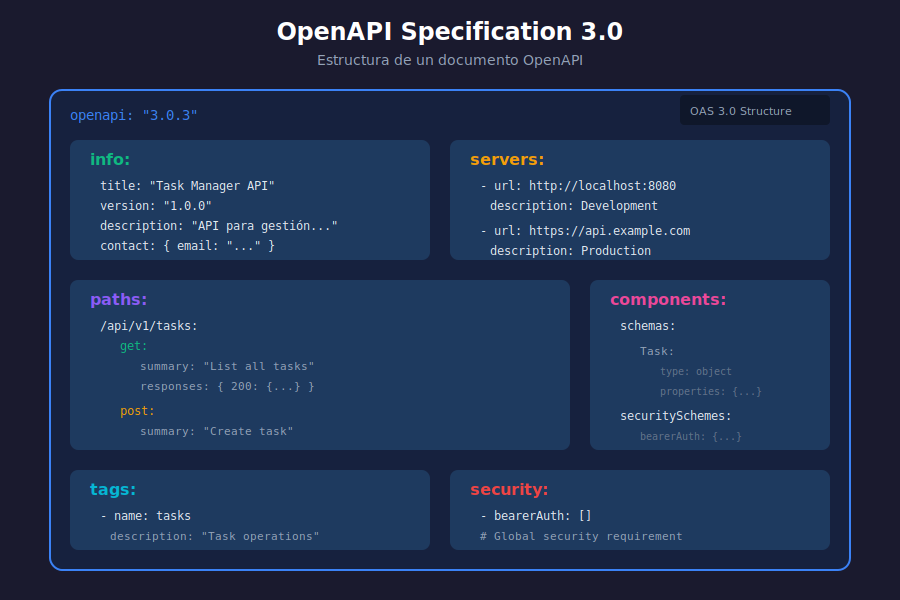

# 📖 Introducción a OpenAPI y Swagger

## 🎯 Objetivos de Aprendizaje

- Comprender qué es OpenAPI Specification (OAS)
- Diferenciar entre OpenAPI, Swagger y SpringDoc
- Conocer los beneficios de documentar APIs
- Entender la estructura de un documento OpenAPI

---

## 📊 Diagrama: Estructura OpenAPI



---

## 🤔 ¿Por Qué Documentar APIs?

### El Problema Sin Documentación

```
Desarrollador Frontend: "¿Qué endpoint uso para crear un usuario?"
Desarrollador Backend: "POST /users"
Frontend: "¿Qué campos envío?"
Backend: "username, email... creo que también password"
Frontend: "¿Qué responde? ¿Qué errores puede dar?"
Backend: "Mmmm... déjame revisar el código..."
```

### La Solución: Documentación Automatizada

Con OpenAPI, la documentación:

- ✅ Se genera automáticamente del código
- ✅ Siempre está actualizada
- ✅ Es interactiva (se puede probar)
- ✅ Permite generar clientes automáticamente
- ✅ Sirve como contrato entre frontend y backend

---

## 📚 Conceptos Clave

### OpenAPI Specification (OAS)

**OpenAPI Specification** es un estándar para describir APIs REST de forma independiente al lenguaje de programación.

| Versión | Año | Características |
|---------|-----|-----------------|
| OpenAPI 2.0 | 2014 | Antes llamado "Swagger Spec" |
| OpenAPI 3.0 | 2017 | Componentes reutilizables, callbacks |
| OpenAPI 3.1 | 2021 | Compatible con JSON Schema |

> 💡 **Usaremos OpenAPI 3.0** que es la versión más soportada actualmente.

### Swagger

**Swagger** es un conjunto de herramientas para trabajar con OpenAPI:

| Herramienta | Propósito |
|-------------|-----------|
| **Swagger UI** | Interfaz web para visualizar y probar APIs |
| **Swagger Editor** | Editor online para escribir especificaciones |
| **Swagger Codegen** | Generador de código cliente/servidor |

### SpringDoc vs Springfox

| Característica | SpringDoc | Springfox |
|----------------|-----------|-----------|
| Mantenimiento | ✅ Activo | ❌ Abandonado |
| Spring Boot 3.x | ✅ Soportado | ❌ No soportado |
| OpenAPI 3.0 | ✅ Nativo | ⚠️ Parcial |
| Configuración | Mínima | Compleja |

> ⚠️ **Importante**: Usa **SpringDoc** para proyectos nuevos. Springfox está abandonado desde 2020.

---

## 📄 Estructura de un Documento OpenAPI

Un documento OpenAPI tiene las siguientes secciones principales:

### 1. Información General (info)

```yaml
openapi: "3.0.3"
info:
  title: "Task Manager API"
  description: "API para gestión de tareas"
  version: "1.0.0"
  contact:
    name: "Soporte API"
    email: "api@example.com"
  license:
    name: "MIT"
    url: "https://opensource.org/licenses/MIT"
```

### 2. Servidores (servers)

```yaml
servers:
  - url: http://localhost:8080
    description: Servidor de desarrollo
  - url: https://api.example.com
    description: Servidor de producción
```

### 3. Rutas (paths)

```yaml
paths:
  /api/v1/tasks:
    get:
      summary: "Listar todas las tareas"
      operationId: "getAllTasks"
      tags:
        - tasks
      responses:
        '200':
          description: "Lista de tareas"
          content:
            application/json:
              schema:
                type: array
                items:
                  $ref: '#/components/schemas/Task'
    post:
      summary: "Crear una tarea"
      # ...
```

### 4. Componentes (components)

```yaml
components:
  schemas:
    Task:
      type: object
      properties:
        id:
          type: string
          format: uuid
        title:
          type: string
          example: "Completar informe"
        completed:
          type: boolean
          default: false
      required:
        - title

  securitySchemes:
    bearerAuth:
      type: http
      scheme: bearer
      bearerFormat: JWT
```

### 5. Tags

```yaml
tags:
  - name: tasks
    description: "Operaciones con tareas"
  - name: users
    description: "Gestión de usuarios"
```

### 6. Seguridad Global

```yaml
security:
  - bearerAuth: []
```

---

## 🔍 Formatos de Salida

OpenAPI soporta dos formatos:

### JSON

```json
{
  "openapi": "3.0.3",
  "info": {
    "title": "Task Manager API",
    "version": "1.0.0"
  },
  "paths": {}
}
```

### YAML

```yaml
openapi: "3.0.3"
info:
  title: "Task Manager API"
  version: "1.0.0"
paths: {}
```

> 💡 **YAML es más legible** para humanos, **JSON es más fácil** de procesar programáticamente.

---

## 🎯 Beneficios de OpenAPI

### Para Desarrolladores Backend

1. **Documentación automática**: No hay que escribir documentación manual
2. **Validación**: Se puede validar que la API cumple el contrato
3. **Testing**: Swagger UI permite probar endpoints fácilmente

### Para Desarrolladores Frontend

1. **Claridad**: Saben exactamente qué endpoints usar
2. **Ejemplos**: Ven ejemplos de request/response
3. **Generación de código**: Pueden generar clientes TypeScript automáticamente

### Para el Equipo

1. **Contrato compartido**: API-first design
2. **Comunicación**: Reduce malentendidos
3. **Onboarding**: Nuevos miembros entienden la API rápidamente

---

## 🛠️ Herramientas Relacionadas

| Herramienta | Propósito | URL |
|-------------|-----------|-----|
| Swagger UI | Visualizar y probar APIs | swagger.io |
| Swagger Editor | Editar especificaciones | editor.swagger.io |
| Postman | Importar OpenAPI specs | postman.com |
| Insomnia | Cliente API con soporte OpenAPI | insomnia.rest |
| OpenAPI Generator | Generar clientes/servidores | openapi-generator.tech |

---

## 📝 Resumen

| Concepto | Descripción |
|----------|-------------|
| **OpenAPI** | Especificación estándar para describir APIs REST |
| **Swagger** | Conjunto de herramientas para OpenAPI |
| **SpringDoc** | Librería para generar OpenAPI en Spring Boot |
| **Swagger UI** | Interfaz web interactiva para probar APIs |

---

## 🔗 Referencias

- [OpenAPI Specification](https://spec.openapis.org/oas/latest.html)
- [Swagger Documentation](https://swagger.io/docs/)
- [SpringDoc OpenAPI](https://springdoc.org/)

---

> 💡 **Próximo paso**: Aprende a configurar SpringDoc en tu proyecto Spring Boot en [02-springdoc-configuracion.md](02-springdoc-configuracion.md)
