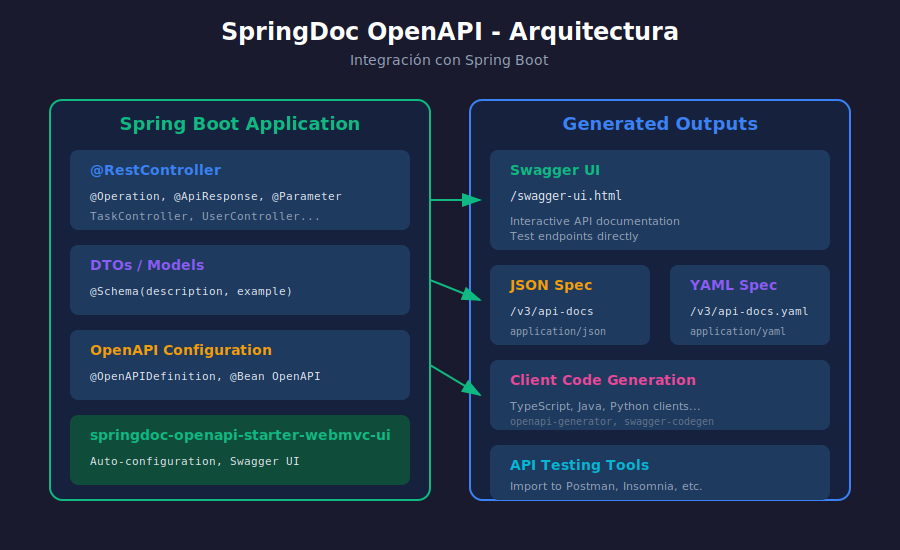

# ⚙️ Configuración de SpringDoc OpenAPI

## 🎯 Objetivos de Aprendizaje

- Agregar dependencias de SpringDoc al proyecto
- Configurar información básica de la API
- Personalizar rutas de Swagger UI y api-docs
- Configurar servidores y tags

---

## 📊 Diagrama: Arquitectura SpringDoc



---

## 📦 Dependencias Maven

### Dependencia Principal

```xml
<dependency>
    <groupId>org.springdoc</groupId>
    <artifactId>springdoc-openapi-starter-webmvc-ui</artifactId>
    <version>2.3.0</version>
</dependency>
```

Esta dependencia incluye:
- ✅ Auto-configuración de OpenAPI
- ✅ Swagger UI embebido
- ✅ Endpoints `/v3/api-docs` y `/swagger-ui.html`

### pom.xml Completo

```xml
<?xml version="1.0" encoding="UTF-8"?>
<project xmlns="http://maven.apache.org/POM/4.0.0"
         xmlns:xsi="http://www.w3.org/2001/XMLSchema-instance"
         xsi:schemaLocation="http://maven.apache.org/POM/4.0.0
         http://maven.apache.org/xsd/maven-4.0.0.xsd">
    <modelVersion>4.0.0</modelVersion>

    <parent>
        <groupId>org.springframework.boot</groupId>
        <artifactId>spring-boot-starter-parent</artifactId>
        <version>3.2.0</version>
    </parent>

    <groupId>com.bootcamp</groupId>
    <artifactId>api-documentada</artifactId>
    <version>1.0.0</version>

    <properties>
        <java.version>21</java.version>
    </properties>

    <dependencies>
        <!-- Spring Boot Web -->
        <dependency>
            <groupId>org.springframework.boot</groupId>
            <artifactId>spring-boot-starter-web</artifactId>
        </dependency>

        <!-- Spring Data JPA -->
        <dependency>
            <groupId>org.springframework.boot</groupId>
            <artifactId>spring-boot-starter-data-jpa</artifactId>
        </dependency>

        <!-- Validation -->
        <dependency>
            <groupId>org.springframework.boot</groupId>
            <artifactId>spring-boot-starter-validation</artifactId>
        </dependency>

        <!-- SpringDoc OpenAPI (Swagger) -->
        <dependency>
            <groupId>org.springdoc</groupId>
            <artifactId>springdoc-openapi-starter-webmvc-ui</artifactId>
            <version>2.3.0</version>
        </dependency>

        <!-- PostgreSQL -->
        <dependency>
            <groupId>org.postgresql</groupId>
            <artifactId>postgresql</artifactId>
            <scope>runtime</scope>
        </dependency>
    </dependencies>
</project>
```

---

## ⚙️ Configuración Básica

### Sin Configuración (Auto-configuración)

SpringDoc funciona **sin configuración adicional**. Solo agregando la dependencia tendrás:

| Endpoint | URL |
|----------|-----|
| Swagger UI | http://localhost:8080/swagger-ui.html |
| OpenAPI JSON | http://localhost:8080/v3/api-docs |
| OpenAPI YAML | http://localhost:8080/v3/api-docs.yaml |

### Configuración en application.properties

```properties
# ===== SpringDoc OpenAPI Configuration =====

# Información de la API
springdoc.info.title=Task Manager API
springdoc.info.description=API REST para gestión de tareas
springdoc.info.version=1.0.0

# Rutas personalizadas (opcional)
springdoc.api-docs.path=/api-docs
springdoc.swagger-ui.path=/docs

# Ordenar endpoints alfabéticamente
springdoc.swagger-ui.operationsSorter=alpha
springdoc.swagger-ui.tagsSorter=alpha

# Mostrar duración de requests
springdoc.swagger-ui.displayRequestDuration=true

# Expandir/colapsar tags por defecto
springdoc.swagger-ui.docExpansion=none

# Habilitar "Try it out" por defecto
springdoc.swagger-ui.tryItOutEnabled=true
```

---

## 🔧 Configuración Programática

### Clase de Configuración OpenAPI

```java
package com.bootcamp.config;

import io.swagger.v3.oas.models.OpenAPI;
import io.swagger.v3.oas.models.info.Contact;
import io.swagger.v3.oas.models.info.Info;
import io.swagger.v3.oas.models.info.License;
import io.swagger.v3.oas.models.servers.Server;
import org.springframework.context.annotation.Bean;
import org.springframework.context.annotation.Configuration;

import java.util.List;

@Configuration
public class OpenApiConfig {

    @Bean
    public OpenAPI customOpenAPI() {
        return new OpenAPI()
            .info(new Info()
                .title("Task Manager API")
                .version("1.0.0")
                .description("API REST para gestión de tareas del bootcamp")
                .contact(new Contact()
                    .name("Equipo de Desarrollo")
                    .email("dev@bootcamp.com")
                    .url("https://bootcamp.com"))
                .license(new License()
                    .name("MIT License")
                    .url("https://opensource.org/licenses/MIT")))
            .servers(List.of(
                new Server()
                    .url("http://localhost:8080")
                    .description("Servidor de Desarrollo"),
                new Server()
                    .url("https://api.bootcamp.com")
                    .description("Servidor de Producción")
            ));
    }
}
```

### Con Seguridad JWT

```java
package com.bootcamp.config;

import io.swagger.v3.oas.models.Components;
import io.swagger.v3.oas.models.OpenAPI;
import io.swagger.v3.oas.models.info.Info;
import io.swagger.v3.oas.models.security.SecurityRequirement;
import io.swagger.v3.oas.models.security.SecurityScheme;
import org.springframework.context.annotation.Bean;
import org.springframework.context.annotation.Configuration;

@Configuration
public class OpenApiConfig {

    @Bean
    public OpenAPI customOpenAPI() {
        final String securitySchemeName = "bearerAuth";

        return new OpenAPI()
            .info(new Info()
                .title("Task Manager API")
                .version("1.0.0")
                .description("API con autenticación JWT"))
            .addSecurityItem(new SecurityRequirement()
                .addList(securitySchemeName))
            .components(new Components()
                .addSecuritySchemes(securitySchemeName,
                    new SecurityScheme()
                        .name(securitySchemeName)
                        .type(SecurityScheme.Type.HTTP)
                        .scheme("bearer")
                        .bearerFormat("JWT")
                        .description("Ingresa el token JWT")));
    }
}
```

---

## 🏷️ Configuración de Tags

### Usando @OpenAPIDefinition

```java
package com.bootcamp;

import io.swagger.v3.oas.annotations.OpenAPIDefinition;
import io.swagger.v3.oas.annotations.info.Contact;
import io.swagger.v3.oas.annotations.info.Info;
import io.swagger.v3.oas.annotations.info.License;
import io.swagger.v3.oas.annotations.servers.Server;
import io.swagger.v3.oas.annotations.tags.Tag;
import org.springframework.boot.SpringApplication;
import org.springframework.boot.autoconfigure.SpringBootApplication;

@SpringBootApplication
@OpenAPIDefinition(
    info = @Info(
        title = "Task Manager API",
        version = "1.0.0",
        description = "API REST para gestión de tareas",
        contact = @Contact(
            name = "Soporte",
            email = "soporte@bootcamp.com"
        ),
        license = @License(
            name = "MIT",
            url = "https://opensource.org/licenses/MIT"
        )
    ),
    servers = {
        @Server(url = "http://localhost:8080", description = "Desarrollo"),
        @Server(url = "https://api.example.com", description = "Producción")
    },
    tags = {
        @Tag(name = "tasks", description = "Operaciones de tareas"),
        @Tag(name = "users", description = "Gestión de usuarios"),
        @Tag(name = "categories", description = "Gestión de categorías")
    }
)
public class Application {
    public static void main(String[] args) {
        SpringApplication.run(Application.class, args);
    }
}
```

---

## 🎨 Personalización de Swagger UI

### Propiedades Disponibles

```properties
# Tema oscuro (no nativo, requiere CSS custom)
springdoc.swagger-ui.displayRequestDuration=true

# Ordenamiento
springdoc.swagger-ui.operationsSorter=alpha
springdoc.swagger-ui.tagsSorter=alpha

# Expansión de documentación
# none: Todo colapsado
# list: Solo operaciones visibles
# full: Todo expandido
springdoc.swagger-ui.docExpansion=list

# Filtro de búsqueda
springdoc.swagger-ui.filter=true

# Mostrar extensiones
springdoc.swagger-ui.showExtensions=true

# Sintaxis de respuesta por defecto
springdoc.swagger-ui.defaultModelRendering=model

# Habilitar validador
springdoc.swagger-ui.validatorUrl=none
```

### Deshabilitar en Producción

```properties
# application-prod.properties
springdoc.api-docs.enabled=false
springdoc.swagger-ui.enabled=false
```

---

## 📁 Estructura del Proyecto

```
src/main/java/com/bootcamp/
├── Application.java
├── config/
│   └── OpenApiConfig.java
├── controller/
│   ├── TaskController.java
│   └── UserController.java
├── dto/
│   ├── TaskDTO.java
│   └── CreateTaskRequest.java
├── entity/
│   └── Task.java
├── repository/
│   └── TaskRepository.java
└── service/
    └── TaskService.java
```

---

## ✅ Verificación

### 1. Iniciar la aplicación

```bash
./mvnw spring-boot:run
```

### 2. Acceder a Swagger UI

Abre el navegador en: http://localhost:8080/swagger-ui.html

### 3. Verificar OpenAPI JSON

```bash
curl http://localhost:8080/v3/api-docs | jq
```

### 4. Descargar especificación

```bash
# JSON
curl -o openapi.json http://localhost:8080/v3/api-docs

# YAML
curl -o openapi.yaml http://localhost:8080/v3/api-docs.yaml
```

---

## 🚨 Problemas Comunes

### Swagger UI no carga

```properties
# Verificar que el path sea correcto
springdoc.swagger-ui.path=/swagger-ui.html
```

### Conflicto con Spring Security

```java
@Bean
public SecurityFilterChain filterChain(HttpSecurity http) throws Exception {
    http.authorizeHttpRequests(auth -> auth
        .requestMatchers(
            "/swagger-ui/**",
            "/v3/api-docs/**",
            "/swagger-ui.html"
        ).permitAll()
        .anyRequest().authenticated()
    );
    return http.build();
}
```

### No detecta controladores

Verifica que los controladores tengan `@RestController` o `@Controller`.

---

## 📝 Resumen

| Configuración | Propósito |
|---------------|-----------|
| `springdoc-openapi-starter-webmvc-ui` | Dependencia principal |
| `OpenApiConfig` | Configuración programática |
| `@OpenAPIDefinition` | Configuración declarativa |
| `application.properties` | Configuración de propiedades |

---

## 🔗 Referencias

- [SpringDoc Official Documentation](https://springdoc.org/)
- [SpringDoc FAQ](https://springdoc.org/faq.html)
- [GitHub SpringDoc](https://github.com/springdoc/springdoc-openapi)

---

> 💡 **Próximo paso**: Aprende a documentar endpoints con anotaciones en [03-anotaciones-openapi.md](03-anotaciones-openapi.md)
