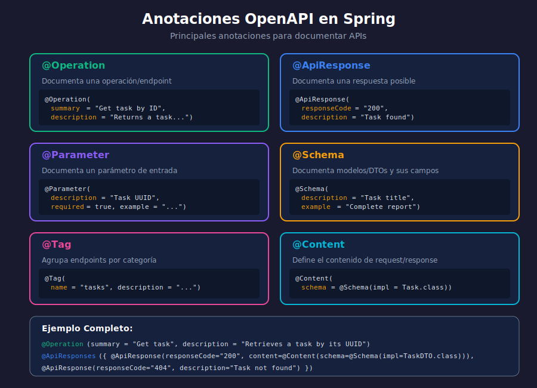

# 🏷️ Anotaciones OpenAPI en Spring

## 🎯 Objetivos de Aprendizaje

- Dominar las anotaciones principales de OpenAPI
- Documentar operaciones con @Operation y @ApiResponse
- Documentar parámetros con @Parameter
- Documentar modelos/DTOs con @Schema

---

## 📊 Diagrama: Anotaciones OpenAPI



---

## 📦 Anotaciones Principales

### Resumen de Anotaciones

| Anotación | Ubicación | Propósito |
|-----------|-----------|-----------|
| `@Tag` | Clase Controller | Agrupa endpoints |
| `@Operation` | Método | Documenta endpoint |
| `@ApiResponse` | Método | Documenta respuesta |
| `@ApiResponses` | Método | Múltiples respuestas |
| `@Parameter` | Parámetro | Documenta parámetro |
| `@Schema` | Clase/Campo | Documenta modelo |
| `@Content` | Dentro de @ApiResponse | Define contenido |
| `@RequestBody` | Parámetro | Documenta body |

---

## 🏷️ @Tag - Agrupar Endpoints

### En el Controller

```java
import io.swagger.v3.oas.annotations.tags.Tag;

@RestController
@RequestMapping("/api/v1/tasks")
@Tag(name = "tasks", description = "Operaciones de gestión de tareas")
public class TaskController {
    // ...
}
```

### Múltiples Tags

```java
@Tag(name = "tasks", description = "Tareas")
@Tag(name = "admin", description = "Operaciones administrativas")
public class TaskController {
    // ...
}
```

---

## 📝 @Operation - Documentar Endpoint

### Uso Básico

```java
import io.swagger.v3.oas.annotations.Operation;

@GetMapping
@Operation(
    summary = "Listar todas las tareas",
    description = "Retorna una lista paginada de todas las tareas del usuario"
)
public ResponseEntity<List<TaskDTO>> findAll() {
    return ResponseEntity.ok(taskService.findAll());
}
```

### Atributos de @Operation

| Atributo | Descripción | Ejemplo |
|----------|-------------|---------|
| `summary` | Resumen corto | "Crear tarea" |
| `description` | Descripción detallada | "Crea una nueva tarea..." |
| `operationId` | ID único de operación | "createTask" |
| `tags` | Tags adicionales | {"tasks", "write"} |
| `deprecated` | Marcar como deprecated | true |
| `hidden` | Ocultar de documentación | true |

### Ejemplo Completo

```java
@PostMapping
@Operation(
    summary = "Crear nueva tarea",
    description = """
        Crea una nueva tarea para el usuario autenticado.

        El título es obligatorio y debe tener entre 3 y 100 caracteres.
        La descripción es opcional.
        """,
    operationId = "createTask",
    tags = {"tasks", "write-operations"}
)
public ResponseEntity<TaskDTO> create(@RequestBody CreateTaskRequest request) {
    // ...
}
```

---

## 📤 @ApiResponse - Documentar Respuestas

### Respuesta Simple

```java
@GetMapping("/{id}")
@Operation(summary = "Obtener tarea por ID")
@ApiResponse(
    responseCode = "200",
    description = "Tarea encontrada",
    content = @Content(schema = @Schema(implementation = TaskDTO.class))
)
public ResponseEntity<TaskDTO> findById(@PathVariable UUID id) {
    // ...
}
```

### Múltiples Respuestas con @ApiResponses

```java
import io.swagger.v3.oas.annotations.responses.ApiResponse;
import io.swagger.v3.oas.annotations.responses.ApiResponses;
import io.swagger.v3.oas.annotations.media.Content;
import io.swagger.v3.oas.annotations.media.Schema;

@GetMapping("/{id}")
@Operation(summary = "Obtener tarea por ID")
@ApiResponses(value = {
    @ApiResponse(
        responseCode = "200",
        description = "Tarea encontrada exitosamente",
        content = @Content(
            mediaType = "application/json",
            schema = @Schema(implementation = TaskDTO.class)
        )
    ),
    @ApiResponse(
        responseCode = "400",
        description = "ID con formato inválido",
        content = @Content(
            mediaType = "application/json",
            schema = @Schema(implementation = ErrorResponse.class)
        )
    ),
    @ApiResponse(
        responseCode = "404",
        description = "Tarea no encontrada",
        content = @Content
    ),
    @ApiResponse(
        responseCode = "500",
        description = "Error interno del servidor",
        content = @Content
    )
})
public ResponseEntity<TaskDTO> findById(@PathVariable UUID id) {
    return ResponseEntity.ok(taskService.findById(id));
}
```

### Códigos de Respuesta Comunes

| Código | Descripción | Cuándo usar |
|--------|-------------|-------------|
| 200 | OK | GET exitoso, PUT exitoso |
| 201 | Created | POST exitoso (recurso creado) |
| 204 | No Content | DELETE exitoso |
| 400 | Bad Request | Validación fallida |
| 401 | Unauthorized | Sin autenticación |
| 403 | Forbidden | Sin permisos |
| 404 | Not Found | Recurso no existe |
| 409 | Conflict | Duplicado, conflicto |
| 500 | Internal Server Error | Error del servidor |

---

## 📥 @Parameter - Documentar Parámetros

### Path Variables

```java
@GetMapping("/{id}")
@Operation(summary = "Obtener tarea por ID")
public ResponseEntity<TaskDTO> findById(
    @Parameter(
        description = "UUID de la tarea",
        required = true,
        example = "550e8400-e29b-41d4-a716-446655440000"
    )
    @PathVariable UUID id
) {
    return ResponseEntity.ok(taskService.findById(id));
}
```

### Query Parameters

```java
@GetMapping
@Operation(summary = "Listar tareas con filtros")
public ResponseEntity<Page<TaskDTO>> findAll(
    @Parameter(description = "Número de página (0-indexed)")
    @RequestParam(defaultValue = "0") int page,

    @Parameter(description = "Tamaño de página", example = "10")
    @RequestParam(defaultValue = "10") int size,

    @Parameter(description = "Filtrar por estado completado")
    @RequestParam(required = false) Boolean completed,

    @Parameter(
        description = "Campo de ordenamiento",
        schema = @Schema(allowableValues = {"title", "createdAt", "updatedAt"})
    )
    @RequestParam(defaultValue = "createdAt") String sortBy
) {
    // ...
}
```

### Atributos de @Parameter

| Atributo | Descripción |
|----------|-------------|
| `description` | Descripción del parámetro |
| `required` | Si es obligatorio |
| `example` | Valor de ejemplo |
| `deprecated` | Marcar como deprecated |
| `hidden` | Ocultar de documentación |
| `schema` | Esquema del parámetro |

---

## 📋 @Schema - Documentar Modelos

### En DTOs (Records)

```java
import io.swagger.v3.oas.annotations.media.Schema;

@Schema(description = "DTO de respuesta para una tarea")
public record TaskDTO(
    @Schema(
        description = "Identificador único de la tarea",
        example = "550e8400-e29b-41d4-a716-446655440000"
    )
    UUID id,

    @Schema(
        description = "Título de la tarea",
        example = "Completar informe mensual",
        minLength = 3,
        maxLength = 100
    )
    String title,

    @Schema(
        description = "Descripción detallada de la tarea",
        example = "Elaborar el informe de ventas del mes de enero",
        nullable = true
    )
    String description,

    @Schema(
        description = "Estado de completitud",
        example = "false",
        defaultValue = "false"
    )
    Boolean completed,

    @Schema(
        description = "Fecha de creación",
        example = "2024-01-15T10:30:00"
    )
    LocalDateTime createdAt
) {}
```

### En Request DTOs

```java
@Schema(description = "Request para crear una nueva tarea")
public record CreateTaskRequest(
    @Schema(
        description = "Título de la tarea",
        example = "Revisar código",
        requiredMode = Schema.RequiredMode.REQUIRED,
        minLength = 3,
        maxLength = 100
    )
    @NotBlank(message = "El título es requerido")
    @Size(min = 3, max = 100)
    String title,

    @Schema(
        description = "Descripción opcional",
        example = "Revisar el PR #123",
        requiredMode = Schema.RequiredMode.NOT_REQUIRED,
        maxLength = 500
    )
    @Size(max = 500)
    String description,

    @Schema(
        description = "ID del usuario asignado",
        example = "550e8400-e29b-41d4-a716-446655440000",
        requiredMode = Schema.RequiredMode.REQUIRED
    )
    @NotNull(message = "El userId es requerido")
    UUID userId
) {}
```

### Atributos de @Schema

| Atributo | Descripción |
|----------|-------------|
| `description` | Descripción del campo |
| `example` | Valor de ejemplo |
| `required` | Si es requerido (deprecated, usar requiredMode) |
| `requiredMode` | REQUIRED, NOT_REQUIRED, AUTO |
| `nullable` | Si acepta null |
| `minLength/maxLength` | Longitud para strings |
| `minimum/maximum` | Valores para números |
| `pattern` | Regex pattern |
| `allowableValues` | Valores permitidos (enum) |
| `defaultValue` | Valor por defecto |
| `hidden` | Ocultar campo |
| `accessMode` | READ_ONLY, WRITE_ONLY, READ_WRITE |

---

## 🎨 Ejemplos con @ExampleObject

### Múltiples Ejemplos

```java
@PostMapping
@Operation(summary = "Crear tarea")
@io.swagger.v3.oas.annotations.parameters.RequestBody(
    description = "Datos de la nueva tarea",
    required = true,
    content = @Content(
        mediaType = "application/json",
        schema = @Schema(implementation = CreateTaskRequest.class),
        examples = {
            @ExampleObject(
                name = "Tarea simple",
                summary = "Ejemplo de tarea básica",
                value = """
                    {
                        "title": "Revisar código",
                        "userId": "550e8400-e29b-41d4-a716-446655440000"
                    }
                    """
            ),
            @ExampleObject(
                name = "Tarea completa",
                summary = "Ejemplo con descripción",
                value = """
                    {
                        "title": "Completar informe",
                        "description": "Informe mensual de ventas Q1",
                        "userId": "550e8400-e29b-41d4-a716-446655440000"
                    }
                    """
            )
        }
    )
)
public ResponseEntity<TaskDTO> create(@RequestBody CreateTaskRequest request) {
    // ...
}
```

---

## 📦 Controller Completo Documentado

```java
package com.bootcamp.controller;

import io.swagger.v3.oas.annotations.Operation;
import io.swagger.v3.oas.annotations.Parameter;
import io.swagger.v3.oas.annotations.media.Content;
import io.swagger.v3.oas.annotations.media.Schema;
import io.swagger.v3.oas.annotations.responses.ApiResponse;
import io.swagger.v3.oas.annotations.responses.ApiResponses;
import io.swagger.v3.oas.annotations.tags.Tag;
import jakarta.validation.Valid;
import org.springframework.http.HttpStatus;
import org.springframework.http.ResponseEntity;
import org.springframework.web.bind.annotation.*;

import java.util.List;
import java.util.UUID;

@RestController
@RequestMapping("/api/v1/tasks")
@Tag(name = "tasks", description = "API para gestión de tareas")
public class TaskController {

    private final TaskService taskService;

    public TaskController(TaskService taskService) {
        this.taskService = taskService;
    }

    @GetMapping
    @Operation(
        summary = "Listar todas las tareas",
        description = "Retorna todas las tareas del sistema"
    )
    @ApiResponse(
        responseCode = "200",
        description = "Lista de tareas obtenida exitosamente"
    )
    public ResponseEntity<List<TaskDTO>> findAll() {
        return ResponseEntity.ok(taskService.findAll());
    }

    @GetMapping("/{id}")
    @Operation(
        summary = "Obtener tarea por ID",
        description = "Busca y retorna una tarea por su identificador único"
    )
    @ApiResponses({
        @ApiResponse(
            responseCode = "200",
            description = "Tarea encontrada",
            content = @Content(schema = @Schema(implementation = TaskDTO.class))
        ),
        @ApiResponse(
            responseCode = "404",
            description = "Tarea no encontrada",
            content = @Content
        )
    })
    public ResponseEntity<TaskDTO> findById(
        @Parameter(description = "UUID de la tarea", required = true)
        @PathVariable UUID id
    ) {
        return ResponseEntity.ok(taskService.findById(id));
    }

    @PostMapping
    @Operation(
        summary = "Crear nueva tarea",
        description = "Crea una nueva tarea con los datos proporcionados"
    )
    @ApiResponses({
        @ApiResponse(
            responseCode = "201",
            description = "Tarea creada exitosamente",
            content = @Content(schema = @Schema(implementation = TaskDTO.class))
        ),
        @ApiResponse(
            responseCode = "400",
            description = "Datos de entrada inválidos",
            content = @Content
        )
    })
    public ResponseEntity<TaskDTO> create(
        @Valid @RequestBody CreateTaskRequest request
    ) {
        TaskDTO created = taskService.create(request);
        return ResponseEntity.status(HttpStatus.CREATED).body(created);
    }

    @PutMapping("/{id}")
    @Operation(
        summary = "Actualizar tarea",
        description = "Actualiza los datos de una tarea existente"
    )
    @ApiResponses({
        @ApiResponse(responseCode = "200", description = "Tarea actualizada"),
        @ApiResponse(responseCode = "404", description = "Tarea no encontrada"),
        @ApiResponse(responseCode = "400", description = "Datos inválidos")
    })
    public ResponseEntity<TaskDTO> update(
        @Parameter(description = "UUID de la tarea") @PathVariable UUID id,
        @Valid @RequestBody UpdateTaskRequest request
    ) {
        return ResponseEntity.ok(taskService.update(id, request));
    }

    @DeleteMapping("/{id}")
    @Operation(
        summary = "Eliminar tarea",
        description = "Elimina permanentemente una tarea"
    )
    @ApiResponses({
        @ApiResponse(responseCode = "204", description = "Tarea eliminada"),
        @ApiResponse(responseCode = "404", description = "Tarea no encontrada")
    })
    public ResponseEntity<Void> delete(
        @Parameter(description = "UUID de la tarea") @PathVariable UUID id
    ) {
        taskService.delete(id);
        return ResponseEntity.noContent().build();
    }
}
```

---

## 📝 Resumen

| Anotación | Uso Principal |
|-----------|---------------|
| `@Tag` | Agrupar endpoints por categoría |
| `@Operation` | Documentar un endpoint específico |
| `@ApiResponse` | Documentar respuestas posibles |
| `@Parameter` | Documentar parámetros de entrada |
| `@Schema` | Documentar modelos/DTOs |
| `@Content` | Definir tipo de contenido |

---

> 💡 **Próximo paso**: Aprende a usar Swagger UI en [04-swagger-ui.md](04-swagger-ui.md)
