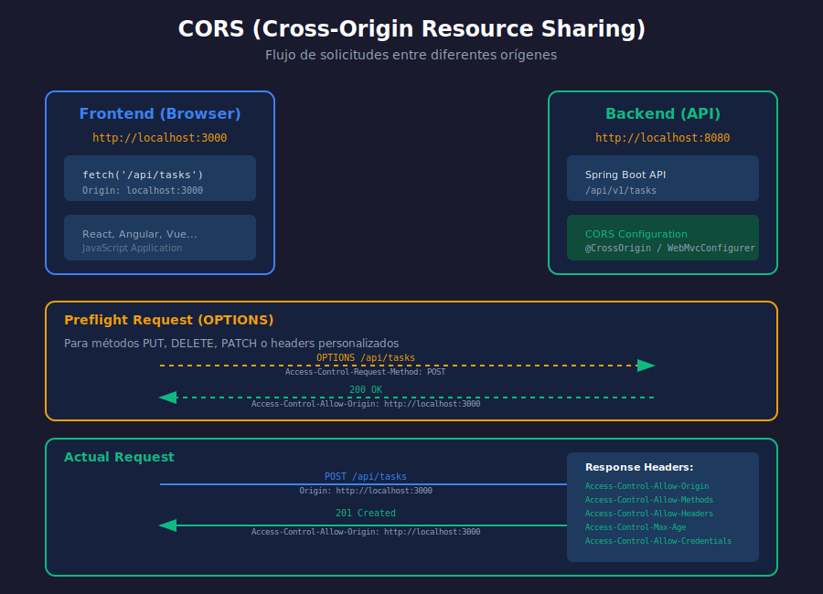

# 🌐 CORS en Spring Boot

## 🎯 Objetivos de Aprendizaje

- Comprender qué es CORS y por qué existe
- Configurar CORS de forma global y por endpoint
- Entender el flujo preflight
- Preparar la API para consumo desde frontends

---

## 📊 Diagrama: Flujo CORS



---

## 🤔 ¿Qué es CORS?

**CORS (Cross-Origin Resource Sharing)** es un mecanismo de seguridad que permite o restringe solicitudes HTTP desde un origen diferente al del servidor.

### ¿Qué es un "Origen"?

Un origen está compuesto por:
- **Protocolo**: http, https
- **Dominio**: localhost, api.example.com
- **Puerto**: 3000, 8080

| Origen A | Origen B | ¿Mismo origen? |
|----------|----------|----------------|
| http://localhost:3000 | http://localhost:3000 | ✅ Sí |
| http://localhost:3000 | http://localhost:8080 | ❌ No (diferente puerto) |
| http://localhost:3000 | https://localhost:3000 | ❌ No (diferente protocolo) |
| http://example.com | http://api.example.com | ❌ No (diferente subdominio) |

### ¿Por Qué Existe CORS?

Sin CORS, cualquier sitio web podría hacer peticiones a cualquier servidor usando tus cookies/credenciales:

```
❌ Sin CORS (peligroso):
sitio-malicioso.com → fetch('https://tu-banco.com/transferir')
                       ↑ Usa tus cookies del banco
```

Con CORS:
```
✅ Con CORS (seguro):
sitio-malicioso.com → fetch('https://tu-banco.com/transferir')
                       ↓
                       🚫 Bloqueado por navegador
                       "No 'Access-Control-Allow-Origin' header"
```

---

## 🔄 Flujo de CORS

### Solicitudes Simples (Simple Requests)

No requieren preflight:
- Métodos: GET, HEAD, POST
- Content-Type: `text/plain`, `multipart/form-data`, `application/x-www-form-urlencoded`
- Sin headers personalizados

```
Browser                              Server
   │                                    │
   │──── GET /api/tasks ───────────────>│
   │     Origin: http://localhost:3000  │
   │                                    │
   │<─── 200 OK ────────────────────────│
   │     Access-Control-Allow-Origin:   │
   │     http://localhost:3000          │
```

### Solicitudes Preflight

Requieren una solicitud OPTIONS previa:
- Métodos: PUT, DELETE, PATCH
- Content-Type: `application/json`
- Headers personalizados

```
Browser                              Server
   │                                    │
   │──── OPTIONS /api/tasks ───────────>│  ← Preflight
   │     Origin: http://localhost:3000  │
   │     Access-Control-Request-Method: │
   │       POST                         │
   │     Access-Control-Request-Headers:│
   │       Content-Type                 │
   │                                    │
   │<─── 200 OK ────────────────────────│
   │     Access-Control-Allow-Origin:   │
   │       http://localhost:3000        │
   │     Access-Control-Allow-Methods:  │
   │       GET, POST, PUT, DELETE       │
   │     Access-Control-Allow-Headers:  │
   │       Content-Type                 │
   │     Access-Control-Max-Age: 3600   │
   │                                    │
   │──── POST /api/tasks ──────────────>│  ← Actual request
   │     Origin: http://localhost:3000  │
   │     Content-Type: application/json │
   │                                    │
   │<─── 201 Created ──────────────────│
```

---

## ⚙️ Configuración en Spring Boot

### Opción 1: @CrossOrigin (Por Endpoint)

```java
@RestController
@RequestMapping("/api/v1/tasks")
@CrossOrigin(origins = "http://localhost:3000")
public class TaskController {
    // Todos los endpoints de este controller permiten localhost:3000
}
```

Con más opciones:

```java
@RestController
@RequestMapping("/api/v1/tasks")
@CrossOrigin(
    origins = {"http://localhost:3000", "http://localhost:5173"},
    methods = {RequestMethod.GET, RequestMethod.POST, RequestMethod.PUT, RequestMethod.DELETE},
    allowedHeaders = {"Content-Type", "Authorization"},
    exposedHeaders = {"X-Custom-Header"},
    allowCredentials = "true",
    maxAge = 3600
)
public class TaskController {
    // ...
}
```

Por método específico:

```java
@GetMapping
@CrossOrigin(origins = "*") // Solo este endpoint permite cualquier origen
public ResponseEntity<List<TaskDTO>> findAll() {
    // ...
}
```

### Opción 2: WebMvcConfigurer (Global) ✅ Recomendado

```java
package com.bootcamp.config;

import org.springframework.context.annotation.Configuration;
import org.springframework.web.servlet.config.annotation.CorsRegistry;
import org.springframework.web.servlet.config.annotation.WebMvcConfigurer;

@Configuration
public class CorsConfig implements WebMvcConfigurer {

    @Override
    public void addCorsMappings(CorsRegistry registry) {
        registry.addMapping("/api/**")
            .allowedOrigins(
                "http://localhost:3000",
                "http://localhost:5173"
            )
            .allowedMethods("GET", "POST", "PUT", "DELETE", "PATCH", "OPTIONS")
            .allowedHeaders("*")
            .exposedHeaders("Authorization", "X-Total-Count")
            .allowCredentials(true)
            .maxAge(3600);
    }
}
```

### Opción 3: CorsFilter (Más Control)

```java
package com.bootcamp.config;

import org.springframework.context.annotation.Bean;
import org.springframework.context.annotation.Configuration;
import org.springframework.web.cors.CorsConfiguration;
import org.springframework.web.cors.UrlBasedCorsConfigurationSource;
import org.springframework.web.filter.CorsFilter;

import java.util.List;

@Configuration
public class CorsConfig {

    @Bean
    public CorsFilter corsFilter() {
        CorsConfiguration config = new CorsConfiguration();

        // Orígenes permitidos
        config.setAllowedOrigins(List.of(
            "http://localhost:3000",
            "http://localhost:5173"
        ));

        // O usar patterns para más flexibilidad
        // config.setAllowedOriginPatterns(List.of("http://localhost:*"));

        // Métodos permitidos
        config.setAllowedMethods(List.of(
            "GET", "POST", "PUT", "DELETE", "PATCH", "OPTIONS"
        ));

        // Headers permitidos
        config.setAllowedHeaders(List.of("*"));

        // Headers expuestos al cliente
        config.setExposedHeaders(List.of(
            "Authorization",
            "X-Total-Count",
            "X-Page-Number"
        ));

        // Permitir credenciales (cookies, auth headers)
        config.setAllowCredentials(true);

        // Tiempo de cache del preflight (en segundos)
        config.setMaxAge(3600L);

        UrlBasedCorsConfigurationSource source = new UrlBasedCorsConfigurationSource();
        source.registerCorsConfiguration("/api/**", config);

        return new CorsFilter(source);
    }
}
```

---

## 🔐 CORS con Spring Security

Cuando usas Spring Security, debes configurar CORS también ahí:

```java
package com.bootcamp.config;

import org.springframework.context.annotation.Bean;
import org.springframework.context.annotation.Configuration;
import org.springframework.security.config.annotation.web.builders.HttpSecurity;
import org.springframework.security.config.annotation.web.configuration.EnableWebSecurity;
import org.springframework.security.web.SecurityFilterChain;
import org.springframework.web.cors.CorsConfiguration;
import org.springframework.web.cors.CorsConfigurationSource;
import org.springframework.web.cors.UrlBasedCorsConfigurationSource;

import java.util.List;

@Configuration
@EnableWebSecurity
public class SecurityConfig {

    @Bean
    public SecurityFilterChain filterChain(HttpSecurity http) throws Exception {
        http
            .cors(cors -> cors.configurationSource(corsConfigurationSource()))
            .csrf(csrf -> csrf.disable())
            .authorizeHttpRequests(auth -> auth
                .requestMatchers("/swagger-ui/**", "/v3/api-docs/**").permitAll()
                .requestMatchers("/api/auth/**").permitAll()
                .anyRequest().authenticated()
            );

        return http.build();
    }

    @Bean
    public CorsConfigurationSource corsConfigurationSource() {
        CorsConfiguration config = new CorsConfiguration();
        config.setAllowedOrigins(List.of(
            "http://localhost:3000",
            "http://localhost:5173"
        ));
        config.setAllowedMethods(List.of("GET", "POST", "PUT", "DELETE", "OPTIONS"));
        config.setAllowedHeaders(List.of("*"));
        config.setAllowCredentials(true);
        config.setMaxAge(3600L);

        UrlBasedCorsConfigurationSource source = new UrlBasedCorsConfigurationSource();
        source.registerCorsConfiguration("/**", config);
        return source;
    }
}
```

---

## 📋 Headers CORS

### Request Headers (del navegador)

| Header | Descripción |
|--------|-------------|
| `Origin` | Origen de la solicitud |
| `Access-Control-Request-Method` | Método que se usará (preflight) |
| `Access-Control-Request-Headers` | Headers que se enviarán (preflight) |

### Response Headers (del servidor)

| Header | Descripción |
|--------|-------------|
| `Access-Control-Allow-Origin` | Orígenes permitidos |
| `Access-Control-Allow-Methods` | Métodos permitidos |
| `Access-Control-Allow-Headers` | Headers permitidos |
| `Access-Control-Expose-Headers` | Headers visibles para JS |
| `Access-Control-Allow-Credentials` | Si permite cookies |
| `Access-Control-Max-Age` | Cache del preflight (segundos) |

---

## 🔧 Configuración por Ambiente

### application.properties

```properties
# application-dev.properties
cors.allowed-origins=http://localhost:3000,http://localhost:5173

# application-prod.properties
cors.allowed-origins=https://myapp.com,https://www.myapp.com
```

### Clase de Configuración

```java
@Configuration
public class CorsConfig implements WebMvcConfigurer {

    @Value("${cors.allowed-origins}")
    private String[] allowedOrigins;

    @Override
    public void addCorsMappings(CorsRegistry registry) {
        registry.addMapping("/api/**")
            .allowedOrigins(allowedOrigins)
            .allowedMethods("GET", "POST", "PUT", "DELETE", "OPTIONS")
            .allowedHeaders("*")
            .allowCredentials(true);
    }
}
```

---

## ✅ Verificar CORS

### Usando curl

```bash
# Simular preflight
curl -X OPTIONS http://localhost:8080/api/v1/tasks \
  -H "Origin: http://localhost:3000" \
  -H "Access-Control-Request-Method: POST" \
  -H "Access-Control-Request-Headers: Content-Type" \
  -v

# Verificar headers en respuesta
# Debe incluir Access-Control-Allow-Origin
```

### Usando el Navegador

```javascript
// En la consola del navegador (localhost:3000)
fetch('http://localhost:8080/api/v1/tasks')
  .then(res => res.json())
  .then(data => console.log(data))
  .catch(err => console.error('CORS Error:', err));
```

### Errores Comunes en Consola

```
❌ Access to fetch at 'http://localhost:8080/api/tasks' from origin
   'http://localhost:3000' has been blocked by CORS policy:
   No 'Access-Control-Allow-Origin' header is present on the
   requested resource.
```

**Solución**: Configurar CORS en el servidor.

---

## ⚠️ Consideraciones de Seguridad

### ❌ NO hacer en producción

```java
// INSEGURO: Permite cualquier origen
config.setAllowedOrigins(List.of("*"));
config.setAllowCredentials(true); // ❌ No funciona con "*"
```

### ✅ Hacer en producción

```java
// SEGURO: Solo orígenes específicos
config.setAllowedOrigins(List.of(
    "https://myapp.com",
    "https://admin.myapp.com"
));
config.setAllowCredentials(true);
```

### Usar allowedOriginPatterns para desarrollo

```java
// Desarrollo: permite cualquier localhost
config.setAllowedOriginPatterns(List.of("http://localhost:*"));

// Producción: solo dominios específicos
config.setAllowedOrigins(List.of("https://*.mycompany.com"));
```

---

## 📝 Resumen

| Aspecto | Configuración |
|---------|---------------|
| Global | `WebMvcConfigurer` o `CorsFilter` |
| Por Controller | `@CrossOrigin` en clase |
| Por Endpoint | `@CrossOrigin` en método |
| Con Security | `cors.configurationSource()` |
| Desarrollo | `localhost:*` patterns |
| Producción | Dominios específicos |

---

## 🔗 Referencias

- [MDN CORS](https://developer.mozilla.org/en-US/docs/Web/HTTP/CORS)
- [Spring CORS Documentation](https://docs.spring.io/spring-framework/reference/web/webmvc-cors.html)
- [Spring Security CORS](https://docs.spring.io/spring-security/reference/servlet/integrations/cors.html)

---

> 💡 **Ahora estás listo** para integrar tu API con cualquier frontend. Revisa las prácticas para aplicar estos conceptos.
