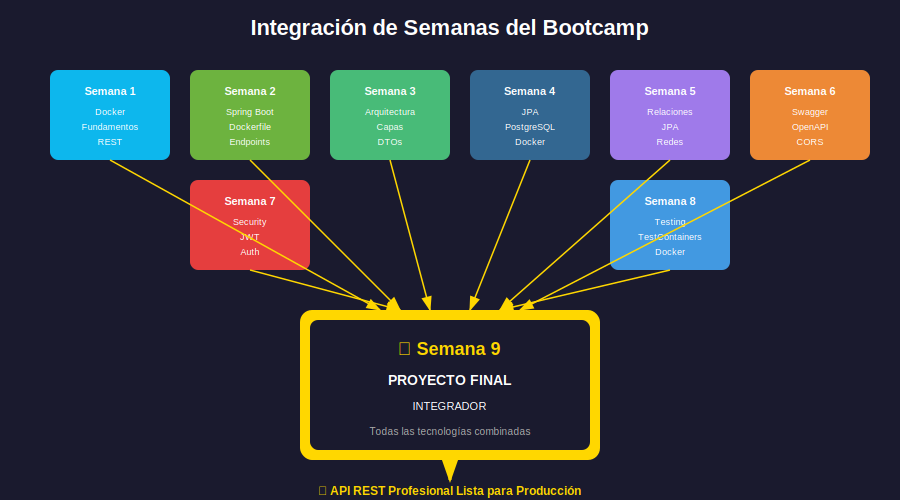

# Integración de Conceptos del Bootcamp

## 📋 Índice

1. [Introducción](#introducción)
2. [Mapa de Conceptos por Semana](#mapa-de-conceptos-por-semana)
3. [Flujo de Integración](#flujo-de-integración)
4. [Dependencias entre Componentes](#dependencias-entre-componentes)
5. [Puntos de Integración Críticos](#puntos-de-integración-críticos)

---

## Introducción

El proyecto final integra **todos los conceptos** aprendidos durante las 8 semanas anteriores del bootcamp. Esta guía te ayudará a entender cómo cada pieza encaja en el rompecabezas completo.



| Semana | Tema | Aplicación en Proyecto Final |
|--------|------|-----------------------------|
| 1 | Docker + REST | Contenedorización base |
| 2 | Spring Boot | Framework y estructura |
| 3 | Arquitectura | Capas y organización |
| 4 | JPA + PostgreSQL | Persistencia de datos |
| 5 | Relaciones JPA | Modelo de datos complejo |
| 6 | Swagger/CORS | Documentación y accesibilidad |
| 7 | Security + JWT | Autenticación y autorización |
| 8 | Testing | Calidad y confiabilidad |

---

## Mapa de Conceptos por Semana

### 🐳 Semana 1: Docker y Fundamentos REST

**Conceptos clave integrados:**

| Concepto | Aplicación en Proyecto Final |
|----------|------------------------------|
| Docker | Contenedor para la aplicación Spring Boot |
| docker-compose | Orquestación de app + PostgreSQL + pgAdmin |
| HTTP Methods | GET, POST, PUT, DELETE en endpoints |
| Códigos de estado | 200, 201, 400, 401, 403, 404, 500 |
| REST principles | Recursos, URIs, stateless |

**Archivos relacionados:**
- `Dockerfile`
- `docker-compose.yml`
- `docker-compose.prod.yml`

---

### 🌱 Semana 2: Spring Boot Básico

**Conceptos clave integrados:**

| Concepto | Aplicación en Proyecto Final |
|----------|------------------------------|
| @SpringBootApplication | Clase principal de la aplicación |
| @RestController | Controladores de la API |
| @RequestMapping | Mapeo de rutas base |
| @GetMapping, @PostMapping | Endpoints CRUD |
| Path variables | IDs en URLs: `/api/products/{id}` |
| Query parameters | Filtros: `?page=0&size=10` |

**Estructura del proyecto:**
```
src/main/java/com/bootcamp/finalproject/
├── FinalProjectApplication.java      ← @SpringBootApplication
├── controller/
│   ├── AuthController.java           ← @RestController
│   ├── ProductController.java
│   └── OrderController.java
```

---

### 🏗️ Semana 3: Arquitectura en Capas

**Conceptos clave integrados:**

| Concepto | Aplicación en Proyecto Final |
|----------|------------------------------|
| Controller Layer | Recibe requests, valida, responde |
| Service Layer | Lógica de negocio |
| Repository Layer | Acceso a datos |
| DTOs | Transferencia de datos sin exponer entidades |
| @Valid | Validación de inputs |
| @ControllerAdvice | Manejo global de excepciones |

**Flujo de una petición:**
```
Request → Controller → Service → Repository → Database
                ↓           ↓
              DTO         Entity
                ↓           ↓
Response ← Controller ← Service ← Repository ← Database
```

**Ejemplo de capas:**
```java
// Controller - Solo coordinación
@PostMapping
public ResponseEntity<ProductDTO> create(@Valid @RequestBody CreateProductRequest request) {
    return ResponseEntity.status(HttpStatus.CREATED)
        .body(productService.create(request));
}

// Service - Lógica de negocio
public ProductDTO create(CreateProductRequest request) {
    Category category = categoryRepository.findById(request.categoryId())
        .orElseThrow(() -> new ResourceNotFoundException("Category not found"));

    Product product = productMapper.toEntity(request);
    product.setCategory(category);

    return productMapper.toDTO(productRepository.save(product));
}

// Repository - Acceso a datos
public interface ProductRepository extends JpaRepository<Product, Long> {
    List<Product> findByCategoryId(Long categoryId);
}
```

---

### 🗄️ Semana 4: JPA y PostgreSQL

**Conceptos clave integrados:**

| Concepto | Aplicación en Proyecto Final |
|----------|------------------------------|
| @Entity | Mapeo de tablas |
| @Id, @GeneratedValue | Claves primarias |
| JpaRepository | Operaciones CRUD automáticas |
| PostgreSQL en Docker | Base de datos containerizada |
| application.properties | Configuración de conexión |
| Profiles (dev, prod) | Diferentes configuraciones |

**Configuración de conexión:**
```properties
# application-dev.properties
spring.datasource.url=jdbc:postgresql://db:5432/finalproject
spring.datasource.username=${DB_USER:dev}
spring.datasource.password=${DB_PASSWORD:dev123}
spring.jpa.hibernate.ddl-auto=update
```

---

### 🔗 Semana 5: Relaciones JPA

**Conceptos clave integrados:**

| Concepto | Aplicación en Proyecto Final |
|----------|------------------------------|
| @OneToMany | User → Orders, Category → Products |
| @ManyToOne | Order → User, Product → Category |
| @ManyToMany | (Opcional) Product ↔ Tag |
| LAZY vs EAGER | Optimización de consultas |
| Cascade | Propagación de operaciones |

**Modelo de relaciones del proyecto:**
```
User (1) ←────→ (N) Order (1) ←────→ (N) OrderItem (N) ←────→ (1) Product
                                                                    ↓
                                                              (N) ←─┴─→ (1) Category
```

**Ejemplo de relaciones:**
```java
@Entity
public class Order {
    @Id
    @GeneratedValue(strategy = GenerationType.IDENTITY)
    private Long id;

    @ManyToOne(fetch = FetchType.LAZY)
    @JoinColumn(name = "user_id", nullable = false)
    private User user;

    @OneToMany(mappedBy = "order", cascade = CascadeType.ALL, orphanRemoval = true)
    private List<OrderItem> items = new ArrayList<>();
}
```

---

### 📚 Semana 6: Swagger y CORS

**Conceptos clave integrados:**

| Concepto | Aplicación en Proyecto Final |
|----------|------------------------------|
| OpenAPI 3.0 | Especificación de la API |
| @Operation | Documentación de endpoints |
| @ApiResponse | Respuestas esperadas |
| @Schema | Documentación de modelos |
| CORS | Acceso desde otros orígenes |
| Swagger UI | Interfaz interactiva |

**Configuración OpenAPI:**
```java
@Configuration
public class OpenApiConfig {
    @Bean
    public OpenAPI customOpenAPI() {
        return new OpenAPI()
            .info(new Info()
                .title("Final Project API")
                .version("1.0.0")
                .description("API REST del proyecto final del bootcamp"))
            .addSecurityItem(new SecurityRequirement().addList("bearerAuth"))
            .components(new Components()
                .addSecuritySchemes("bearerAuth", new SecurityScheme()
                    .type(SecurityScheme.Type.HTTP)
                    .scheme("bearer")
                    .bearerFormat("JWT")));
    }
}
```

---

### 🔐 Semana 7: Spring Security y JWT

**Conceptos clave integrados:**

| Concepto | Aplicación en Proyecto Final |
|----------|------------------------------|
| SecurityFilterChain | Configuración de seguridad |
| JWT | Tokens de autenticación |
| @PreAuthorize | Autorización por roles |
| BCrypt | Encriptación de contraseñas |
| Stateless | Sin sesión del servidor |

**Endpoints de autenticación:**
```
POST /api/auth/register  → Crear cuenta
POST /api/auth/login     → Obtener JWT
GET  /api/auth/me        → Usuario actual (requiere JWT)
```

**Flujo de autenticación:**
```
1. Usuario → POST /api/auth/login (email, password)
2. Server  → Valida credenciales
3. Server  → Genera JWT con claims (userId, role, exp)
4. Server  → Responde con { token: "eyJ..." }
5. Usuario → Guarda token
6. Usuario → GET /api/products (Header: Authorization: Bearer eyJ...)
7. Server  → JwtFilter valida token
8. Server  → Autoriza y responde
```

---

### 🧪 Semana 8: Testing

**Conceptos clave integrados:**

| Concepto | Aplicación en Proyecto Final |
|----------|------------------------------|
| JUnit 5 | Framework de testing |
| Mockito | Mocking de dependencias |
| @SpringBootTest | Tests de integración |
| MockMvc | Tests de controladores |
| TestContainers | PostgreSQL real en tests |
| JaCoCo | Cobertura de código ≥70% |

**Tipos de tests en el proyecto:**
```
src/test/java/
├── unit/
│   ├── service/
│   │   └── ProductServiceTest.java    ← Mockito
│   └── mapper/
│       └── ProductMapperTest.java     ← JUnit puro
├── integration/
│   ├── repository/
│   │   └── ProductRepositoryTest.java ← TestContainers
│   └── controller/
│       └── ProductControllerTest.java ← MockMvc
└── e2e/
    └── AuthFlowTest.java              ← Flujo completo
```

---

## Flujo de Integración

### Flujo Completo de una Petición Autenticada

```
┌──────────────────────────────────────────────────────────────────────┐
│                         FLUJO DE PETICIÓN                            │
├──────────────────────────────────────────────────────────────────────┤
│                                                                      │
│  1. Cliente envía: POST /api/orders                                  │
│     Headers: Authorization: Bearer eyJhbGc...                        │
│     Body: { "items": [{ "productId": 1, "quantity": 2 }] }          │
│                                                                      │
│  2. JwtAuthenticationFilter                                          │
│     → Extrae token del header                                        │
│     → Valida firma y expiración                                      │
│     → Carga UserDetails en SecurityContext                           │
│                                                                      │
│  3. OrderController.create()                                         │
│     → @PreAuthorize("hasRole('USER')")                              │
│     → @Valid valida el request body                                  │
│     → Llama a OrderService                                           │
│                                                                      │
│  4. OrderService.createOrder()                                       │
│     → Obtiene usuario del SecurityContext                            │
│     → Busca productos en ProductRepository                           │
│     → Calcula totales                                                │
│     → Crea Order y OrderItems                                        │
│     → Guarda en OrderRepository                                      │
│                                                                      │
│  5. Response                                                         │
│     → OrderMapper convierte a OrderDTO                               │
│     → Controller retorna 201 Created                                 │
│     → Cliente recibe el pedido creado                                │
│                                                                      │
└──────────────────────────────────────────────────────────────────────┘
```

---

## Dependencias entre Componentes

### Diagrama de Dependencias

```
                    ┌─────────────────┐
                    │  Docker Compose │
                    └────────┬────────┘
                             │
            ┌────────────────┼────────────────┐
            │                │                │
            ▼                ▼                ▼
     ┌──────────┐     ┌──────────┐     ┌──────────┐
     │   App    │────▶│ Postgres │     │ pgAdmin  │
     │ (Spring) │     │    DB    │◀────│          │
     └────┬─────┘     └──────────┘     └──────────┘
          │
          │ Componentes internos:
          │
          ▼
    ┌─────────────────────────────────────────┐
    │            Spring Boot App              │
    │  ┌─────────┐  ┌─────────┐  ┌─────────┐ │
    │  │Security │─▶│Controller│─▶│ Service │ │
    │  │ Filter  │  └─────────┘  └────┬────┘ │
    │  └─────────┘                    │      │
    │       │                         ▼      │
    │       │               ┌─────────────┐  │
    │       └──────────────▶│ Repository  │  │
    │                       └──────┬──────┘  │
    └──────────────────────────────│─────────┘
                                   │
                                   ▼
                            ┌──────────┐
                            │ Database │
                            └──────────┘
```

---

## Puntos de Integración Críticos

### 1. Security + Controllers

```java
// El SecurityContext está disponible en toda la aplicación
@GetMapping("/me")
public ResponseEntity<UserDTO> getCurrentUser() {
    Authentication auth = SecurityContextHolder.getContext().getAuthentication();
    String email = auth.getName();
    return ResponseEntity.ok(userService.findByEmail(email));
}
```

### 2. JPA Entities + DTOs

```java
// Nunca exponer entidades directamente
@GetMapping("/{id}")
public ResponseEntity<ProductDTO> getById(@PathVariable Long id) {
    // ✅ Correcto: retornar DTO
    return ResponseEntity.ok(productService.findById(id));
}

// En el servicio
public ProductDTO findById(Long id) {
    Product product = productRepository.findById(id)
        .orElseThrow(() -> new ResourceNotFoundException("Product not found"));
    return productMapper.toDTO(product);  // Entity → DTO
}
```

### 3. Exception Handling + Responses

```java
@RestControllerAdvice
public class GlobalExceptionHandler {

    @ExceptionHandler(ResourceNotFoundException.class)
    public ResponseEntity<ErrorResponse> handleNotFound(ResourceNotFoundException ex) {
        return ResponseEntity.status(HttpStatus.NOT_FOUND)
            .body(new ErrorResponse(ex.getMessage(), "NOT_FOUND"));
    }

    @ExceptionHandler(AccessDeniedException.class)
    public ResponseEntity<ErrorResponse> handleAccessDenied(AccessDeniedException ex) {
        return ResponseEntity.status(HttpStatus.FORBIDDEN)
            .body(new ErrorResponse("Acceso denegado", "FORBIDDEN"));
    }
}
```

### 4. Docker + Spring Profiles

```yaml
# docker-compose.yml
services:
  app:
    environment:
      - SPRING_PROFILES_ACTIVE=dev
      - DB_HOST=db
      - DB_PASSWORD=${DB_PASSWORD}
```

```properties
# application-dev.properties
spring.datasource.url=jdbc:postgresql://${DB_HOST:localhost}:5432/finalproject
```

---

## Resumen de Integración

| Componente | Depende de | Proporciona a |
|------------|------------|---------------|
| Docker | - | Entorno aislado |
| PostgreSQL | Docker | Persistencia |
| JPA/Entities | PostgreSQL | Modelo de datos |
| Repositories | JPA | Acceso a datos |
| Services | Repositories | Lógica de negocio |
| DTOs/Mappers | Services | Transferencia segura |
| Controllers | Services + DTOs | Endpoints REST |
| Security | Controllers | Protección |
| Swagger | Controllers | Documentación |
| Tests | Todo | Calidad |

---

## 📚 Recursos Adicionales

- [Spring Boot Reference](https://docs.spring.io/spring-boot/docs/current/reference/html/)
- [Spring Security Architecture](https://spring.io/guides/topicals/spring-security-architecture)
- [Docker Compose Documentation](https://docs.docker.com/compose/)

---

> **💡 Tip**: El proyecto final debe funcionar con un solo comando: `docker-compose up`. Si cualquier parte falla, todo el sistema falla. Asegúrate de que cada componente esté correctamente integrado.
