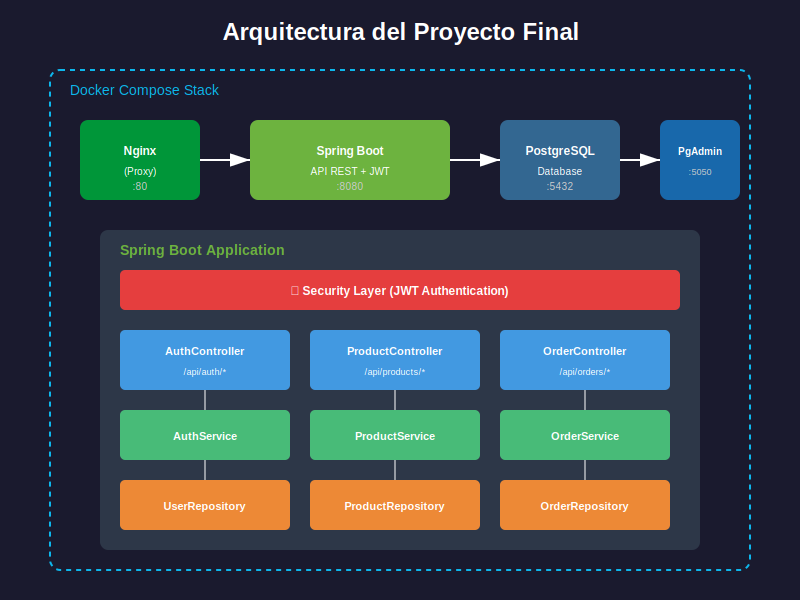
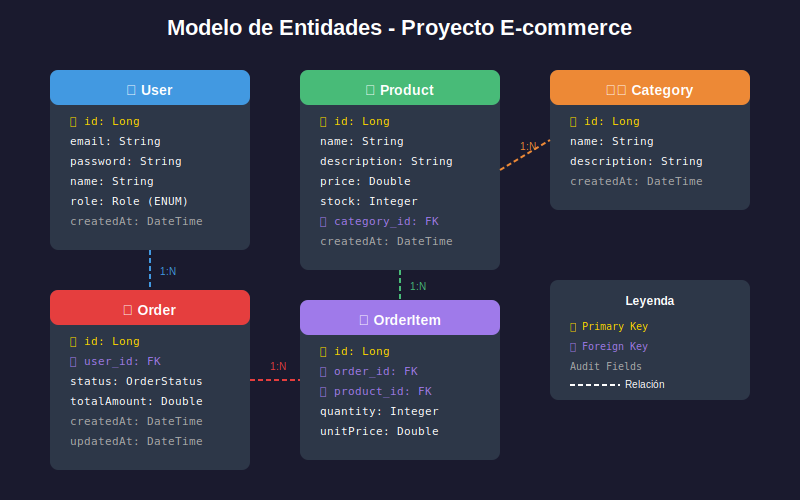

# Arquitectura del Proyecto Final

## 📋 Índice

1. [Visión General](#visión-general)
2. [Arquitectura de Servicios](#arquitectura-de-servicios)
3. [Arquitectura Interna de la Aplicación](#arquitectura-interna-de-la-aplicación)
4. [Estructura de Paquetes](#estructura-de-paquetes)
5. [Modelo de Datos](#modelo-de-datos)
6. [Flujos de la Aplicación](#flujos-de-la-aplicación)
7. [Decisiones Arquitectónicas](#decisiones-arquitectónicas)

---

## Visión General

El proyecto final implementa una **API REST completa** siguiendo los principios de:

- **Clean Architecture**: Separación clara de responsabilidades
- **Domain-Driven Design (DDD)**: Organización por dominio de negocio
- **Twelve-Factor App**: Configuración externalizada, stateless
- **Security by Design**: Seguridad desde el diseño



### Stack Tecnológico

| Capa | Tecnología |
|------|------------|
| Frontend (opcional) | React + Vite + Axios |
| API Gateway | Nginx (proxy reverso) |
| Backend | Spring Boot 3.2 + Java 21 |
| Seguridad | Spring Security + JWT |
| Persistencia | Spring Data JPA + Hibernate |
| Base de datos | PostgreSQL 16 |
| Documentación | OpenAPI 3.0 + Swagger UI |
| Testing | JUnit 5 + Mockito + TestContainers |
| Contenedorización | Docker + Docker Compose |

---

## Arquitectura de Servicios

### Docker Compose Stack

```yaml
# Arquitectura de servicios
services:
  ┌─────────────┐     ┌─────────────┐     ┌─────────────┐
  │    nginx    │────▶│     app     │────▶│     db      │
  │   :80/443   │     │   :8080     │     │   :5432     │
  └─────────────┘     └─────────────┘     └─────────────┘
                                                │
                      ┌─────────────┐           │
                      │   pgadmin   │◀──────────┘
                      │   :5050     │
                      └─────────────┘
```

### Descripción de Servicios

| Servicio | Puerto | Función |
|----------|--------|---------|
| **nginx** | 80, 443 | Proxy reverso, SSL termination, load balancing |
| **app** | 8080 | API REST Spring Boot |
| **db** | 5432 | Base de datos PostgreSQL |
| **pgadmin** | 5050 | Administración de base de datos (solo dev) |

### Comunicación entre Servicios

```
Internet
    │
    ▼
┌───────────────────────────────────────────────────────────────┐
│                    Docker Network: backend                     │
│                                                                │
│   ┌──────────┐          ┌──────────┐          ┌──────────┐   │
│   │  nginx   │──HTTP───▶│   app    │──JDBC───▶│    db    │   │
│   │          │          │          │          │          │   │
│   │ :80→8080 │          │  :8080   │          │  :5432   │   │
│   └──────────┘          └──────────┘          └──────────┘   │
│                               │                              │
│                               │ DNS: db:5432                 │
│                               ▼                              │
│                         ┌──────────┐                         │
│                         │ pgadmin  │                         │
│                         │  :5050   │                         │
│                         └──────────┘                         │
│                                                              │
└───────────────────────────────────────────────────────────────┘
```

---

## Arquitectura Interna de la Aplicación

### Arquitectura en Capas

```
┌─────────────────────────────────────────────────────────────────┐
│                      PRESENTATION LAYER                         │
│  ┌───────────────────────────────────────────────────────────┐ │
│  │                     Controllers                            │ │
│  │  • Reciben HTTP requests                                   │ │
│  │  • Validan input (@Valid)                                  │ │
│  │  • Delegan a servicios                                     │ │
│  │  • Retornan HTTP responses                                 │ │
│  └───────────────────────────────────────────────────────────┘ │
├─────────────────────────────────────────────────────────────────┤
│                       SECURITY LAYER                            │
│  ┌───────────────────────────────────────────────────────────┐ │
│  │                   JWT Filter Chain                         │ │
│  │  • Intercepta todas las requests                           │ │
│  │  • Valida tokens JWT                                       │ │
│  │  • Establece SecurityContext                               │ │
│  │  • Aplica autorizaciones                                   │ │
│  └───────────────────────────────────────────────────────────┘ │
├─────────────────────────────────────────────────────────────────┤
│                       BUSINESS LAYER                            │
│  ┌───────────────────────────────────────────────────────────┐ │
│  │                      Services                              │ │
│  │  • Implementan lógica de negocio                           │ │
│  │  • Coordinan operaciones                                   │ │
│  │  • Manejan transacciones                                   │ │
│  │  • Validan reglas de negocio                               │ │
│  └───────────────────────────────────────────────────────────┘ │
├─────────────────────────────────────────────────────────────────┤
│                      PERSISTENCE LAYER                          │
│  ┌───────────────────────────────────────────────────────────┐ │
│  │                    Repositories                            │ │
│  │  • Acceden a la base de datos                              │ │
│  │  • Implementan queries personalizadas                      │ │
│  │  • Manejan entidades JPA                                   │ │
│  └───────────────────────────────────────────────────────────┘ │
├─────────────────────────────────────────────────────────────────┤
│                        DATA LAYER                               │
│  ┌───────────────────────────────────────────────────────────┐ │
│  │                      Entities                              │ │
│  │  • Mapean tablas de BD                                     │ │
│  │  • Definen relaciones                                      │ │
│  │  • Contienen validaciones JPA                              │ │
│  └───────────────────────────────────────────────────────────┘ │
└─────────────────────────────────────────────────────────────────┘
```

### Componentes Transversales

```
┌─────────────────────────────────────────────────────────────────┐
│                    CROSS-CUTTING CONCERNS                       │
├─────────────────────────────────────────────────────────────────┤
│                                                                 │
│  ┌─────────────┐  ┌─────────────┐  ┌─────────────┐             │
│  │   DTOs      │  │   Mappers   │  │ Exceptions  │             │
│  │             │  │             │  │  Handlers   │             │
│  └─────────────┘  └─────────────┘  └─────────────┘             │
│                                                                 │
│  ┌─────────────┐  ┌─────────────┐  ┌─────────────┐             │
│  │ Validators  │  │  Constants  │  │   Config    │             │
│  │             │  │             │  │             │             │
│  └─────────────┘  └─────────────┘  └─────────────┘             │
│                                                                 │
└─────────────────────────────────────────────────────────────────┘
```

---

## Estructura de Paquetes

### Estructura Recomendada

```
src/main/java/com/bootcamp/finalproject/
│
├── FinalProjectApplication.java          # Clase principal
│
├── config/                               # Configuraciones
│   ├── OpenApiConfig.java               # Swagger/OpenAPI
│   ├── SecurityConfig.java              # Spring Security
│   ├── CorsConfig.java                  # CORS
│   └── JacksonConfig.java               # Serialización JSON
│
├── security/                             # Seguridad JWT
│   ├── jwt/
│   │   ├── JwtService.java              # Generación/validación tokens
│   │   ├── JwtAuthenticationFilter.java # Filtro de autenticación
│   │   └── JwtAuthEntryPoint.java       # Manejo de errores auth
│   └── CustomUserDetailsService.java    # Carga de usuarios
│
├── auth/                                 # Módulo de autenticación
│   ├── controller/
│   │   └── AuthController.java
│   ├── dto/
│   │   ├── LoginRequest.java
│   │   ├── RegisterRequest.java
│   │   └── AuthResponse.java
│   └── service/
│       └── AuthService.java
│
├── user/                                 # Módulo de usuarios
│   ├── controller/
│   │   └── UserController.java
│   ├── dto/
│   │   ├── UserDTO.java
│   │   └── UpdateUserRequest.java
│   ├── entity/
│   │   ├── User.java
│   │   └── Role.java
│   ├── repository/
│   │   └── UserRepository.java
│   ├── service/
│   │   └── UserService.java
│   └── mapper/
│       └── UserMapper.java
│
├── product/                              # Módulo de productos
│   ├── controller/
│   │   └── ProductController.java
│   ├── dto/
│   │   ├── ProductDTO.java
│   │   └── CreateProductRequest.java
│   ├── entity/
│   │   └── Product.java
│   ├── repository/
│   │   └── ProductRepository.java
│   ├── service/
│   │   └── ProductService.java
│   └── mapper/
│       └── ProductMapper.java
│
├── category/                             # Módulo de categorías
│   ├── controller/
│   │   └── CategoryController.java
│   ├── dto/
│   │   ├── CategoryDTO.java
│   │   └── CreateCategoryRequest.java
│   ├── entity/
│   │   └── Category.java
│   ├── repository/
│   │   └── CategoryRepository.java
│   ├── service/
│   │   └── CategoryService.java
│   └── mapper/
│       └── CategoryMapper.java
│
├── order/                                # Módulo de pedidos
│   ├── controller/
│   │   └── OrderController.java
│   ├── dto/
│   │   ├── OrderDTO.java
│   │   ├── OrderItemDTO.java
│   │   └── CreateOrderRequest.java
│   ├── entity/
│   │   ├── Order.java
│   │   ├── OrderItem.java
│   │   └── OrderStatus.java
│   ├── repository/
│   │   ├── OrderRepository.java
│   │   └── OrderItemRepository.java
│   ├── service/
│   │   └── OrderService.java
│   └── mapper/
│       └── OrderMapper.java
│
├── common/                               # Componentes compartidos
│   ├── dto/
│   │   ├── ErrorResponse.java
│   │   └── PageResponse.java
│   ├── exception/
│   │   ├── ResourceNotFoundException.java
│   │   ├── BadRequestException.java
│   │   ├── UnauthorizedException.java
│   │   └── GlobalExceptionHandler.java
│   └── audit/
│       └── AuditableEntity.java
│
└── util/                                 # Utilidades
    └── Constants.java
```

### Estructura de Tests

```
src/test/java/com/bootcamp/finalproject/
│
├── unit/                                 # Tests unitarios
│   ├── auth/
│   │   └── AuthServiceTest.java
│   ├── product/
│   │   ├── ProductServiceTest.java
│   │   └── ProductMapperTest.java
│   └── order/
│       └── OrderServiceTest.java
│
├── integration/                          # Tests de integración
│   ├── auth/
│   │   └── AuthControllerIntegrationTest.java
│   ├── product/
│   │   └── ProductRepositoryIntegrationTest.java
│   └── TestContainersConfig.java
│
└── e2e/                                  # Tests end-to-end
    └── OrderFlowE2ETest.java
```

---

## Modelo de Datos

### Diagrama Entidad-Relación



**Relaciones principales:**

| Relación | Tipo | Descripción |
|----------|------|-------------|
| User → Order | 1:N | Un usuario puede tener muchas órdenes |
| Order → OrderItem | 1:N | Una orden puede tener muchos ítems |
| Category → Product | 1:N | Una categoría puede tener muchos productos |
| Product → OrderItem | 1:N | Un producto puede estar en muchos ítems |

### Especificación de Entidades

#### User

```java
@Entity
@Table(name = "users")
public class User extends AuditableEntity {
    @Id
    @GeneratedValue(strategy = GenerationType.IDENTITY)
    private Long id;

    @Column(unique = true, nullable = false)
    private String email;

    @Column(nullable = false)
    private String password;

    @Column(nullable = false)
    private String name;

    @Enumerated(EnumType.STRING)
    @Column(nullable = false)
    private Role role = Role.USER;

    @OneToMany(mappedBy = "user", fetch = FetchType.LAZY)
    private List<Order> orders = new ArrayList<>();
}
```

#### Product

```java
@Entity
@Table(name = "products")
public class Product extends AuditableEntity {
    @Id
    @GeneratedValue(strategy = GenerationType.IDENTITY)
    private Long id;

    @Column(nullable = false)
    private String name;

    @Column(columnDefinition = "TEXT")
    private String description;

    @Column(nullable = false)
    private Double price;

    @Column(nullable = false)
    private Integer stock;

    @ManyToOne(fetch = FetchType.LAZY)
    @JoinColumn(name = "category_id", nullable = false)
    private Category category;
}
```

---

## Flujos de la Aplicación

### Flujo de Registro

```
┌─────────┐    POST /api/auth/register    ┌────────────┐
│ Cliente │ ──────────────────────────────▶│   Nginx    │
└─────────┘                                └─────┬──────┘
                                                 │
                                                 ▼
                                          ┌────────────┐
                                          │    App     │
                                          │            │
                                          │ 1. Validar │
                                          │    request │
                                          │            │
                                          │ 2. Check   │
                                          │    email   │
                                          │    único   │
                                          │            │
                                          │ 3. Encrypt │
                                          │    password│
                                          │            │
                                          │ 4. Save    │
                                          │    user    │
                                          │            │
                                          │ 5. Generate│
                                          │    JWT     │
                                          └─────┬──────┘
                                                │
                                                ▼
┌─────────┐    { token, user }            ┌────────────┐
│ Cliente │ ◀──────────────────────────────│   Nginx    │
└─────────┘                                └────────────┘
```

### Flujo de Crear Pedido

```
┌─────────┐  POST /api/orders + JWT   ┌────────────────────────────────┐
│ Cliente │ ─────────────────────────▶│           App                   │
└─────────┘                            │                                │
                                       │  1. JwtFilter                  │
                                       │     └─▶ Valida token           │
                                       │     └─▶ Carga user en context  │
                                       │                                │
                                       │  2. OrderController            │
                                       │     └─▶ @PreAuthorize USER     │
                                       │     └─▶ @Valid request         │
                                       │                                │
                                       │  3. OrderService               │
                                       │     └─▶ Obtiene user actual    │
                                       │     └─▶ Valida productos       │
                                       │     └─▶ Verifica stock         │
                                       │     └─▶ Calcula total          │
                                       │     └─▶ Crea Order + Items     │
                                       │     └─▶ Actualiza stock        │
                                       │                                │
                                       │  4. Repositories               │
                                       │     └─▶ save(order)            │
                                       │                                │
┌─────────┐   201 + OrderDTO           │  5. Response                   │
│ Cliente │ ◀──────────────────────────│     └─▶ OrderMapper.toDTO()    │
└─────────┘                            └────────────────────────────────┘
```

---

## Decisiones Arquitectónicas

### ADR 001: Estructura por Módulos de Negocio

**Contexto**: Necesitamos organizar el código de forma mantenible.

**Decisión**: Estructura por módulos de dominio (user, product, order) en lugar de capas técnicas.

**Consecuencias**:
- ✅ Alta cohesión dentro de cada módulo
- ✅ Fácil de escalar y mantener
- ✅ Posible migración a microservicios
- ⚠️ Posible duplicación de código entre módulos

### ADR 002: DTOs para Todas las Respuestas

**Contexto**: Las entidades JPA no deben exponerse directamente.

**Decisión**: Usar DTOs (Data Transfer Objects) en todas las respuestas.

**Consecuencias**:
- ✅ Control sobre datos expuestos
- ✅ Desacoplamiento de API y persistencia
- ✅ Facilita versionado de API
- ⚠️ Código adicional (mappers)

### ADR 003: JWT Stateless

**Contexto**: Necesitamos autenticación escalable.

**Decisión**: JWT con tokens de acceso de corta duración (15 min).

**Consecuencias**:
- ✅ Stateless, escalable horizontalmente
- ✅ No requiere sesiones en servidor
- ✅ Compatible con microservicios
- ⚠️ No se pueden invalidar tokens antes de expiración

### ADR 004: PostgreSQL en Docker

**Contexto**: Necesitamos persistencia relacional consistente.

**Decisión**: PostgreSQL 16 en contenedor Docker con volumen persistente.

**Consecuencias**:
- ✅ Entorno reproducible
- ✅ Fácil de versionar y actualizar
- ✅ Consistente entre dev y prod
- ⚠️ Requiere Docker en desarrollo

---

## 📚 Referencias

- [Clean Architecture - Robert C. Martin](https://blog.cleancoder.com/uncle-bob/2012/08/13/the-clean-architecture.html)
- [Spring Boot Reference Documentation](https://docs.spring.io/spring-boot/docs/current/reference/html/)
- [Twelve-Factor App](https://12factor.net/)

---

> **💡 Nota**: Esta arquitectura está diseñada para proyectos de tamaño mediano. Para proyectos más grandes, considerar Domain-Driven Design completo o arquitectura hexagonal.
