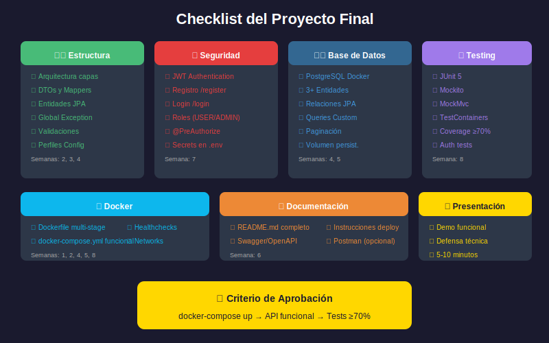

# Checklist de Calidad del Proyecto

## 📋 Índice

1. [Introducción](#introducción)
2. [Checklist de Estructura](#checklist-de-estructura)
3. [Checklist de Seguridad](#checklist-de-seguridad)
4. [Checklist de Base de Datos](#checklist-de-base-de-datos)
5. [Checklist de Testing](#checklist-de-testing)
6. [Checklist de Docker](#checklist-de-docker)
7. [Checklist de Documentación](#checklist-de-documentación)
8. [Checklist de Código](#checklist-de-código)
9. [Lista Resumida para Entrega](#lista-resumida-para-entrega)

---

## Introducción

Este documento contiene los criterios de calidad que tu proyecto debe cumplir para considerarse completo. Usa estas listas como guía durante el desarrollo y como verificación final antes de la entrega.



### Leyenda

- ✅ **Obligatorio**: Debe estar presente para aprobar
- 🔶 **Recomendado**: Suma puntos adicionales
- 💎 **Bonus**: Puntos extra por implementación avanzada

---

## Checklist de Estructura

### Arquitectura en Capas

| # | Criterio | Estado |
|---|----------|--------|
| ✅ | Controllers solo coordinan (no lógica de negocio) | ☐ |
| ✅ | Services contienen toda la lógica de negocio | ☐ |
| ✅ | Repositories solo acceden a datos | ☐ |
| ✅ | DTOs para requests y responses | ☐ |
| ✅ | Mappers para convertir Entity ↔ DTO | ☐ |
| ✅ | GlobalExceptionHandler implementado | ☐ |
| 🔶 | AuditableEntity con createdAt/updatedAt | ☐ |
| 💎 | Estructura por módulos de negocio | ☐ |

### Ejemplo de Verificación

```java
// ✅ CORRECTO: Controller solo coordina
@RestController
@RequestMapping("/api/products")
public class ProductController {

    private final ProductService productService;

    @PostMapping
    public ResponseEntity<ProductDTO> create(@Valid @RequestBody CreateProductRequest request) {
        return ResponseEntity.status(HttpStatus.CREATED)
            .body(productService.create(request));  // Delega al service
    }
}

// ❌ INCORRECTO: Lógica en controller
@PostMapping
public ResponseEntity<Product> create(@RequestBody Product product) {
    if (product.getPrice() < 0) {  // Lógica de negocio aquí
        throw new BadRequestException("Precio inválido");
    }
    return ResponseEntity.ok(productRepository.save(product));  // Acceso directo a repo
}
```

---

## Checklist de Seguridad

### Autenticación y Autorización

| # | Criterio | Estado |
|---|----------|--------|
| ✅ | Endpoint POST /api/auth/register funcional | ☐ |
| ✅ | Endpoint POST /api/auth/login funcional | ☐ |
| ✅ | JWT generado correctamente | ☐ |
| ✅ | JWT validado en cada request | ☐ |
| ✅ | Endpoints protegidos con @PreAuthorize o similar | ☐ |
| ✅ | Roles USER y ADMIN diferenciados | ☐ |
| ✅ | Contraseñas hasheadas con BCrypt | ☐ |
| 🔶 | Refresh token implementado | ☐ |
| 💎 | Rate limiting en endpoints sensibles | ☐ |

### Validación y Sanitización

| # | Criterio | Estado |
|---|----------|--------|
| ✅ | @Valid en todos los @RequestBody | ☐ |
| ✅ | @NotNull, @NotBlank, @Size en DTOs | ☐ |
| ✅ | @Email para campos de email | ☐ |
| ✅ | @Min, @Max para valores numéricos | ☐ |
| ✅ | Mensajes de error personalizados | ☐ |
| 🔶 | Validaciones de negocio en Services | ☐ |
| 💎 | Custom validators para reglas complejas | ☐ |

### Configuración Segura

| # | Criterio | Estado |
|---|----------|--------|
| ✅ | Credenciales en variables de entorno | ☐ |
| ✅ | .env en .gitignore | ☐ |
| ✅ | JWT secret mínimo 256 bits | ☐ |
| ✅ | No stack traces en respuestas de error | ☐ |
| ✅ | CORS configurado correctamente | ☐ |
| 🔶 | Diferentes secrets por ambiente | ☐ |
| 💎 | Secrets en vault (HashiCorp, AWS) | ☐ |

### Ejemplo de Validación

```java
// ✅ CORRECTO: DTO con validaciones completas
public record CreateProductRequest(
    @NotBlank(message = "El nombre es requerido")
    @Size(min = 2, max = 100, message = "El nombre debe tener entre 2 y 100 caracteres")
    String name,

    @NotNull(message = "El precio es requerido")
    @Min(value = 0, message = "El precio debe ser mayor o igual a 0")
    Double price,

    @NotNull(message = "El stock es requerido")
    @Min(value = 0, message = "El stock debe ser mayor o igual a 0")
    Integer stock,

    @NotNull(message = "La categoría es requerida")
    Long categoryId
) {}
```

---

## Checklist de Base de Datos

### Modelo de Datos

| # | Criterio | Estado |
|---|----------|--------|
| ✅ | Mínimo 3 entidades relacionadas | ☐ |
| ✅ | Relaciones JPA correctas (@ManyToOne, @OneToMany) | ☐ |
| ✅ | IDs autogenerados (@GeneratedValue) | ☐ |
| ✅ | Constraints (@Column nullable, unique) | ☐ |
| ✅ | Fetch types apropiados (LAZY/EAGER) | ☐ |
| 🔶 | Índices en campos de búsqueda frecuente | ☐ |
| 🔶 | Auditoría (createdAt, updatedAt) | ☐ |
| 💎 | Soft delete implementado | ☐ |

### Consultas

| # | Criterio | Estado |
|---|----------|--------|
| ✅ | CRUD completo para cada entidad | ☐ |
| ✅ | Query methods en repositories | ☐ |
| ✅ | Paginación implementada | ☐ |
| 🔶 | Consultas custom con @Query | ☐ |
| 🔶 | Ordenamiento configurable | ☐ |
| 💎 | Especificaciones (Specification API) | ☐ |

### PostgreSQL

| # | Criterio | Estado |
|---|----------|--------|
| ✅ | PostgreSQL en Docker | ☐ |
| ✅ | Volumen para persistencia | ☐ |
| ✅ | Configuración por profiles | ☐ |
| 🔶 | Init scripts para datos de prueba | ☐ |
| 💎 | Migraciones con Flyway/Liquibase | ☐ |

---

## Checklist de Testing

### Tests Unitarios

| # | Criterio | Estado |
|---|----------|--------|
| ✅ | Tests de Services con Mockito | ☐ |
| ✅ | Tests de Mappers | ☐ |
| ✅ | Mínimo 3 tests por servicio principal | ☐ |
| 🔶 | Tests de validadores custom | ☐ |
| 💎 | Tests parametrizados | ☐ |

### Tests de Integración

| # | Criterio | Estado |
|---|----------|--------|
| ✅ | Tests de Controllers con MockMvc | ☐ |
| ✅ | Tests de autenticación (login, register) | ☐ |
| ✅ | Tests de autorización (acceso denegado) | ☐ |
| 🔶 | Tests de Repositories con TestContainers | ☐ |
| 💎 | Tests E2E de flujos completos | ☐ |

### Cobertura

| # | Criterio | Estado |
|---|----------|--------|
| ✅ | Cobertura ≥ 70% | ☐ |
| ✅ | JaCoCo configurado | ☐ |
| 🔶 | Cobertura ≥ 80% | ☐ |
| 💎 | Mutation testing | ☐ |

### Ejemplo de Test

```java
// ✅ Test de Service con Mockito
@ExtendWith(MockitoExtension.class)
class ProductServiceTest {

    @Mock
    private ProductRepository productRepository;

    @Mock
    private CategoryRepository categoryRepository;

    @Mock
    private ProductMapper productMapper;

    @InjectMocks
    private ProductService productService;

    @Test
    @DisplayName("Debería crear producto correctamente")
    void shouldCreateProductSuccessfully() {
        // Given
        CreateProductRequest request = new CreateProductRequest("Test", 10.0, 5, 1L);
        Category category = new Category(1L, "Category");
        Product product = new Product(1L, "Test", 10.0, 5, category);
        ProductDTO expectedDTO = new ProductDTO(1L, "Test", 10.0, 5, "Category");

        when(categoryRepository.findById(1L)).thenReturn(Optional.of(category));
        when(productMapper.toEntity(request)).thenReturn(product);
        when(productRepository.save(any())).thenReturn(product);
        when(productMapper.toDTO(product)).thenReturn(expectedDTO);

        // When
        ProductDTO result = productService.create(request);

        // Then
        assertThat(result).isEqualTo(expectedDTO);
        verify(productRepository).save(any(Product.class));
    }
}
```

---

## Checklist de Docker

### Dockerfile

| # | Criterio | Estado |
|---|----------|--------|
| ✅ | Multi-stage build | ☐ |
| ✅ | Base image oficial (eclipse-temurin) | ☐ |
| ✅ | Usuario no-root | ☐ |
| ✅ | .dockerignore configurado | ☐ |
| 🔶 | Layer caching optimizado | ☐ |
| 🔶 | Imagen final < 300MB | ☐ |
| 💎 | Security scanning (Trivy) | ☐ |

### Docker Compose

| # | Criterio | Estado |
|---|----------|--------|
| ✅ | Servicios: app, db | ☐ |
| ✅ | Networks definidos | ☐ |
| ✅ | Volúmenes para persistencia | ☐ |
| ✅ | Variables de entorno en .env | ☐ |
| ✅ | Healthchecks configurados | ☐ |
| ✅ | depends_on con condition | ☐ |
| 🔶 | Servicio pgAdmin | ☐ |
| 🔶 | docker-compose.prod.yml separado | ☐ |
| 💎 | Nginx como reverse proxy | ☐ |

### Ejecución

| # | Criterio | Estado |
|---|----------|--------|
| ✅ | `docker-compose up` funciona sin errores | ☐ |
| ✅ | API responde en localhost:8080 | ☐ |
| ✅ | Base de datos persiste datos | ☐ |
| ✅ | Logs accesibles con `docker-compose logs` | ☐ |
| 🔶 | Reinicio automático (restart: unless-stopped) | ☐ |
| 💎 | Hot reload en desarrollo | ☐ |

---

## Checklist de Documentación

### README.md

| # | Criterio | Estado |
|---|----------|--------|
| ✅ | Descripción del proyecto | ☐ |
| ✅ | Requisitos (Docker, etc.) | ☐ |
| ✅ | Instrucciones de instalación | ☐ |
| ✅ | Cómo ejecutar (`docker-compose up`) | ☐ |
| ✅ | Endpoints disponibles | ☐ |
| ✅ | Variables de entorno | ☐ |
| 🔶 | Arquitectura explicada | ☐ |
| 🔶 | Diagrama de entidades | ☐ |
| 💎 | Troubleshooting común | ☐ |

### API Documentation

| # | Criterio | Estado |
|---|----------|--------|
| ✅ | Swagger UI accesible | ☐ |
| ✅ | Todos los endpoints documentados | ☐ |
| ✅ | Schemas de request/response | ☐ |
| ✅ | Códigos de error documentados | ☐ |
| 🔶 | Ejemplos de uso | ☐ |
| 🔶 | Autenticación documentada en Swagger | ☐ |
| 💎 | OpenAPI exportable | ☐ |

### Código

| # | Criterio | Estado |
|---|----------|--------|
| ✅ | Javadoc en clases públicas principales | ☐ |
| ✅ | Comentarios en lógica compleja | ☐ |
| 🔶 | Javadoc en todos los métodos públicos | ☐ |
| 💎 | Architecture Decision Records (ADR) | ☐ |

---

## Checklist de Código

### Clean Code

| # | Criterio | Estado |
|---|----------|--------|
| ✅ | Nomenclatura en inglés | ☐ |
| ✅ | Nombres descriptivos (variables, métodos) | ☐ |
| ✅ | Métodos cortos (< 20 líneas ideal) | ☐ |
| ✅ | Una responsabilidad por clase | ☐ |
| ✅ | Sin código duplicado | ☐ |
| ✅ | Sin código comentado | ☐ |
| 🔶 | Constantes en lugar de magic numbers | ☐ |
| 💎 | Records para DTOs inmutables | ☐ |

### Java 21 Features

| # | Criterio | Estado |
|---|----------|--------|
| 🔶 | Records para DTOs | ☐ |
| 🔶 | Pattern matching (instanceof) | ☐ |
| 🔶 | Switch expressions | ☐ |
| 💎 | Virtual threads | ☐ |
| 💎 | Sealed classes | ☐ |

### Logging

| # | Criterio | Estado |
|---|----------|--------|
| ✅ | SLF4J para logging | ☐ |
| ✅ | Logs en operaciones importantes | ☐ |
| ✅ | Niveles apropiados (INFO, WARN, ERROR) | ☐ |
| ✅ | Sin datos sensibles en logs | ☐ |
| 🔶 | Correlation IDs en requests | ☐ |
| 💎 | Structured logging (JSON) | ☐ |

---

## Lista Resumida para Entrega

### Pre-entrega: Verificación Rápida

```bash
# 1. Clonar en directorio limpio
git clone <tu-repo> test-clone
cd test-clone

# 2. Copiar .env
cp .env.example .env

# 3. Ejecutar
docker-compose up --build

# 4. Verificar endpoints
curl http://localhost:8080/api/health
curl http://localhost:8080/swagger-ui.html

# 5. Ejecutar tests
docker-compose exec app ./mvnw test

# 6. Verificar cobertura
docker-compose exec app ./mvnw jacoco:report
# Ver target/site/jacoco/index.html
```

### Checklist Final de Entrega

| # | Criterio | ✓ |
|---|----------|---|
| 1 | README.md completo | ☐ |
| 2 | .env.example presente | ☐ |
| 3 | docker-compose.yml funcional | ☐ |
| 4 | API responde correctamente | ☐ |
| 5 | Login/Register funcionan | ☐ |
| 6 | JWT protege endpoints | ☐ |
| 7 | CRUD de entidades completo | ☐ |
| 8 | Swagger UI accesible | ☐ |
| 9 | Tests pasan (≥70% coverage) | ☐ |
| 10 | Sin errores en logs | ☐ |

---

## Comandos Útiles para Verificación

```bash
# Ver cobertura de tests
./mvnw clean test jacoco:report
open target/site/jacoco/index.html

# Verificar estilo de código (si usas checkstyle)
./mvnw checkstyle:check

# Verificar dependencias vulnerables
./mvnw dependency-check:check

# Limpiar y reconstruir todo
docker-compose down -v
docker-compose up --build

# Ver logs en tiempo real
docker-compose logs -f app

# Ejecutar solo tests de integración
./mvnw test -Dtest="*IntegrationTest"

# Generar documentación
./mvnw javadoc:javadoc
```

---

> **💡 Consejo**: Ejecuta esta verificación al menos **2 días antes** de la entrega para tener tiempo de corregir cualquier problema.
